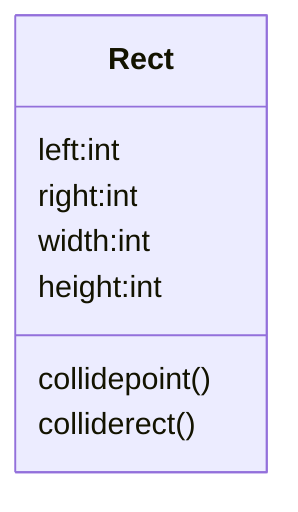

<h1>Snake Eat Apple</h1>

## display snake
[MainFrame](../src/snake/MainFrame.java)
[Snake](../src/snake/Snake.java)
[Apple](../src/snake/Apple.java)
[AbstractBoard](../src/snake/AbstractBoard.java)
1. [Board](../src/snake/Board.java)
[Position](../src/snake/Position.java)

## move snake
2. [Move Snake](../src/snake/MoveSnake.java)
3. [Control snake](../src/snake/ControlSnake.java)

## display apple
4. [RandomApple](../src/snake/RandomApple.java)

## Rect class

## Test Driving Development (TDD)
[Test case for Rect](../test/snake/RectTest.java)