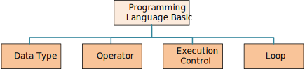

<h1> 休斯顿华夏中文学校-Java Class Notes</h1>

- [Markdown Class Notes](#markdown-class-notes)
- [Language Basics](#language-basics)
- [Print](#print)
- [Data Type](#data-type)
- [Operator](#operator)
- [If-else](#if-else)
- [Loop](#loop)
- [References](#references)

## Markdown Class Notes
Organize Class Notes File Structure
<java root>
    ├── ReadMe.md
    └── doc/
         ├── images/
         ├── homeworks/
         |      ├── mardown01.md
         |      └── mardown02.md
         ├── eclipseTrics.md     
         ├── markdownTrics.md     
         ├── myIcons.md     
         └── learnJava.md     

[Homework 1](homeworks/markdown01.md)
[Homework 2](homeworks/markdown02.md)

## Language Basics

## Print
* [Print.java](src/Print.java)
* Homeworks
  1. [Math Competition](homeworks/12023%20Harmoney%20School%20Houston.pdf)
  2. [variable01](homeworks/variable01.md)
  3. [variable02](homeworks/variable02.md)

## Data Type
* [DataType.java](src/DataType.java)
* Homeworks
    1. 
## Operator
* [Operator.java](src/Operator.java)
* Homeworks
    1. [quiz02.md](homeworks/quiz02.md)
    2. [operator01.md](homeworks/operator01.md)
    3. [operator02.md](homeworks/operator02.md)

## If-else
* [if-else syntax](src/IfElse.java)

## Loop
* [for/while loop](src/Loop.java)

## References
* [Java Tutorial](http://www.beginwithjava.com/java/)
* [All excercises]()
  1. [Loop Excercises](http://www.beginwithjava.com/java/loops/questions.html)
  2. [method Excercises](http://www.beginwithjava.com/java/methods/questions.html)
  3. [class excercises](http://math.hws.edu/eck/cs124/javanotes4/c5/exercises.html)
  4. [OOP Excercises](https://www3.ntu.edu.sg/home/ehchua/programming/java/J3f_OOPExercises.html)
  5. [Operator Excercise](https://docs.oracle.com/javase/tutorial/java/nutsandbolts/QandE/questions_operators.html)
* [Good Java Tutorial WebSite](https://beginnersbook.com/2014/07/how-to-sort-a-treemap-by-value-in-java/)
* [Java Point](https://www.javatpoint.com/java-tutorial)
* [Linked List](https://www.javatpoint.com/singly-linked-list-vs-doubly-linked-list)