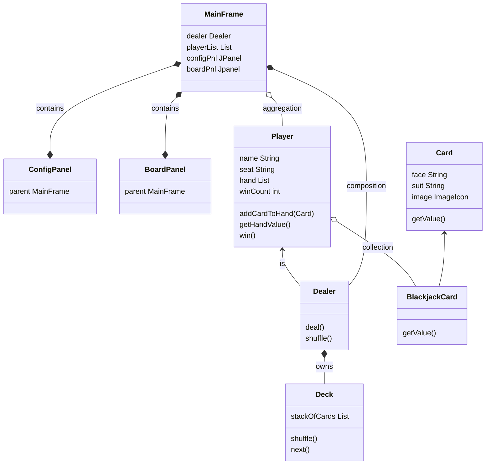

<h1>Blackjack Card Game Specification and Design</h1>

## File Structure

```output
blackjack/ (project)
    ├── 📝doc/
    |    ├── mistakes.md 
    |    └── ReadMe.md 
    ├── 🔥src/
    |       └── blackjack/ (package)
    |              ├── Blackjack.java (start up class) 
    |              └── MainFrame.java
```
## Start up

1. Create **blackjack** java project
2. create doc folder in the project
3. create **ReadMe.md** in doc folder
4. Create package **blackjack** under src
5. create **resources** folder, load all images to that folder
6. Create MainFrame and Blackjack.java (game start up class)

Click to see source code: [Start up java class](../src/blackjack/Blackjack.java)

display the main window with title, fixed size, and close to terminate the app.

```java
// MainFrame.java
public class MainFrame extends JFrame {

	private static final long serialVersionUID = 1L;

	MainFrame(){ // default scope modifier (public, protected, private, default)
		this.setSize(1024, 728);
		this.setDefaultCloseOperation(JFrame.EXIT_ON_CLOSE);
		this.setTitle("Blackjack Card Game");
		this.setResizable(false);
	}
}
```


1. CardLayout
2. Bi-direction connection

## Object Relationship

