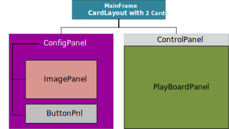
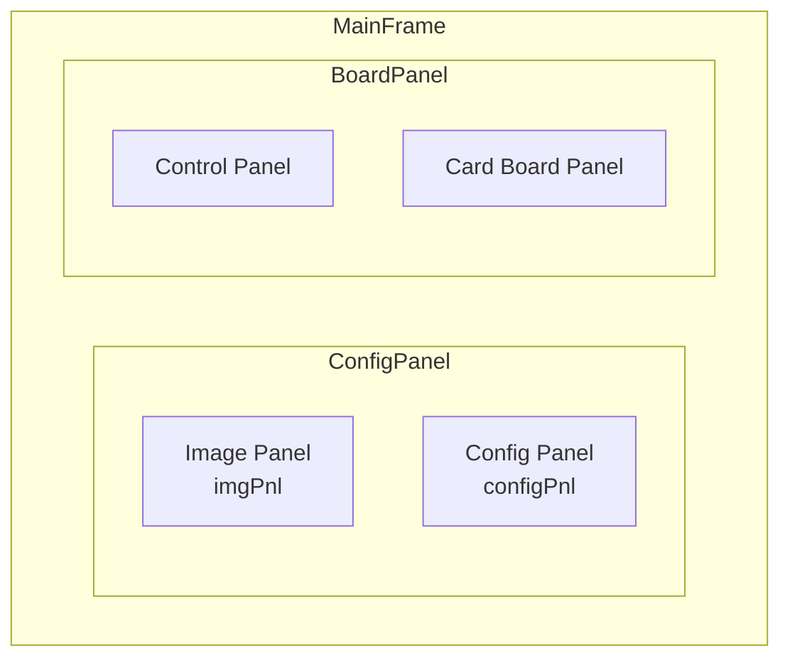

<h1>Blackjack GUI Design</h1>

## Panel Design

```mermaid
graph TB

C[Image Panel<br>imgPnl]
D[Config Panel<br>configPnl]
E[Control Panel]
F[Card Board Panel]


subgraph ConfigPanel
    C
    D
end

subgraph BoardPanel
    E
    F
end

subgraph MainFrame
    subgraph ConfigPanel
        C
        D
    end
    subgraph BoardPanel
        E
        F
    end
end
```

```mermaid
graph TB
A[Configure Window<br>ConfigPanel.java]
B[Play Board Window<br>BoardPanel.java]

```
