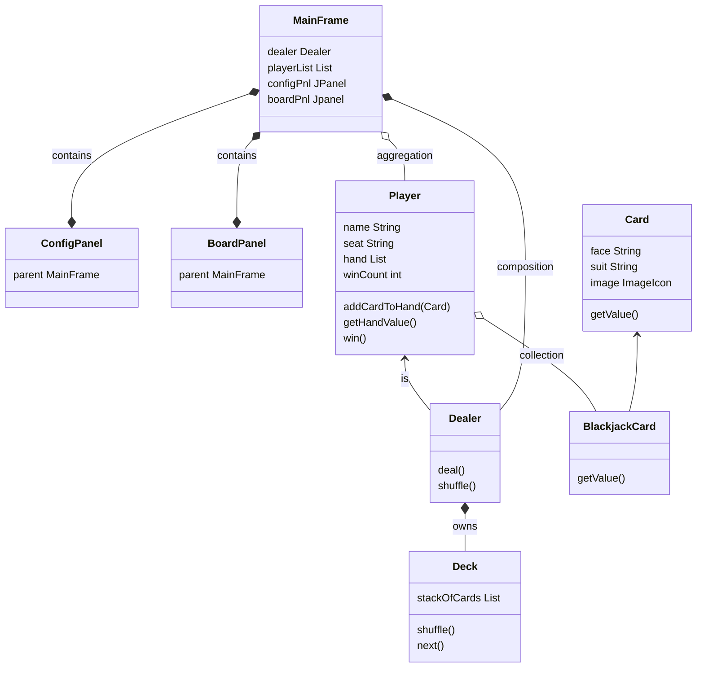
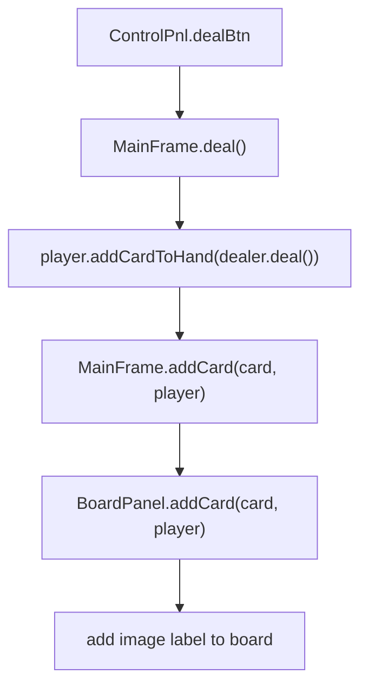

<h1>Blackjack Card Game Specification and Design</h1>


## File Structure

```output
blackjack/ (project)
    ├── 📝doc/
    |    ├── mistakes.md 
    |    └── ReadMe.md 
    ├── 🔥src/
    |       └── blackjack/ (package)
    |              ├── Blackjack.java (start up class) 
    |              └── MainFrame.java
```
## Start up

1. Create **blackjack** java project
2. create doc folder in the project
3. create **ReadMe.md** in doc folder
4. Create package **blackjack** under src
5. create **resources** folder, load all images to that folder
6. Create MainFrame and Blackjack.java (game start up class)

Click to see source code: [Start up java class](../src/blackjack/Blackjack.java)

display the main window with title, fixed size, and close to terminate the app.

```java
// MainFrame.java
public class MainFrame extends JFrame {

	private static final long serialVersionUID = 1L;

	MainFrame(){ // default scope modifier (public, protected, private, default)
		this.setSize(1024, 728);
		this.setDefaultCloseOperation(JFrame.EXIT_ON_CLOSE);
		this.setTitle("Blackjack Card Game");
		this.setResizable(false);
	}
}
```


1. CardLayout
2. Bi-direction connection

## Object Relationship



## Copy all class files
1. Card.java
2. BlackjackCard.java
3. Player.java
4. Dealer.java

## Display player names
1. set the panel layout to be null (because we want put our GUI components on certain location);
2. set label location by setLocation() function;
3. set label size by setSize() function.

```java
	this.setLayout(null);
... ...
	String name = player.getName();
	JLabel lbl = new JLabel(name);
	lbl.setLocation(player.getX()-50, player.getY());
	lbl.setSize(50, 30);
	add(lbl);
```

📌❗️ **Knowlodge Base**

All 3 steps are very important, missing one of them, the label will not displayed.

## Display cards on board
1. load card image (from OOP, Card class should know which image should be loaded and load the image)
2. create JLable with image
3. setLayout(null);setLocation();setSize();

```java
	public Card(String face, String suit) {
		this.face = face;
		this.suit = suit;
		String imageFileName = "resources/".concat(suit).concat(face).concat(".gif");
		URL url = getClass().getClassLoader().getResource(imageFileName);
		image = new ImageIcon(url);
	}
...

	JLabel cardLbl = new JLabel(diamondK.getImage());
	cardLbl.setLocation(player.getX(), player.getY());
	cardLbl.setSize(Card.IMAGE_WIDTH, Card.IMAGE_HEIGHT);
	add(cardLbl);
```

## Change background
* use paint() function
1. set color; (predefined, or new Color(RGB))
2. fill rectangle;

```java
		g.setColor(new Color(103, 139, 74));
		g.fillRect(0, 0, MainFrame.WIDTH, MainFrame.HEIGHT);
```

* use JPanel
call setBackground() function
```java
	BoardPanel(MainFrame parent, List<Player> playerList) {
		this.parent = parent;
		this.playerList = playerList;
		this.setLayout(null);
		this.setBackground(BLUE); // set default background
```

📌❗️ **Knowlodge Base**

Clean up the area before your drawing, or something strange will be painted.

```java
g.clearRect(0, 0, MainFrame.WIDTH, MainFrame.HEIGHT);
```

## Add title
1. set color; (need use different color from background)
2. set Font;
3. draw String;

```java
		g.setColor(new Color(110, 15, 135));
		g.setFont(new Font(Font.SERIF, Font.BOLD, 48));
		g.drawString("Welcome to Our Blackjack Game!", 160, 70);
```

## Add buttons on first screen
1. add GridBagLayout for 3 buttons;
2. change background color for Start button.

```java
		JPanel configPnl = new JPanel();
		configPnl.setLayout(new GridBagLayout());
		GridBagConstraints gbc = new GridBagConstraints();
... ...
		gbc.gridx = 1;
		gbc.gridy = 2;
		gbc.gridwidth =2;
		gbc.fill = GridBagConstraints.HORIZONTAL;
		configPnl.add(switchBtn, gbc);
```

## Add padding between components

1. add empty JLabel (not so good)
2. configure Border Layout (only add padding between components)

```java
		this.setLayout(new BorderLayout(0, 20)); // (horizontal, vertical)
```
3. use empty Border

```java
		configPnl.setBorder(BorderFactory.createEmptyBorder(20, 0, 20, 0));
```

🔑❗️ **Knowlodge Base**

1. the Border in Java Swing is a interface, you have to use BorderFactory to create it.
2. by using BorderFactory you can create many different kind of border.


## Change background color on Play Board

1. Create predefined color set in BoardPanel;
2. call MainFrame.setBoardBackground(Color);
* use JPanel
call setBackground() function
```java
	BoardPanel(MainFrame parent, List<Player> playerList) {
		this.parent = parent;
		this.playerList = playerList;
		this.setLayout(null);
		this.setBackground(BLUE); // set default background
```
3. get player's input for the background color. (Dialog, JOptionPane)

😢❌ Problem: it is hard for player to figure out the color displayed on the list📌❗️

## Set player's seat

🔑❗️ **Knowlodge Base**

setSize() and setPreferredSize() won't work if you put the button in BorderLayout.
in orderder to make proper size, you need create another embedded panel.

```java
		JPanel buttonPnl = new JPanel();
		JButton setPlayerNameBtn = new JButton("Set Player Name");
//		setPlayerNameBtn.setSize(110, 25);
//		setPlayerNameBtn.setPreferredSize(new Dimension(110, 25)); no working
		buttonPnl.add(setPlayerNameBtn);
		add(buttonPnl, BorderLayout.SOUTH);
```

* add ActionListener() to the setPlayerNameBtn;
* add a Hashtable() which hold name label for player's name
* add setPlayerName(name, seat) > get the JLabel from hashtable and change the label text

🔑❗️ **Knowlodge Base**

we do not do repaint(), it is because we change the text on JLabel.

## Deal 2 cards to each player




```output
blackjack/ (project)
    ├── 📝doc/
    |    ├── mistakes.md 
    |    └── ReadMe.md 
    └── 🔥src/
            ├── blackjack/ (package)
    		|      ├── Blackjack.java (start up class) 
    		|      ├── MainFrame.java (Main Frame include two other panels)
    		|      ├── ConfigPanel.java (start up game main window) 
    		|      ├── BoardPanel.java (play board panel) 
    		|      ├── ControlPanel.java (button panel ) 
    		|      ├── ConfigPlayerDialog.java (assign seat to player) 
    		|      ├── Card.java (generic card class) 
    		|      ├── BlackjackCard.java (Blackjack card class) 
    		|      ├── Player.java (player class) 
    		|      ├── Dealer.java (dealer class) 
    		|      ├── Deck.java (Deck class) 
    		|      └── Position.java (card location coordinate class) 
    	    └── resources/ (images)
    		       ├── animation.gif (start up image) 
    		       ├── backR.gif (card facedown image) 
    		       ├── clubA.gif (card image) 
    		       ....gif (card image) 
    		       ├── clubK.gif (card image) 
    		       ....gif (card image) 
    		       └── heartK.gif (card image) 
```
❌ **Mistake:**: new card is put under the old one
✔️ **Solution:**: when add the new card, using index=0

[BoardPanel.addCard()](../src/blackjack/BoardPanel.java)

```java
	public void addCard(Card card, Player player) {
		ImageIcon image = card.getImage();
		JLabel imageLbl = new JLabel(image);
		imageLbl.setLocation(player.getX(), player.getY());
		imageLbl.setSize(125, 170);
		add(imageLbl, 0); // new card will be on top of old one.
		if(player.name.equals("Dealer") && player.hand.size()==2) { // cover second card
			facedownLbl.setLocation(player.getX(), player.getY());
			facedownLbl.setSize(125, 170);
			add(facedownLbl,0);
			parent.disableDealBtn();
			parent.enableHitBtn();
			parent.enablePassBtn();
		}
		repaint();
	}
```

1. get image from Card object;
2. create a JLabel by the image;
3. set the lable location;
4. set the lable size;
5. add the lable to the panel by index=0;

## hit and pass
* MainFrame.hit()
* MainFrame.pass()

## handle dealer's hand
* MainFrame.pass()
  while hand value <17, get more cards.

## disable and enable buttons properly
* MainFrame.enable...()
* MainFrame.diable...()
  
## calculate result
* MainFrame.updateResult()
  
## add result to BoardPanel
* BoardPanel.buildResultPanel()
  
1. create a titled panel (BorderFactory)
2. put the panel on frame
   a. create a grid layout panel;
   b. set the panel location;
   c. set the panel size;
   d. add the panel to the frame;

## clear all cards(player's hand, and display)
* MainFrame.clearCards()
* BoardPanel.clearCards()

1. clear cards on screen;
2. disable clear button;
3. enable deal button;
4. clear each player's hand;
5. set first player (EAST) to ControlPanle.

## create MyColor class
for display predefined colors by name (override toString())

## deploy the application

* build a jar file which is nothing but a zip file.
* use build.xml
  1. init
  2. compile
  3. dist

## documentation
1. player's guide
2. GUI design document
3. development notes
4. improvement in the future.
5. java doc (for contributors or developer)