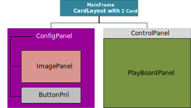
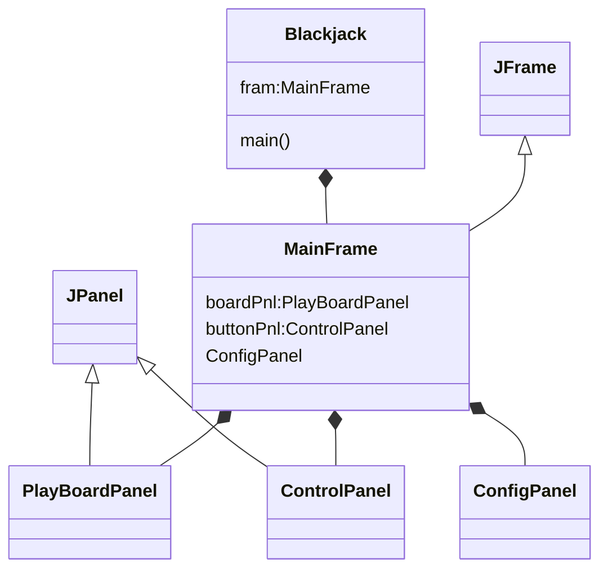

<h1>Blackjack Game GUI Design</h1>

## Panel Design

## Class Diagram

## Objects Design Details
1. Each Card object contains the card image, should be able to load image once the Card object is created;
2. CardLayout is set to MainFrame which has 2 panels, one is ConfigPanel, another is game board panel;
3. These 2 panels can be switched by **Start** button on ConfigPanel, and **Configure** button on ControlPanel;
4. The ControlPanel is used to control the game, such as deal cards, let player hit or pass, and more...;
5. PlayBoardPanel is used to display all cards in each player's hand, and game result;
6. To display cards on PlayBoardPanel, JLabel with card image is used on specific location of the board panel;
7. Player and MainFrame have bi-direction connection, so that player can add his/her card image to the board;
8. PlayBoardPanel and MainFrame have bi-direction connection, so that the board panel can receive commands from MainFrame;
9. ControlPanel and MainFrame have bi-direction connection, so that the control commands can be passed to MainFrame.