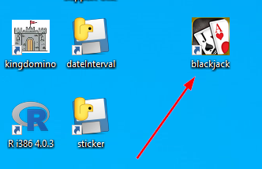
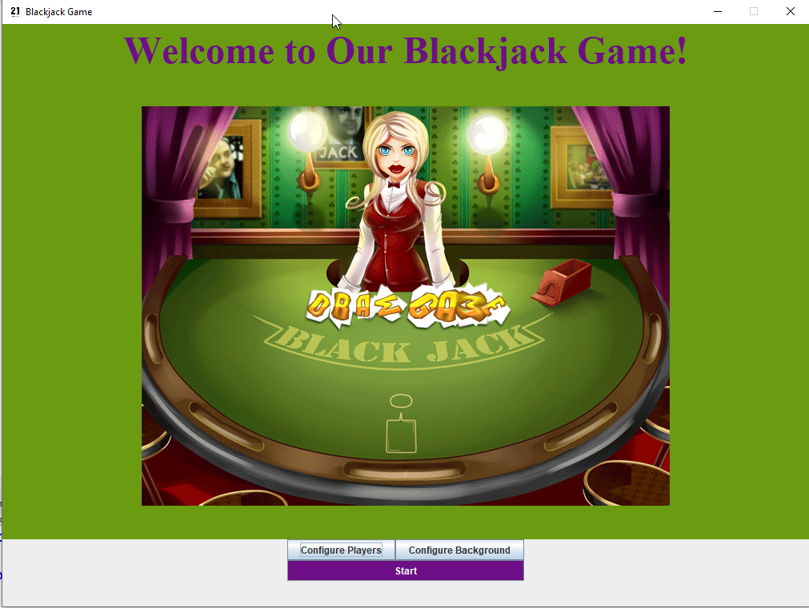
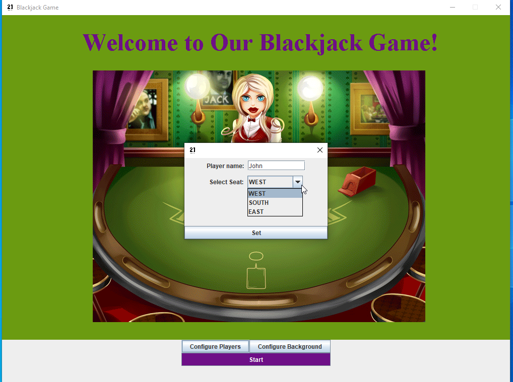
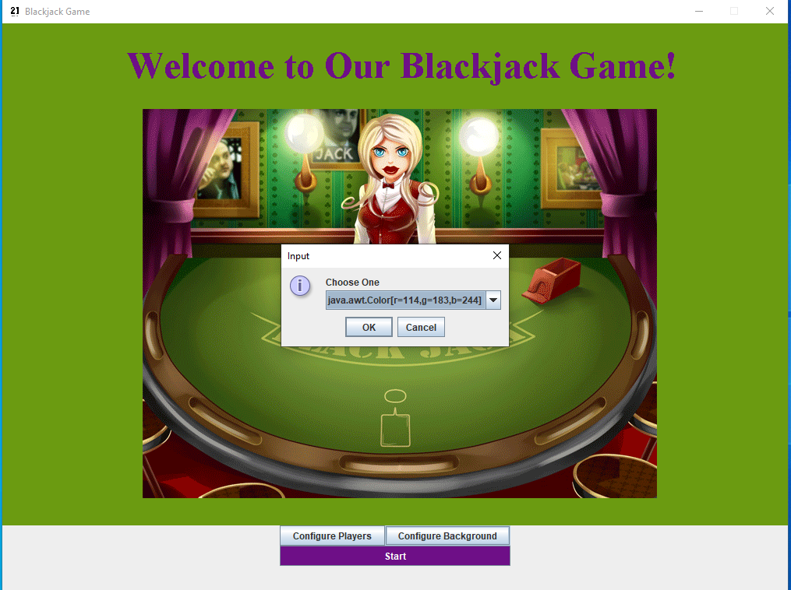
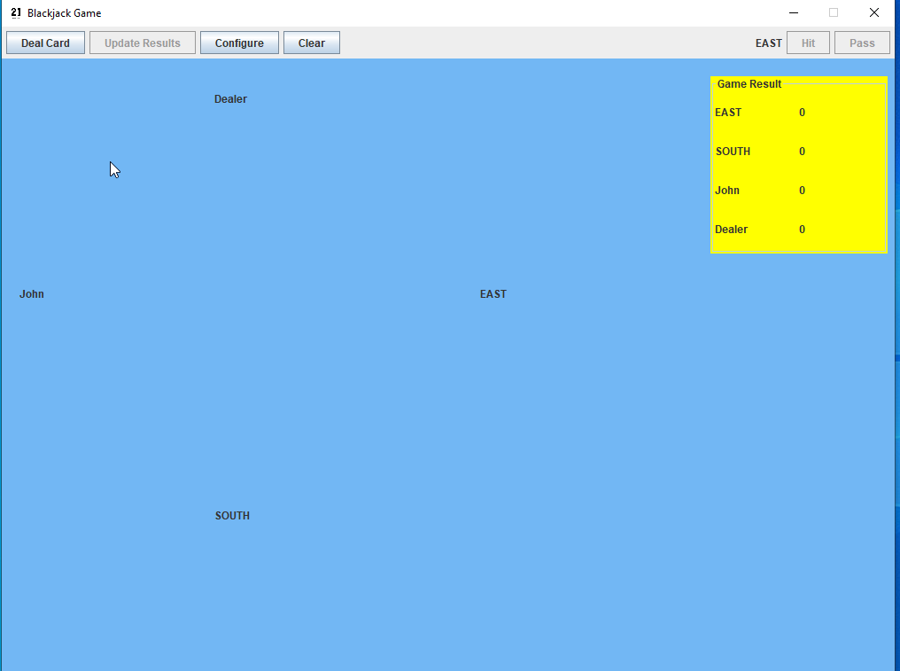
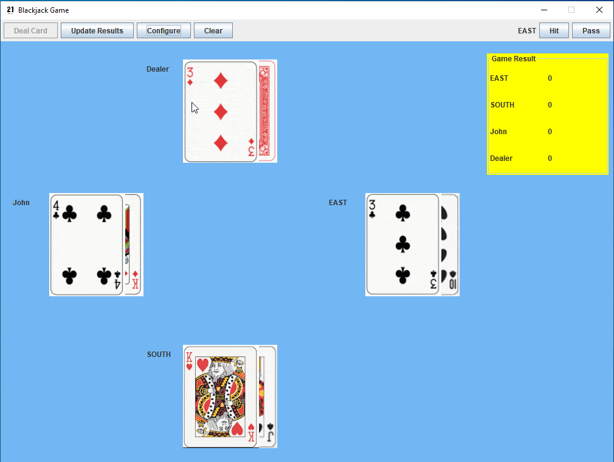
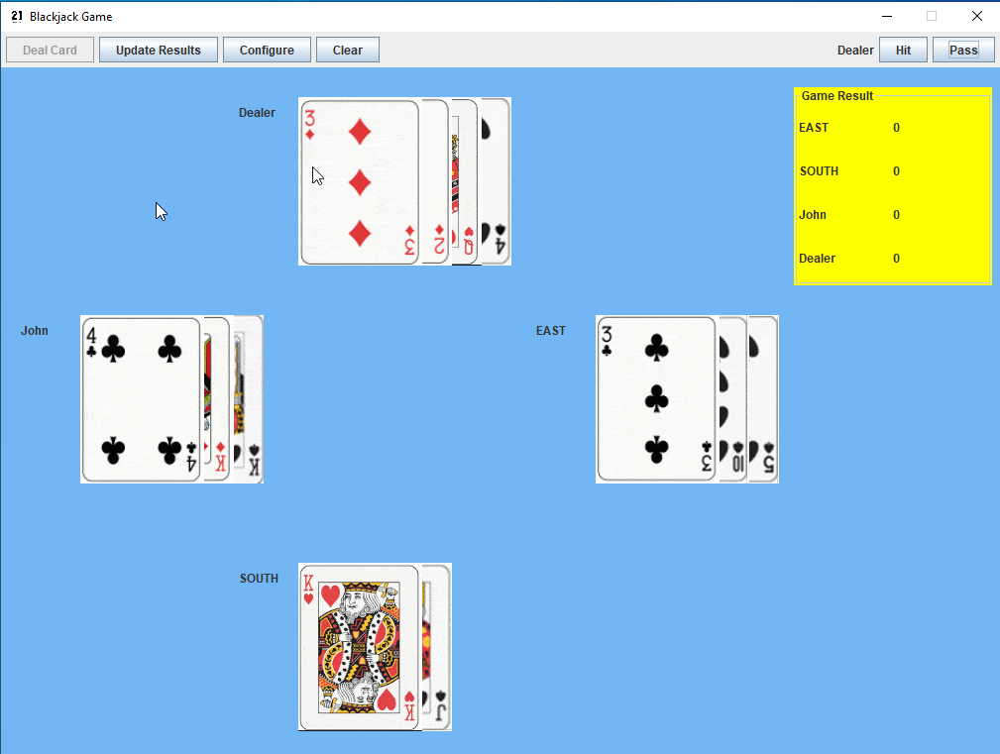
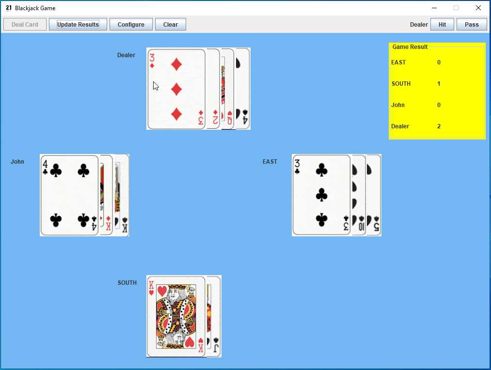

<h1>Blackjack Card Game Player's Guide</h1>

## Start the Game
* Double click the icon on desktop

* the startup window will be shown as below

## Configure Game
1. configure player 
to configure player, click **Configure Players** button on the startup window, a popup dialog will be shown on the center location, enter player's name and select seat from dropdown list, click set button on the bottom of the popup window. There are 3 seats available for player to choose. By default, the application will assign player's name to "WEST", "SOUTH", and "EAST" respectively.

2. configure background color
to configure background color, click **Configure Background** button on startup window, there are three pre-defined can be selected.

## Play Game
1. to start game, click **Start** button on startup window, the main play board window will show up;

2. deal 2 cards to each player clockwise by click **Deal Card** button on control panel;

3. Start from east player by click **hit** button or **pass** button. if click hit, additional card will be added to that player till every player include dealer all passed.

4. Click **Update Result** button, the Game Result will be updated in Game Result window on top-right conor;

5. to Start another round, click **Clear** button in control panel. Reapet from step 2 above.
6. to end the game, click x on top-right of the main window.