<h1>Computer Science</h1>

- [Chapter 1](#chapter-1)
- [Chapter 2](#chapter-2)
  - [practice](#practice)
- [Chapter 3](#chapter-3)
  - [Efficiency](#efficiency)
  - [Graph](#graph)
- [Chapter 4](#chapter-4)
  - [binary](#binary)
  - [Fraction Number](#fraction-number)
  - [two's complement representation](#twos-complement-representation)
  - [Sound](#sound)
  - [image](#image)
  - [Practice Problems](#practice-problems)
  - [Not Gate](#not-gate)
  - [Transistor as switch](#transistor-as-switch)
  - [Practice Problems](#practice-problems-1)
  - [sequential circute](#sequential-circute)
  - [SR Latch](#sr-latch)
  - [CE Compare-for-Equality](#ce-compare-for-equality)
  - [Add 2 bits Circuit](#add-2-bits-circuit)
  - [Control Circuits](#control-circuits)
  - [Exercises](#exercises)
  - [Challenge work](#challenge-work)
  - [Transistor Amplifier](#transistor-amplifier)
- [Chapter 5](#chapter-5)
- [References](#references)


## Chapter 1
❓ What is computer science?
>✔️ Design and develop algorithms to solve a range of important problems.

To Solve the problem:
1. understand the problem;
2. find solution;
3. create algorithms
4. select better algorithms
5. check the result.

One word to it: 🔍🔨✔️do it right! (not just read text book)

❓ What is Algorithms?
>✔️procedure for solving a mathematical problems in a finite number of steps that frequently involves repetition of an operation; broadly: a step-by-step methodfor accomplishing some task.

❓ Algorithms operations?
>1. Sequential operations (PC: Program Counter)
>2. Conditional operations (Logical comparison => PC adjust)
>3. Iteration operations (Jump back to DPTR)

* [Page 9:Add 2 numbers](../../cs/src/chapter1/AddTwoWithCarry.java)

## Chapter 2
❓ What is Pseudocode?
> ✔️Pseudocode is a set of English-language constructs designed to more or less resemble statements in a programming language but do not actually run on a computer. It represent algorithms. (Page 47, 59)
> 1. Computation; (Set value)
> 2. Input/Output; (Get value, print value)
> 3. Conditional; (If-Else)
> 4. Iterative. (While-do-Step)

* [Add two number](../src/chapter2/Add2Numbers.java)
* [Squential Search](../src/chapter2/SquentialSearch.java)
* [Find largest](../src/chapter2/FindLargest.java)
* [Meeting your match](../src/chapter2/PatternMatching.java)
* [Problem 1](../src/chapter2/Problem1.java)
* [Challenge 1: Python plot ](../python/findRoot.py)
* [Challenge 1: FindRoot](../src/chapter2/Challenge1.java)

### practice
1. write pseudocodev from above sample code;
2. write java program from given pseudocode;


## Chapter 3
❓ What are the attributes of algorithms?
> 1. existence
> 2. correctness
> 3. practical
> 4. efficiency

### Efficiency
❓ What is Order of Magnitude?
>✔️ We will classify algorithms according to the order of magnitude of their time efficiency.

1. Anything that varies as a constant times n (and whose graph follows the basic shape of n) is said to be of order of magnitude n, written $Θ(n)$ and pronounced “order n.”
2. there are best-case, worst-case, and average.
3. As we have seen, if an $Θ(n^2)$ algorithm and an $Θ(n)$ algorithm exist for the same task, then for large enough n, the $Θ(n^2)$ algorithm does more work and takes longer to execute, regardless of the constant factors for peripheral work. This is the rationale for ignoring constant factors and concentTat'int on the basic order of magnitude of algorithms

* [Find Prime](../src/chapter3/Prime01.java)
  
* [Sequential Search](../src/chapter3/SequentialSearch.java)


* [Selection Sort](../src/chapter3/SelectionSort.java)


* [Practice Problem](../python/algorithmOrder.py)
* [Data Cleanup-Shuffle left](../src/chapter3/ShuffleLeft.java)
* [Data Cleanup-Copy over](../src/chapter3/CopyOver.java)
* [Converging Pointers](../src/chapter3/ConvergingPointers.java)

* [Binary Search](../src/chapter3/BinarySearch.java)


* [Problem 1](../src/chapter3/ShuffleLeft.java)
* [Problem 2](../src/chapter3/CopyOver.java)
* [Problem 3](../src/chapter3/ConvergingPointers.java)
* [Pattern Matching](../src/chapter3/PatternMatching.java)

* [quick sort](../src/chapter3/QuickSort.java)


* [Insertion Sort](../src/chapter3/InsertionSort.java)

 
* [Merge Sort](../src/chapter3/MergeSort.java)


### Graph
❓ What is graph?
>✔️A collection of nodes and connecting edges is called a graph.

❓ What is Hamiltonian circut?
>✔️A path through a graph that begins and ends at the same node and goes through all other nodes exactly once is called a Hamiltonian circuit. (page 113)

* [Find Graph](../src/chapter3/HamiltonianCycle.java)
* [Practice Problem 1]

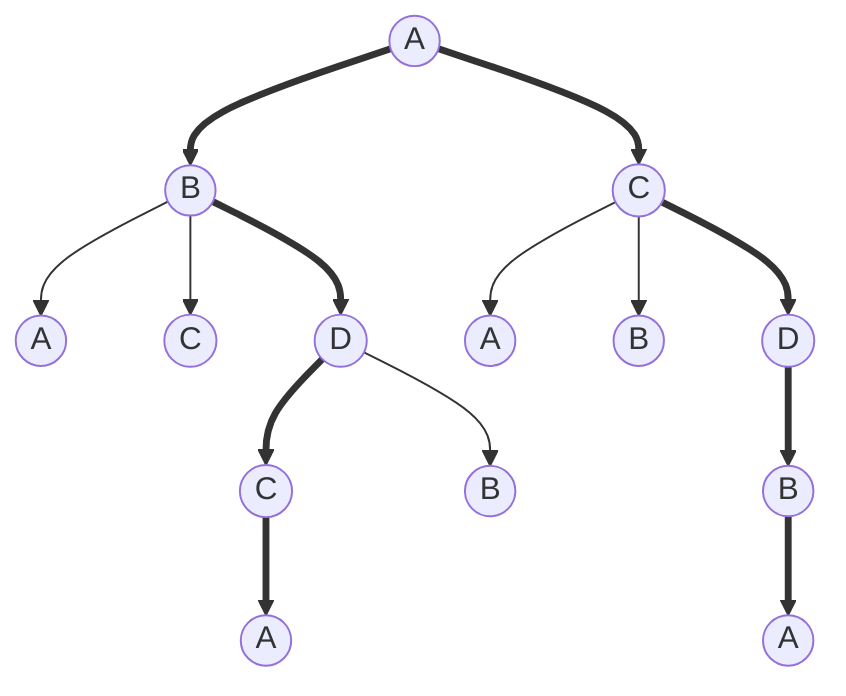

## Chapter 4

### binary

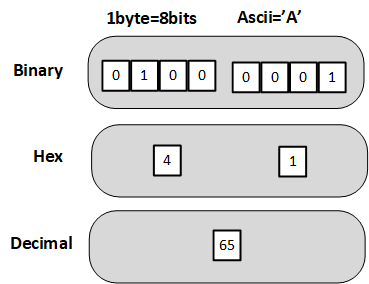

❓ Why use Binary?
>✔️ Reliability. (Electric hardware bistable environment)

Binary Storage
1. 0 or 1
2. no change by accident
3. easy read
4. easy to change

### Fraction Number

### two's complement representation
* [See bitwise operators](../../basics/src/languagebasics/operators/Operators.java)

### Sound
* [Shoot](python/whiff.wav)
* [云雀](python/yunque.mp3)

### image

* [Fist-Chimp](python/FistRolloverChimp.py)
* [image modify](python/changeImage.py) RGBA

Amazon Search：8051 microcontroller $19

* [89C58](https://www.aliexpress.us/item/3256803636278219.html?gatewayAdapt=glo2usa4itemAdapt&_randl_shipto=US)


* [51系列汇编指令手册-122页，](STC89C52.pdf)

```asm
    ADD A,R2  ;2A
```


* Keil μVision Demo

### Practice Problems
4.1 3 min=180 sec. if 256 kbps(kilo-bytes per second) ⟶ 180*256 = 46080 KB= 46080*1024*8 bits = 377487360 bits.


### Not Gate
* Ohm's Law


* [Ohm's Law calculator](../src/chapter4/OhmsLaw.java)
  
### Transistor as switch


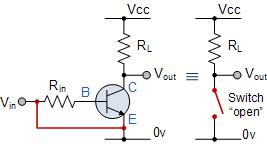


❓ What are the differences between PNP and NPN transistor?
> 1. While both have the ability to amplify signals or even act to switch larger currents on and off, they accomplish this signal boosting ability in different ways.
> 2. From a practical standpoint, NPN transistors (sometimes called "sinking sensors") amplify a positive signal applied to the base by allowing a larger current to flow from the collector to emitter pins of the device, proportional to the base voltage. This proportional current flow occurs in an active range, but below a certain cutoff voltage no current flows. Above a certain point a transistor reaches saturation, allowing electrons to flow freely.
> 3. While PNP and NPN sensors do the same basic job, you might wonder why one would be used over another. There are, in fact, some differences, and in most circuit design applications NPN transistors are preferred. This is due to the fact that the “N” substrate can transfer electrons significantly faster than “P” type substrates can transport positive electron holes. This presents a huge advantage in high-speed switching and amplifier circuits applications. Adding on to this advantage is the fact that NPN transistors are also easier, and thus cheaper, to manufacture than PNP transistors.

* [transistor as switch](https://www.electronics-tutorials.ws/transistor/tran_4.html)

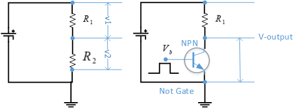

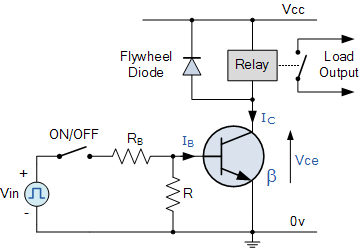
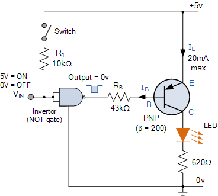

💡👉Understand Circuit Design

Output 1:
case1: $\bar a\cdot  b \cdot \bar c$
case2: $a\cdot  b \cdot \bar c$
combination use OR gate: $O_1=(\bar a\cdot  b \cdot \bar c) + (a\cdot  b \cdot \bar c)$


Output 2:
case1: $\bar b \cdot \bar c$
case2: $b \cdot \bar c$
case3: $b \cdot c$
combination use OR gate: $O_2=(\bar b \cdot \bar c) + (b \cdot \bar c) + (b \cdot c)$


### Practice Problems

2. $output=(\bar a \cdot \bar b) + (\bar a \cdot b) + (a \cdot \bar b) + \overline {(a \cdot b)}$


### sequential circute
Page 194
* [Sequential Circuits YouTube](https://www.youtube.com/watch?v=fLN1YOmuAr8)

a: control bit;
b: data bit;
when a=0; b==>c
when a=1; b==>d

a|b|c
|---|---|---|
0|0|0
0|1|1 
1|0|1
1|1|1

a|b|d
|---|---|---|
0|0|1
0|1|1
1|0|0
1|1|1 

a|b|c|d
|---|---|---|---|
1|0|1|0
1|1|1|1
0|0|0|1
0|1|1|1

$c = (a+b)$
$d = \overline {(a+b) \cdot \bar b}$

* Output depends on the present inputs and past inputs/outputs

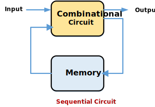
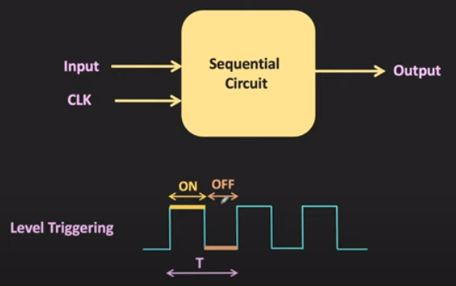

a=0 ⟶ b==>c
a=1 ⟶ b==>d

a makes b goes to different output.

### SR Latch

s|r|q|$\bar q$
|---|---|---|---|
0|0|1|0
|||0|1
0|1|0|1
1|0|1|0
1|1|0|0 invalid|

r:restore, s:set, Q: queue

### CE Compare-for-Equality

a|b|output
---|---|---|
0|0|1
0|1|0
1|0|0
1|1|1

### Add 2 bits Circuit
1-bit add: sum,carry = a + b + c, where c: carry
$s=(\bar a\cdot \bar b \cdot c) + (\bar a\cdot  b \cdot \bar c) + (a\cdot \bar b \cdot c) + (a\cdot  b \cdot c)$
$c=(\bar a\cdot b \cdot c) + (a\cdot \bar b \cdot c) + (a\cdot b \cdot \bar c) + (a\cdot  b \cdot c)$

❓ How many transistors needed for NOT-Gate, AND-Gate, and OR-Gate?
>✔️

❓ How OR-Gate builds up? explain why?
>✔️

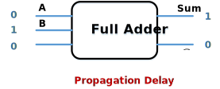

### Control Circuits

1. Multicomplexers
  * $2^n$ input with n selector, and 1 output, the output value will depends on selected input.
  * address(selector):input(select certain register)⟶output(will be selected register value) 
  
Sample of $2^1$/1==>1

a|b|s|output
|---|---|---|---|
0||0|0
1||0|1
||1|1|1
||0|1|0

$output=(a\cdot \bar s) + (b \cdot s)$

1. Decoders
  * n input and $2^n$ output;
  * based on input code, determine what circuit to start.

Sample 2⟶$2^2=4$
a|b|o0|
|---|---|---|
0|0|1

a|b|o1|
|---|---|---|
0|1|1

a|b|o2|
|---|---|---|
1|0|1

a|b|o3|
|---|---|---|
1|1|1

$O_0=(\bar a \cdot \bar b)$
$O_1=(\bar a \cdot b)$
$O_2=(a \cdot \bar b)$
$O_3=(a \cdot b)$

### Exercises
6. a) 71=0x47=0b0010_0111; 
   b) 1 = 0b0000_0001, 1+-1=0, -1 = 0b1111_1111; 
      -1 = 0b1 0000001 (sign/magnitude format)
   c) -81 = 0x51 = 0b0101_0001, -81=0b1010_1111;
      -81 = 0b1 1010001 (sign/magnitude format)
10. Assume that our computer stores decimal numbers using 16 bits—10 bits for a sign/magnitude mantissa and 6 bits for a sign/ the same representation shown on page 1 62) Show the internal representation of the followingdecimal quantities.  
    a) 7.5 = 0b0 111100000_0 00011 (float point)
    b) -20.25 = 0b1 101000100_0 00101
    c) -1/64 = 0b1100000000_100101

### Challenge work
1. $sum=(\bar a \cdot \bar b \cdot c) + (\bar a \cdot b \cdot \bar c) + (a \cdot \bar b \cdot \bar c) + (a \cdot b \cdot c) = \bar a \cdot [(\bar b \cdot c)+(b \cdot \bar c)] + a \cdot [(\bar b \cdot \bar c) + (b \cdot c)]$

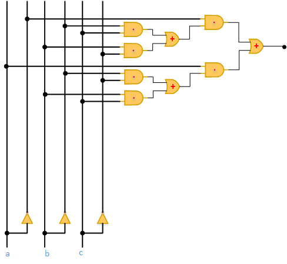

### Transistor Amplifier

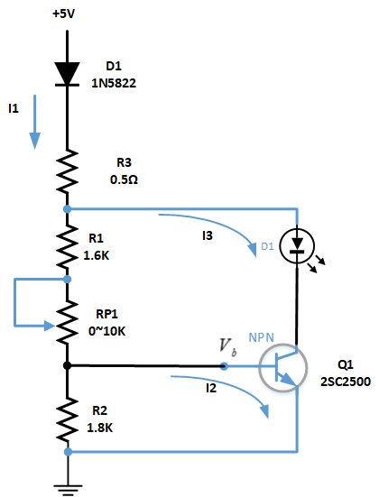
* [transistor amplifier plot](python/transistor.py)
$I_2 = I_{R_1}-I_{R_2}=\frac {V_a-V_b} {R_1} - \frac {V_c} {R_2}$
$I_3=I_1-\frac {V_a-V_b} {R_1}$
$\beta = \frac {I_3} {I_2}$

## Chapter 5

❓ What is memory?
>✔️memory is the functional unit of a computer that stores and retrieves instructions and data.  
1. cells and address;
2. cell is minimum unit of access;
3. same access time for all cells.

❓ What are difference between RAM and ROM, EROM?
>✔️RAM: random access memory; ROM: read only memory; EROM: erasable read only memory.

use multiple memory cells (byte) to store single data value.

❓ difference between an address and the contents of that address?
>✔️

❓ nondestructive fatch?
>✔️
1. fatch
2. store


## References
* [👍😄transistor as switch](https://www.electronics-tutorials.ws/transistor/tran_4.html)
* [👍😄SR Latch](https://www.youtube.com/watch?v=-aQH0ybMd3U&list=PLTd6ceoshpreKyY55hA4vpzAUv9hSut1H)
* [Digital Electronics serise](https://www.youtube.com/watch?v=DBTna2ydmC0&list=PLwjK_iyK4LLBC_so3odA64E2MLgIRKafl)

* [Chapter 4 Practice Problems](https://www.chegg.com/homework-help/questions-and-answers/practice-problems-1-using-mp3-many-bits-required-store-3-minute-song-uncompressed-format-i-q34574883)

* [👍😄Keil tutorial for Beginners](https://www.youtube.com/watch?v=oBvP_Lxoqxo)
* [👍😄Embedded Systems - Registers](https://www.tutorialspoint.com/embedded_systems/es_registers.htm)

* [SDCC Compiler for 8051](https://www.youtube.com/watch?v=JJcnARsFnsE)
* [SDCC Info](https://sdcc.sourceforge.net/)
* [SDCC Download](https://sourceforge.net/projects/sdcc/files/)
* [installation file name](sdcc-4.2.0-x64-setup.exe)
* [Programer's notepad](https://www.pnotepad.org/download/)
* [](https://www.youtube.com/watch?v=CGTQ6JrDZ3Q)

Rn: register
A: Accumulator
B: register
PC: Program Counter
DPTR: Data Pointer
SP: Stack Pointer
ALU: Arithmetic/Logic Unit
RAM: Random Access Memory
CELL: Minimum unit of access

