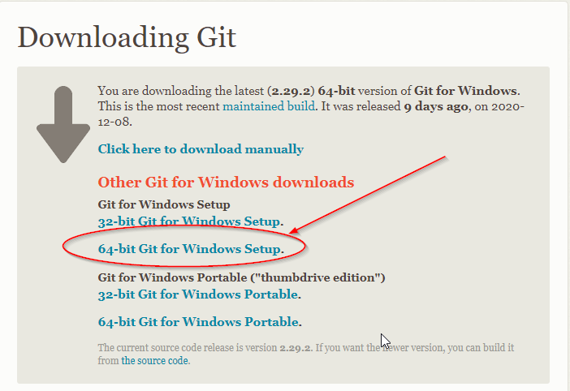

# 华夏中文学校 Java level-I

## Table of Contents
1. [Familiar with your keyboard](#Familiar-with-your-keyboard)
1. [Getting Started](#Getting-Started)
1. [Using Markdown](#Using-Markdown)
1. [Basic Git Command](#Basic-Git-Command)
1. [How to turn in the homework](#How-to-turn-in-the-homework)
1. [Learn from mistake](#Learn-from-mistake)
1. [open Eclipse](#open-Eclipse)
1. [Print String](#Print-String)
1. [Syntax basic](#Syntax-Basic)
1. [Data type](#Data-type)
1. [Operator](#Operator)
1. [Loop](#Loop)
1. [if-else](#if-else)
1. [Switch](#Switch)
1. [Array](#Array)
1. [Array List](#Array-List)
1. [Simple Math](#Simple-Math)
1. [Exception](#Exception)
1. [OOP](#OOP)
1. [File Access](#File-Access)
1. [Data Structure](Data-Structure)
1. [References](#References)
1. [All Topics](#All-topics)
1. [Review](#Review)

## Familiar with your keyboard


1. [Key name web link](https://www.computerhope.com/keys.htm)

1. Keyboard Name in our Java class

    Key | Name
    |---|---|
    space | space, empty space in editor
    Enter | return, enter, new line in editor
    ;  | semicolon, end of line
    {} | curly bracket, class, method, for loop, while loop block
    () | parenthesis, function definition and call
    [] | bracket, square bracket, array item
    ,  | comma, separator of args, and elements; delimiter in csv file
    .  | dot, period, instance function call()
    \* | asterisk, star, bullet point in markdown, math multiply operator
    \- | dash, hyphen, minus math operator, command option java -version
    \  | back slash, escape sequence, \n, \t...
    /  | forward slash, file name path fold dilimiter
    `  | back quote, grave accent, command block in markdown
    \| | pipe, virtical bar, bitwise OR operator
    &  | ampersand, and simple, bitwise AND operator
    ^  | caret, circumflex, bitwise XOR operator
    ?  | question mark, ternary operator
	:  | colon, ternary operator
    _  | underscore
    $  | dollar sign
    \# | pound, hashtag, number
    
```
space
:
ctrl+c
Ctrl+v
ctrl+/
shift+downarrow
tab
shift+tab
Enter(Return)
"
`back quote
upArrow: bring previous command back
downArrow: bring next command back
leftArrow: move cursor to left in DOS window
rightArrow: move cursor to right in DOS window
```
---
[Table of Contents](#Table-of-Contents)

## Getting Started
* Install JDK
	>Google search: jdk 8 download
	Search result: Java SE Development Kit 8 - Downloads - Oracle
	[Java Compiler Download](https://www.oracle.com/java/technologies/javase-downloads.html)

	
	>File: jdk-14.0.1_osx-x64_bin.dmg
* Install Eclipse
	>Google search: eclipse for java
	Search result: Eclipse Downloads | The Eclipse Foundation

	[Eclipse Download](https://www.eclipse.org/downloads/)
	
	>File: eclipse-inst-mac64.dmg

* Install Git
	>Google search: git downloads
	Search result: Git - Downloads 
	[Git Download](https://git-scm.com/downloads)
	
	>File: Git-2.29.2.3-64-bit.exe

For MacOS:
```
brew install git
ls -la /usr/local 
sudo chown -R wangqianjiang:wheel /usr/local
brew link git
```

* installation check

Open Dos Command Window:
```sh
java -version
javac -version
git --version
```
---
[Table of Contents](#Table-of-Contents)

## Using Markdown 
* √ Markdown md文件的制作，制作课堂笔记

    - add Markdown Extension
    - 显示标题，子标题 #, ##
    - 显示 tablet *，1
    - 显示命令行
    - 显示图形
    - 显示链接

**Shapen your knife will not slowdown your work!** 


* [Markdown Cheat Sheet](markdown-cheat-sheet.md)
---
[Table of Contents](#Table-of-Contents)

## Basic Git Command

* Check Git Installation
```
git --version
```
* intruduce git repository basic
```
git init
git --version
git config user.name "<username>"
git config user.email "<useremail>"
git status
git add .
git log --oneline
git branch
git commit -m "initial commit"
git push
```

test some code change

* install EGit (Git for Eclipse)


[EGit website](https://www.eclipse.org/egit/download/)
>help > install new software > 

* Create a GitHub account, try upload some file
[GitHub Website](https://github.com/)

## How to turn in the homework
	[Java-I Homework](https://github.com/jwang1122/java1homework)
* homework demo
	- HomeworkDemo.java
* make git pull for java repository
	- rename /workspace/java > /workspace/myjava
	- git clone https://github.com/jwang1122/java.git
	- help > Eclipse Marketplace > Find:git > Git integration
---
[Table of Contents](#Table-of-Contents)
	
## Syntax basic


* Hello.java; create Java code from new class (key words, modifier, (), {})


Modifier     | Description
|---         |---          |
public       | access modifier, accessible for all classes
protected    | access modifier, accessible in same package and subclasses
private      | access modifier, accessible only in the declared class
[default]    | no modifier, accessible in the same package
final        | on class to make the class cannot be inherited by other class
final        | on attribute and method so then cannot be override or make change
static       | make attribute and method belong to the class, can be accessed directly by using class name.
abstract     | abstract class or abstract method
transient    | attributes and methods are skipped when serializing the object
synchronized | Method can only be accessed by one thread at a time
volatile     | value of an attribute is not cached thrad-locally, and is always read from the "main memory"


* OOP concept > Abstraction (Cup.java; Computer.java)
* System print() (LearnForLoop.java right-angle triangle)
* main method (MainMethodTest.java); String[] args; 

	Run > Run Configurations... > Arguments


command line 

```
$ java com.huaxia.test.MainMethodTest arg1 arg2 arg3 arg4
```
---
[Table of Contents](#Table-of-Contents)

## Print String
* Hello.java; 
* Print.java; Simple math (Homework: )
* Print1.java; print String
* Print2.java; String.format() > java.util.Formatter
* Print3.java; StringBuilder vs. StringBuffer


* PrintTriangle.java; After learn Loop, print Triangle, Diamonds

[String format document](https://docs.oracle.com/javase/8/docs/api/) > String > format(String format, Object... args) > Parameters: format > java.util.Formatter
* StringTest.java; Understand String operations
	- stringLength
	- letterAtIndex
	- upperLowerCase
	- stringEquals

	
	- escapeSquence
	- stringBuilder
	- stringBuilder2stringBuffer
---
[Table of Contents](#Table-of-Contents)

## Loop
* ForLoop1.java; simple for loop
* ForLoop2.java; step by 2
* ForLoop3.java; neigative step
* ForLoop4.java; forEach
* ForLoop5.java; break loop on condition
* ForLoop6.java; continue on condition
* ForLoop7.java; infinite loop, Scanner
* ForLoop12.java; nested for loop, print right triangle
* ForLoopTester.java
	- simpleFor
	- stepBy2
	- stepByNeigative2
	- forEach
	- breakOnCondition
	- continueOnCondition
	- prime
	- findPrimeNumbersBetween(40,50)
	- perfactNumber.java
	- findGCD
	- rollDices
	- infiniteLoop

[Print Homework](printHW.md)

* WhileLoop1.java; 
	- whileTest
	- doWhileTest
	- breakOnCondition
	- continueOnCondition
	- dice (probability)
	- infiniteLoop
* GuessNumber.java;
* RollDice.java; Math.random()
* RollDice2.java; static method
---
[Table of Contents](#Table-of-Contents)

## Simple Math
* SimpleMath.java; add(), sub(), mul(), div(). method overloading
* MathTest.java; built in Math functions
* LCM.java; Least Common Multiple
* GCF.java; Greatest Common Factor
* GCD1.java; Greatest Common Divisor
* GCD1.java; find GCD by while loop
* Prime.java; find prime number by definition
* PerfactNumber.java; find perfact number
* Fraction.java; Fraction math: add, sub, multiply and divide


---
[Table of Contents](#Table-of-Contents)

## Array
* ArrayTest.java
	- intArrayTest()
	- elementTest()
	- forEachTest()
	- changeIndividualElement()
	- arraycopyTest()
	- objectArrayTest() (fix compiler error on line-77)
	- multidimensionalArrayTest()
---
[Table of Contents](#Table-of-Contents)

## Array List
* ArrayListTest.java
	- review create string array
	- createIntegerArrayList (difference between array and ArrayList)
	- api doc > ArrayList, Arrays
	- array to ArrayList
	- creatObjectArrayList
	- practice
		- create float ArrayList display under certain condition
		- create a student list, write it to a file use forEach loop
---
[Table of Contents](#Table-of-Contents)

## Switch	
* SwitchTest.java
	- weekdayConverter
	- day2word
	- number2Weekday
---
[Table of Contents](#Table-of-Contents)

## Data Structure
* QueueTest.java
* StackTest.java
* binary search

	
* sort (sortTest.java)
---
[Table of Contents](#Table-of-Contents)


## Exception
* Understand Exception Hierarchy
	- uncheckedArrayUsage
	- tryCatchTest() > add try-catch
	- area(1.0f)
	- area(-2.0f)
	- add throw new Exception
	- practice: rectangleArea() throw Exception test.
---
[Table of Contents](#Table-of-Contents)

## OOP
* Object Oriented Programming concept

	

	

* Abstraction
	Cup.java
* Inheritance
	SuperClass1.java
	SubClass1.java
* Encapsulation
* Polymophism
	what's your name?
	Student
	Teacher
	Employee
	Manager
* Interface (variable, method signature)
* Abstract class (abstract method, concrete method)
* Class
* Constructor
	Computer.java(String brand, int battery)
* Getter/Setter
	- right-click > source > generate constructor using fields
	- right-click > source > generate getters and setters
* Method overloading (add(int, int), add(float, float))
* Method overriding (Card.java, Blackcard.java, getValue())
* Super class/sub class (protected vs. package default)
* toString() method
* Card.java; basic card class


* BlackjackCard.java; sub card class
Why Java always start from class? Java is oop.

What is OOP? Abstraction, inheritence, encapsulation, polymophism


* Abstraction
You have beening doing it every day since you were 3 years old. You never see dog, you always see individual a dog.

Same thing in our class, we abstract Cup from one real cup to our class cup.
```
workspace: /workspace/java
project: blackjack
package: com.huaxia.blackjack
refer Cup.java
```
Perspective windows
1. Package Explore 
2. Navigator (Package==file folder)

Create new project ==> huaxia

create new package ==> com.huaxia.playground

drag the cup to that folder

create toString() method for Cup

3. what we used in Cup.java
package : file folder
class : abstraction, design, type
public : can be used in everywhere
float : decimal number
static : Class level attribute or function, can be used by class name

String: Java build in class
System.out.println(): Java build in function
public function => return type, name, parameters signature(finger print)
overloading (overriding)

cast
filled = 0.8f;
field = (float)0.8;

play around with main:
change signature, 
remove 

public String toString()

change float to int

add constructor
---
[Table of Contents](#Table-of-Contents)

## File Access
* FileTest.java
	- readFileTest (create class, read a file, print content to console)
	- writeFileTest
	- appendToFileTest (api doc > FileWriter) (write "Hello world" to a file)
* Write_CSV_File.java
* Read_CSV_File.java
* GsonExample1.java; write Staff object to json file staff.json
* GsonExample2.java; read staff.json to build Staff object

* Review
	- search Scanner, Break, Continue
	- read content from a file, parse each line to a world, display on console
	- write hello world to a file
	- get user name from console, write hello and his name to a file
	- write even number between 0 to 20 to file
	- write odd number between 10 to 30 to a file
	- append integer 1 to 10 to a existing file
	- create a string array, write each element to a file
	- create a string array with names, write only name < your name to a file
	- read content from a file, parse each line to a world, write to another file
---
[Table of Contents](#Table-of-Contents)

## All topics
* Hello World! (HelloWorld.java)
* OOP concept > Abstraction (Cup.java; Computer.java)
* System print() (LearnForLoop.java right-angle triangle)
* main method (MainMethodTest.java)
* Generate JavaDoc
* Package perspective, Navigator window, Console Window, Outline
* Data type (DataType.java)
* Array Test (ArrayTest.java)
* String Test (StringTest.java)
* Operator (OperatorTest.java)
* Scanner (ScannerTest.java)
* For-loop (ForLoopTest.java)
* Function (over loadding, overriding)
* File (FileTest.java)
* While-loop (WhileLoopTester.java)
* ArrayList (ArrayListTest.java)
* GuessNumber.java (while loop, if-else, scanner)
* Switch (SwitchTet.java)
* Card.java
* CollectionsTest.java
* create HelloWorld.java
* Use scanner ask user name, and then say hello to him~~
* create any class you can think of~~
* how to find println document in java api doc

[Java API Document](https://docs.oracle.com/javase/8/docs/api/)
* Use Scanner ask user name, and save the hello to him in file
* create a Card class with face and suit fields(Card.java)
* create simple math functions add, sub, mul, div
* create array hold 52 cards (Card2.java)
* use Scanner get user input do simple math
* Find System.out.printf document in javadoc api online
* (ForLoopTest->forEach():add condition skip Ford)
* Eclipse Search button on toolbar, menu Search
* add javadoc in java source code
* generate javadoc
	- Reorganize project package
	- Use Eclipse generate Constructor, toString, getter-setter
	- Use Code Style Formatter to avoid comments change
* Refactor Rename (someone demo this)
* MainMethodTest.java
* DataTypeTest.java
* ArrayTest.java
* Reorganize project package
* Use Eclipse generate Constructor, toString, getter*setter
* Use Code Style Formatter to avoid comments change
---
[Table of Contents](#Table-of-Contents)

## Applications
* Snake-Game pull from javahuaxia github
---
[Table of Contents](#Table-of-Contents)

## Data type
Change variable name for windows: Alt+shift+R; 
Primitive Data Types
```
Refer to: DataTypeTest.java
```
* array of int 
* loop through an array with for each syntax
* array copy
* object array
```
Refer to: ArrayTest.java
```
Right-click [project name]:properties > Java Code Style:Formatter > Configure Workspace Settings> Active profile: jwang > [Edit] > comments >

---
[Table of Contents](#Table-of-Contents)

## Operator
* OperatorTest.java
	- mathOperator
	- doubleOperator
	- comparisionOperator
	- logicOperator
---
[Table of Contents](#Table-of-Contents)

## Reorganize project and package
* highlight your java source code name drag to different project
---
[Table of Contents](#Table-of-Contents)

## You see a Cup by your eye, 
never see Cup in your mind in the real world. 
never see Cup defined in our Cup.java class.
---
[Table of Contents](#Table-of-Contents)
 
## if-else
* IfElseTest.java
	- ifElse()
	- ifElseIf()
	- ternary()
	- number2Week()
	- isPerfactNumber(6)
	- prime(); method return true/false

(with for loop)
* print even number from 1 - 20
* print odd number from 1 - 20 
* understand what % does


Add document for your constructor, methods and class
menu: Project > Generate Javadoc
---
[Table of Contents](#Table-of-Contents)

### String.format()
```java
	public static void main(String[] args) {
		String name = "John";
		String sf1 = String.format("name is %s.", name);
		String sf2 = String.format("value is %f.", 3.1415926);
		String sf3 = String.format("value is %5.3f.", 3.1415926);
		System.out.println(sf1);
		System.out.println(sf2);
		System.out.println(sf3);
	}
```
Homework: do math
---

## Learn from mistake


>Learn from other's mistake is better than from my own.
Why? you pay price on you own mistake, but if it is other's mistake, they pay the price for you.

>Issue 1:  he stucked the installation on wrong folder.

> Solution: delete the folder in wrong place, recreate on the right place which is
```
Macintosh HD⁩ ▸ ⁨Users⁩ ▸ ⁨wangqianjiang⁩ ▸ ⁨workspace⁩ ▸ python
```
where wangqianjiang is the login user's name.

* show the homework /grace (Very good example except missing image files that she used in the notes)
* show the homework /angela (We should use what we have learned)
* talking about GitHub which is not show stopper, does not stop you learning Java, it is better to have

问学生要他们在自己周围看到的第一个物体，抽象出来制作一个class
学生：cup，computer

制作一个Cup实体类
refer：com.huaxia.blackjack.Cup

把Computer作为作业让学生模仿制作。


## 软件下载安装
## use text editor to write java program
```sh
(base) Johns-MacBook-Pro:java wangqianjiang$ javac Test.java
(base) Johns-MacBook-Pro:java wangqianjiang$ java Test
```
>Java no longer have the limit of file name must match class name
>Make some mistake, and compile, such as x = 4

myTest.java
```java
class Test1{
	static public void main(String[] args){
		System.out.println("Hello, World!");
	}
}

class Test2{
	static public void main(String[] args){
		int x = 5;
		int y = 6;
		System.out.println("x + y = " + (x + y));
	}
}
```
compare Java with Python firstPy.py
```py
a = 4
b = 5
print("%d + %d = %d" %(a, b,(a + b)))
```

## Java Document
It is very important, you can learn Java all by yourself from Java document.

>Google search: java document download
Search result: Java SE - Downloads | Oracle Technology Network | Oracle
[Java Document Download](https://www.oracle.com/java/technologies/javase-downloads.html)

>File: jdk-14.0.1_doc-all.zip
[JSE 8 Online API Document](https://docs.oracle.com/javase/8/docs/api)
>All classes > System > Field Detail > out
let student find scan

It is not easy to use for big project

* Generate Javadoc

Google Search: java 8 api document

[Java api document](https://docs.oracle.com/javase/8/docs/api/)


Project > Generate Javadoc... >


## open Eclipse
getting formillar with Eclipse IDE


Open File explore>create a workspace\java
```
git init
```
Run Eclipse icon > close Welcome window > File > new project > java project > huaxia > next 
> Project name: huaxia > [Finish] > Open Perspective
explain little bit about perspective > close Task List window
(Window > show view > navigator)
click project name > click package icon > com.huaxia.package1
click class icon > Name: First > check main() > [finish]

```java
package com.huaxia.package1;

public class First {

	public static void main(String[] args) {
		System.out.println("Hello, World!");

	}
}
```
```java
    Scanner scanner = new Scanner(System.in);
    String name = scanner.nextLine();
    System.out.println("Hello," + name);
    scanner.close();
```
try to change the format
try to remove ;
try to create variable without data type


## References
[Java api document](https://docs.oracle.com/javase/8/docs/api/)
[Tutorial point](https://www.tutorialspoint.com/java/java_exceptions.htm)
[Java Tutorial](https://www.w3schools.com/java/java_methods.asp)
[Breakout room](https://www.businessinsider.com/how-to-do-breakout-rooms-in-zoom)
[Java class type](https://www.javatpoint.com/types-of-classes-in-java)

Homework 1-1
1. write md file to take notes about all stuff we have learned today.

[学校网站](http://houstonhuaxia.org/)
user name: 281-818-2512t
password: instructor

## 注册学生邮箱
wfkuang@yahoo.com; 
td6606@hotmail.com;
janecn@hotmail.com;
janeliu@gmail.com；
ywang.cbi@gmail.com
mshlwang@gmail.com;
happyleejing@hotmail.com;
JOCELYN.MAK@WORLEYPARSONS.COM;
samuelkoh2002@gmail.com;
jhzhang68@gmail.com;
zhch120@hotmail.com;
ann.lee.2224@gmail.com;
