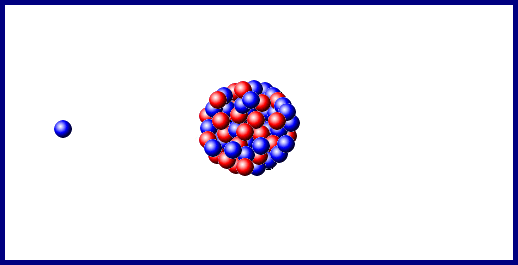

# 华夏中文学校 Java level-II

Java 编写应用软件的几大要素
1. logging ([Java Logging](#Logging))
2. Unit test ([Unit Test](#JUnittest))
3. Document ([Java Doc](#Java-Doc))
4. Database ([Sqlite](#Sqlite))
5. Version Control ([Git](#Git))


[Understand Kingdomino Game](#Understand-Kingdomino-Game)

[enum](#enum)

[Functional Programming](#Functional-Programming)

[Reactive x in Java](#Reactive-x-in-Java)

[class](#class)

[build Blackjack Card Game](#build-Blackjack-Card-Game)

[JUnittest](#JUnittest)

[Gson](#Gson)

[Java Doc](#Java-Doc)

[Design Pattern](#Design-Pattern)

[Sqlite](#Sqlite)

[Applications](#Applications)

## JUnittest
* Create JUnittest test case
* Test Driving Development (TDD)
    - SimpleMath.java
    - SimpleMathTest.java

## Java Doc
* Project > Generate Javadoc...

    

## Sqlite
add sqlite-jdbc-3.34.0.jar in classpath
* Sqlite1.java; create connection
* Sqlite2.java; Create table
* Sqlite3.java; CRUD: Create record
* Sqlite4.java; CRUD: Retrieve record
* Sqlite5.java; CRUD: Update a record
* Sqlite6.java; CRUD: Delete a record

## Git
* Create a git repository folder

```
git init
```

* .gitignore
* Check in
```
git add *
git commit -m "must add some message when commit"
```

* git Branch
```
git branch
git branch dev
```
* Check Status
```
git status
git log --oneline
```

## Design Pattern
* Observer

    ObserverPatternTest.java
* Singleton
* Factory
* Builder
* Decorator
* Strategy
* Command
* Bridge
* Facade
* Prototype

## Gson
[Gson Tutorial](https://mkyong.com/java/how-to-parse-json-with-gson/)
* GsonExample1.java
* GsonExample2.java
* GsonExample3.java; read json file, return ArrayList<Book>

## Understand Kingdomino Game
* BoarderTest.java; Unittest
* PlayerTest.java;
* CardTest.java;
* DeckTest.java;
* MessageTest.java;
* PositionTest.java;
### Test Driving Development
* practice: simaple math: add(), sub(), mul(), div()

## enum
* DividedByZero.java; Traditional programming, NullPointException
* EitherExample.java; 

## Functional Programming

## Reactive x in Java


* DividedByZero.java; normal way to handle exception
* OptionExample1.java; DividedByZero, Option way
* EitherExample2.java; use Either for / by zero
* EitherExample1.java; Use Gson convert json file to book list
* Employee.java; use filter
* MultipleReturn1.java; use Hashmap for function return multiple values.
* Operation.java; abstract class
* OptionExample1.java; 

## class
* Static Class; StaticClassExample.java
* Final Class; FinalClassExample.java > final class cannot be inheriated.
* Abstract Class; Operation.java > can define constant, abstract method, and concret method.
* Concrete Class; ConcreteClassExample.java
* Singleton Class; SingletonClassExample.java; StaticAttribute.java
* POJO Class; Plain Old Java Object > PojoClassExample.java
    - It does not extend the predefined classes such as Arrays, HttpServlet, etc.
    - It cannot contain pre-specified annotations.
    - It cannot implement pre-defined interfaces.
    - It is not required to add any constructor.
    - All instance variables must be private.
    - The getter/ setter methods must be public.
* Inner Class; OuterClass.java, AnonymousClassExample.java (Swing use a lot)

## build Blackjack Card Game

## Logging
    - Log all the things. Log as much as we possibly can, to always have relevant, contextual logs that don’t add overhead.
    - Work smarter, not harder. Consolidate and aggregate all of our logging to a central location, available to all devs, and easy to distil. Also, to find new ways for our logging and exception data to help us proactively improve our product.
* C:\Program Files\Java\jdk-14.0.2\conf\logging.properties
make change on this file will make FileHandler on level FINE, and ConsoleHandler on INFO
```
handlers= java.util.logging.FileHandler, java.util.logging.ConsoleHandler
.level= FINE
java.util.logging.FileHandler.pattern = %h/java%u.log
java.util.logging.FileHandler.limit = 50000
java.util.logging.FileHandler.count = 1
java.util.logging.FileHandler.maxLocks = 100
java.util.logging.FileHandler.formatter = java.util.logging.XMLFormatter
java.util.logging.ConsoleHandler.level = INFO
java.util.logging.ConsoleHandler.formatter = java.util.logging.SimpleFormatter
```
* if you don't setup output file name, the default file will be saved in user's home folder with format java0.log

    LoggerExample1.java
* Create your own log file

    LoggerExample2.java
* Configure you own logging properties and output file: ./conf/logging.properties

    LoggerExample3.java

```java
String path = LoggerExample1.class.getClassLoader().getResource("logging.properties").getFile();
System.setProperty("java.util.logging.config.file",path);

```

## Applications
* Calculator
* Notepade
* Snake-Game
* Kingdomino
* Tic Tac Toe
* Blackjack Card Game

## References
[Java Class Type](https://www.javatpoint.com/types-of-classes-in-java)

[Gson Tutorial](https://mkyong.com/java/how-to-parse-json-with-gson/)

[Design Patter Tutorial](https://www.journaldev.com/1827/java-design-patterns-example-tutorial)

[Java Logging](http://tutorials.jenkov.com/java-logging/logger.html)

[Sqlite](https://www.tutorialspoint.com/sqlite/sqlite_java.htm)