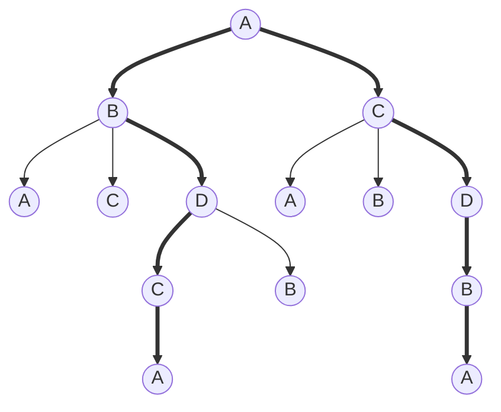

<h1>Computer Science</h1>

- [Chapter 1](#chapter-1)
- [Chapter 2](#chapter-2)
  - [practice](#practice)
- [Chapter 3](#chapter-3)
  - [Efficiency](#efficiency)
  - [Graph](#graph)
- [Chapter 4](#chapter-4)
  - [binary](#binary)
  - [Sound](#sound)
  - [image](#image)

## Chapter 1

## Chapter 2
❓ What is Pseudocode?
> ✔️Pseudocode is a set of English-language constructs designed to more or less resemble statements in a programming language but do not actually run on a computer. It represent algorithms. (Page 47, 59)
> 1. Computation; (Set value)
> 2. Input/Output; (Get value, print value)
> 3. Conditional; (If-Else)
> 4. Iterative. (While-do-Step)

* [Squential Search](../../datastructure/src/algorithms/chapter2/SquentialSearch.java)
* [Find largest](../../datastructure/src/algorithms/chapter2/FindLargest.java)
* [Meeting your match](../../datastructure/src/algorithms/chapter2/PatternMatching.java)
* [Problem 1](../../datastructure/src/algorithms/chapter2/Problem1.java)
* [Challenge 1: Python plot ](../python/findRoot.py)
* [Challenge 1: FindRoot](../../datastructure/src/algorithms/chapter2/Challenge1.java)

### practice
1. write pseudocodev from above sample code;
2. write java program from given pseudocode;

## Chapter 3
❓ What are the attributes of algorithms?
> 1. existence
> 2. correctness
> 3. practical
> 4. efficiency

### Efficiency
❓ What is Order of Magnitude?
>✔️ We will classify algorithms according to the order of magnitude of their time efficiency.

1. Anything that varies as a constant times n (and whose graph follows the basic shape of n) is said to be of order of magnitude n, written $Θ(n)$ and pronounced “order n.” 
2. there are best-case, worst-case, and average.
3. As we have seen, if an $Θ(n^2)$ algorithm and an $Θ(n)$ algorithm exist for the same task, then for large enough n, the $Θ(n^2)$ algorithm does more work and takes longer to execute, regardless of the constant factors for peripheral work. This is the rationale for ignoring constant factors and concentTat'int on the basic order of magnitude of algorithms

* [Sequential Search](../../datastructure/src/algorithms/chapter3/SequentialSearch.java)
* [Selection Sort](../../datastructure/src/algorithms/chapter3/SelectionSort.java)
* [Practice Problem](../python/algorithmOrder.py)
* [Data Cleanup-Shuffle left](../../datastructure/src/algorithms/chapter3/ShuffleLeft.java)
* [Data Cleanup-Copy over](../../datastructure/src/algorithms/chapter3/CopyOver.java)
* [Binary Search](../../datastructure/src/algorithms/chapter3/BinarySearch.java)
* [Problem 1](../../datastructure/src/algorithms/chapter3/ShuffleLeft.java)
* [Problem 2](../../datastructure/src/algorithms/chapter3/CopyOver.java)
* [Problem 3](../../datastructure/src/algorithms/chapter3/ConvergingPointers.java)
* [Pattern Matching](../../datastructure/src/algorithms/chapter3/PatternMatching.java)

### Graph
❓ What is graph?
>✔️A collection of nodes and connecting edges is called a graph.

❓ What is Hamiltonian circut?
>✔️A path through a graph that begins and ends at the same node and goes through all other nodes exactly once is called a Hamiltonian circuit. (page 113)

* [Find Graph](../../datastructure/src/algorithms/chapter3/HamiltonianCycle.java)
* [Practice Problem 1]

## Chapter 4

### binary

### Sound
* [Shoot](../python/whiff.wav)
* [云雀](../python/yunque.mp3)

### image
* [Chimp](../python/chimp.png)
* [apple](../python/apple1.jpg)
* [Fist-Chimp](../python/FistRolloverChimp.py)

