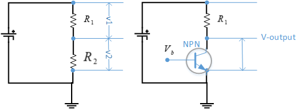
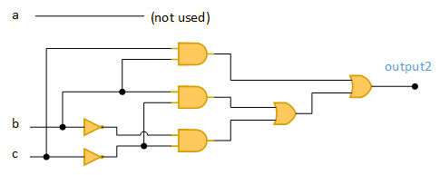
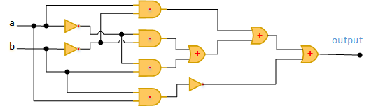

<h1>Computer Science</h1>

- [Chapter 1](#chapter-1)
- [Chapter 2](#chapter-2)
  - [practice](#practice)
- [Chapter 3](#chapter-3)
  - [Efficiency](#efficiency)
  - [Graph](#graph)
- [Chapter 4](#chapter-4)
  - [binary](#binary)
  - [Sound](#sound)
  - [image](#image)
  - [Practice Problems](#practice-problems)
  - [Not Gate](#not-gate)
  - [Transistor as switch](#transistor-as-switch)
  - [Practice Problems](#practice-problems-1)
- [References](#references)


## Chapter 1

## Chapter 2
❓ What is Pseudocode?
> ✔️Pseudocode is a set of English-language constructs designed to more or less resemble statements in a programming language but do not actually run on a computer. It represent algorithms. (Page 47, 59)
> 1. Computation; (Set value)
> 2. Input/Output; (Get value, print value)
> 3. Conditional; (If-Else)
> 4. Iterative. (While-do-Step)

* [Squential Search](../../datastructure/src/algorithms/chapter2/SquentialSearch.java)
* [Find largest](../../datastructure/src/algorithms/chapter2/FindLargest.java)
* [Meeting your match](../../datastructure/src/algorithms/chapter2/PatternMatching.java)
* [Problem 1](../../datastructure/src/algorithms/chapter2/Problem1.java)
* [Challenge 1: Python plot ](../python/findRoot.py)
* [Challenge 1: FindRoot](../../datastructure/src/algorithms/chapter2/Challenge1.java)

### practice
1. write pseudocodev from above sample code;
2. write java program from given pseudocode;


## Chapter 3
❓ What are the attributes of algorithms?
> 1. existence
> 2. correctness
> 3. practical
> 4. efficiency

### Efficiency
❓ What is Order of Magnitude?
>✔️ We will classify algorithms according to the order of magnitude of their time efficiency.

1. Anything that varies as a constant times n (and whose graph follows the basic shape of n) is said to be of order of magnitude n, written $Θ(n)$ and pronounced “order n.”
2. there are best-case, worst-case, and average.
3. As we have seen, if an $Θ(n^2)$ algorithm and an $Θ(n)$ algorithm exist for the same task, then for large enough n, the $Θ(n^2)$ algorithm does more work and takes longer to execute, regardless of the constant factors for peripheral work. This is the rationale for ignoring constant factors and concentTat'int on the basic order of magnitude of algorithms

* [Find Prime](../../datastructure/src/algorithms/chapter3/Prime01.java)
  
* [Sequential Search](../../datastructure/src/algorithms/chapter3/SequentialSearch.java)


* [Selection Sort](../../datastructure/src/algorithms/chapter3/SelectionSort.java)


* [Practice Problem](../python/algorithmOrder.py)
* [Data Cleanup-Shuffle left](../../datastructure/src/algorithms/chapter3/ShuffleLeft.java)
* [Data Cleanup-Copy over](../../datastructure/src/algorithms/chapter3/CopyOver.java)
* [Converging Pointers](../../datastructure/src/algorithms/chapter3/ConvergingPointers.java)

* [Binary Search](../../datastructure/src/algorithms/chapter3/BinarySearch.java)


* [Problem 1](../../datastructure/src/algorithms/chapter3/ShuffleLeft.java)
* [Problem 2](../../datastructure/src/algorithms/chapter3/CopyOver.java)
* [Problem 3](../../datastructure/src/algorithms/chapter3/ConvergingPointers.java)
* [Pattern Matching](../../datastructure/src/algorithms/chapter3/PatternMatching.java)

* [quick sort](../../datastructure/src/algorithms/chapter3/QuickSort.java)


* [Insertion Sort](../../datastructure/src/algorithms/chapter3/InsertionSort.java)

 
* [Merge Sort](../../datastructure/src/algorithms/chapter3/MergeSort.java)


### Graph
❓ What is graph?
>✔️A collection of nodes and connecting edges is called a graph.

❓ What is Hamiltonian circut?
>✔️A path through a graph that begins and ends at the same node and goes through all other nodes exactly once is called a Hamiltonian circuit. (page 113)

* [Find Graph](../../datastructure/src/algorithms/chapter3/HamiltonianCycle.java)
* [Practice Problem 1]


## Chapter 4

### binary


### Sound
* [Shoot](../python/whiff.wav)
* [云雀](../python/yunque.mp3)

### image
* [Chimp](../python/chimp.png
* [apple](../python/apple1.jpg)
* [Fist-Chimp](../python/FistRolloverChimp.py)
* [image modify](../python/changeImage.py) RGBA

Amazon Search：8051 microcontroller $19

* [89C58](https://www.aliexpress.us/item/3256803636278219.html?gatewayAdapt=glo2usa4itemAdapt&_randl_shipto=US)


* [51系列汇编指令手册-122页，](STC89C52.pdf)

```asm
    ADD A,R2  ;2A
```


* Keil μVision Demo

### Practice Problems
4.1 3 min=180 sec. if 256 kbps(kilo-bytes per second) ⟶ 180*256 = 46080 KB= 46080*1024*8 bits = 377487360 bits.


❓ Why use Binary?
>✔️ Reliability. (Electric hardware bistable environment)

Binary Storage
1. 0 or 1
2. no change by accident
3. easy read
4. easy to change

### Not Gate
* Ohm's Law


* [Ohm's Law calculator](../../datastructure/src/algorithms/chapter4/OhmsLaw.java)
  
### Transistor as switch




❓ What are the differences between PNP and NPN transistor?
> 1. While both have the ability to amplify signals or even act to switch larger currents on and off, they accomplish this signal boosting ability in different ways.
> 2. From a practical standpoint, NPN transistors (sometimes called "sinking sensors") amplify a positive signal applied to the base by allowing a larger current to flow from the collector to emitter pins of the device, proportional to the base voltage. This proportional current flow occurs in an active range, but below a certain cutoff voltage no current flows. Above a certain point a transistor reaches saturation, allowing electrons to flow freely.
> 3. While PNP and NPN sensors do the same basic job, you might wonder why one would be used over another. There are, in fact, some differences, and in most circuit design applications NPN transistors are preferred. This is due to the fact that the “N” substrate can transfer electrons significantly faster than “P” type substrates can transport positive electron holes. This presents a huge advantage in high-speed switching and amplifier circuits applications. Adding on to this advantage is the fact that NPN transistors are also easier, and thus cheaper, to manufacture than PNP transistors.

* [transistor as switch](https://www.electronics-tutorials.ws/transistor/tran_4.html)


💡👉Understand Circuit Design

Output 1:
case1: $\bar a\cdot  b \cdot \bar c$
case2: $a\cdot  b \cdot \bar c$
combination use OR gate: $O_1=(\bar a\cdot  b \cdot \bar c) + (a\cdot  b \cdot \bar c)$

Output 2:
case1: $\bar b \cdot \bar c$
case2: $b \cdot \bar c$
case3: $b \cdot c$
combination use OR gate: $O_2=(\bar b \cdot \bar c) + (b \cdot c) + (b \cdot \bar c)$



### Practice Problems

2. $output=(\bar a \cdot \bar b) + (\bar a \cdot b) + (a \cdot \bar b) + \overline {(a \cdot b)}$


## References
* [👍😄transistor as switch](https://www.electronics-tutorials.ws/transistor/tran_4.html)

* [Chapter 4 Practice Problems](https://www.chegg.com/homework-help/questions-and-answers/practice-problems-1-using-mp3-many-bits-required-store-3-minute-song-uncompressed-format-i-q34574883)

* [👍😄Keil tutorial for Beginners](https://www.youtube.com/watch?v=oBvP_Lxoqxo)
* [👍😄Embedded Systems - Registers](https://www.tutorialspoint.com/embedded_systems/es_registers.htm)

* [SDCC Compiler for 8051](https://www.youtube.com/watch?v=JJcnARsFnsE)
* [SDCC Info](https://sdcc.sourceforge.net/)
* [SDCC Download](https://sourceforge.net/projects/sdcc/files/)
* [installation file name](sdcc-4.2.0-x64-setup.exe)
* [Programer's notepad](https://www.pnotepad.org/download/)
* [](https://www.youtube.com/watch?v=CGTQ6JrDZ3Q)

Rn: register
A: Accumulator
B: register
PC: Program Counter
DPTR: Data Pointer
SP: Stack Pointer
