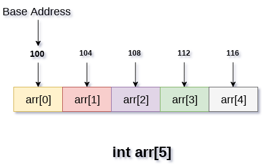

# Java Data Structures

## Data Structure Category
* Primitive Data Type: int, char, float, double...
* Non-Primitive Data Type: 
  - linear data structure
  >The arrangement of data in a sequential manner is known as a linear data structure. The data structures used for this purpose are Arrays, Linked list, Stacks, and Queues. In these data structures, one element is connected to only one another element in a linear form.

  - non-linear data structure
  >When one element is connected to the 'n' number of elements known as a non-linear data structure. The best example is trees and graphs. In this case, the elements are arranged in a random manner.
* Static data structure:
  >It is a type of data structure where the size is allocated at the compile time. Therefore, the maximum size is fixed.
* Dynamic data structure:
  >It is a type of data structure where the size is allocated at the run time. Therefore, the maximum size is flexible.

## Array

[Array](https://www.javatpoint.com/data-structure-array)
```java
int arri[10];
char arrc[10];
float arrf[5];
```
* One variable name for all data
* Easy to traverse
* Able to get individual item by index

