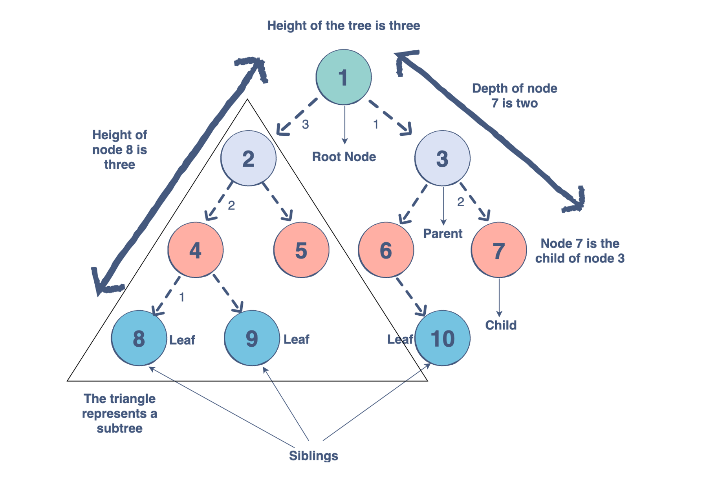

# Java Data Structures


❓ Why we want to learn data structure?
>✔️

## Data Structure & Algorithms

## Data Structure Category
* Primitive Data Type: int, char, float, double...
* Non-Primitive Data Type: 
  - linear data structure
  >The arrangement of data in a sequential manner is known as a linear data structure. The data structures used for this purpose are Arrays, Linked list, Stacks, and Queues. In these data structures, one element is connected to only one another element in a linear form.

  - non-linear data structure
  >When one element is connected to the 'n' number of elements known as a non-linear data structure. The best example is trees and graphs. In this case, the elements are arranged in a random manner.
* Static data structure:
  >It is a type of data structure where the size is allocated at the compile time. Therefore, the maximum size is fixed.
* Dynamic data structure:
  >It is a type of data structure where the size is allocated at the run time. Therefore, the maximum size is flexible.


❓ What is data structure?
>✔️A data structure is a named location that can be used to store and organize data. And, an algorithm is a collection of steps to solve a particular problem. Learning data structures and algorithms allow us to write efficient and optimized computer programs.

* [Array](../datastructure/src/array/array1.java)
* [Array List](../datastructure/src/builtins/MyArrayList.java)

❓ What are Algorithms?
>✔️ Informally, an algorithm is nothing but a mention of steps to solve a problem. They are essentially a solution.

🔑💡 **Knowlodge Base**
### Data Management
> 1. append
> 2. insert
> 3. delete
> 4. (modify)

### Data Usage
> 1. traverse
> 2. sort
> 3. search


❓ What is data traverse?
>✔️Traversing a data structure means: "visiting" or "touching" the elements of the structure, and doing something with the data. (Traversing is also sometimes called iterating over the data structure)

## Array

[Array](https://www.javatpoint.com/data-structure-array)
```java
int arri[10];
char arrc[10];
float arrf[5];
```
* One variable name for all data
* Easy to traverse
* Able to get individual item by index


* [data without structure](../datastructure/src/array/array1.java)
* [int array](../datastructure/src/array/array2.java)
* [data stream reduce without loop](../datastructure/src/array/array3.java)
* [data stream calculate average](../datastructure/src/array/array4.java)
* [data stream map with average() function](../datastructure/src/array/array5.java)


❓What is map() function?
>✔️ the map() function is processing iterables without loop.

$$data: a_1, a_2, ..., a_n$$
$$list.stream.map(f)$$
$$result: f(a_1),f(a_2),...,f(a_n)$$

### Lambda Expression

```
([argument list])->{[function code block]};
```

* [lambda forEach]()
### Stream

### Java Generics
❓ What is Generics?
>✔️Generics add stability to your code by making more of your bugs detectable at compile time. In Java, Generics data structure handle any other data type in more generic way.


## Built-ins Data Structure
>1. ArrayList
>2. Vector
>3. Hashtable
>4. HashMap
>5. TreeSet
### ArrayList

* [ArrayList]()

### Vector


### Linked List
[Linked List website](https://www.geeksforgeeks.org/data-structures/linked-list/)

* [Sigle linked list]()


* [Doubly linked list](../datastructure/src/linkedlist/DoubleList.java)
* [Double node](../datastructure/src/linkedlist/DoubleNode.java)
* [Double data link test](../datastructure/src/linkedlist/DoubleListTest.java)


* [Circular Linked List]()


* [Quick Link]()


## Data Structure

### Queue
❓ What is Queue?
>✔️ First-In-First-Out data structure.


* [Queue]()

### Stack
❓ What is stack?
>✔️ The Stack class represents a last-in-first-out (LIFO) stack of objects.


[implement IStack]()


* [Stack](../datastructure/src/builtins/MyStack.java)


### Set
* [Set]()

### TreeSet
* [Tree]()


### Search

* [Sequential Search]()
* [Binary Search]()

### Sort
* [Selection sort](../datastructure/src/sort/SelectionSort.java)
* [Bubble sort](../datastructure/src/sort/BubbleSort.java)
* [Insertion sort](../datastructure/src/sort/InsertionSort.java)
* [Merge Sort](../datastructure/src/sort/MergeSort.java)
* [Quick Sort](../datastructure/src/sort/QuickSort.java)
* [Java Collections sort](../datastructure/src/sort/CollectionsSort.java)
* [Java TreeSet]()
* [Comparable]()
   
## HashCode() and equals()


* Stack (FILO)
* Queue (FIFO)
* [Linked List](../huaxia/src/com/huaxia/datastructure/LinkedList.java)
* [Doubly linked list](../huaxia/src/com/huaxia/datastructure/DoublyLinkedList.java)
* Tree
❓ What is tree structure
✔️Trees are a collection of nodes (vertices), and they are linked with edges (pointers), representing the hierarchical connections between the nodes. A node contains data of any type, but all the nodes must be of the same data type. 

[](https://www.educative.io/blog/data-structures-trees-java)


* [BinaryNode](../huaxia/src/com/huaxia/datastructure/BinaryNode.java)
* [BinaryTree](../huaxia/src/com/huaxia/datastructure/BinaryTree.java)
* [PartList Homework](../huaxia/docs/PartList.pdf)
* 

* [BinaryTree.insert() test](../huaxia/src/com/huaxia/danceticket/Test.java)
* [BinaryTree.remove() test](../huaxia/src/com/huaxia/danceticket/Test.java)
* [BinaryTree](../huaxia/src/com/huaxia/danceticket/BinaryTree.java)

* [TreeMap sort by AutoComparator](../huaxia/src/com/huaxia/java2/treemap/PartList.java)
* [Functional programing Better way to load part data](../huaxia/src/com/huaxia/java2/treemap/PartList1.java)
* [Insertion sort](../huaxia/src/com/huaxia/datastructure/InsertionSort.java)


* [Selection Sort](../huaxia/src/com/huaxia/datastructure/SelectionSort.java)


* [Quick sort](../huaxia/src/com/huaxia/datastructure/QuickSort.java)


* [Order Part by make and year](../huaxia/src/com/huaxia/java2/treemap/TreeMapDemo1.java)
* [Sorted by make, mode, and year](../huaxia/src/com/huaxia/java2/treemap/TreeMapDemo2.java)
* [TreeMap Generics sorted by value](../huaxia/src/com/huaxia/java2/treemap/TreeMapDemo.java)
* [TreeSet ](../huaxia/src/com/huaxia/java2/treemap/TreeSetExample.java)
* [TreeSetDemo](../huaxia/src/com/huaxia/java2/treemap/TreeSetDemo.java)
* [Video for insertion sort](images/insertionsort.mp4)

## References
* [Wetsite tutorial](https://jenkov.com/tutorials/java-collections/queue.html)
* [Algorithms](https://www.programiz.com/dsa/why-algorithms)
* []()
* []()