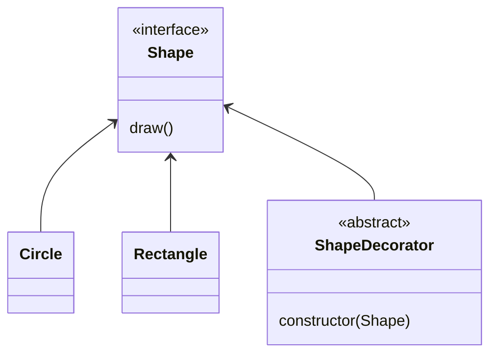
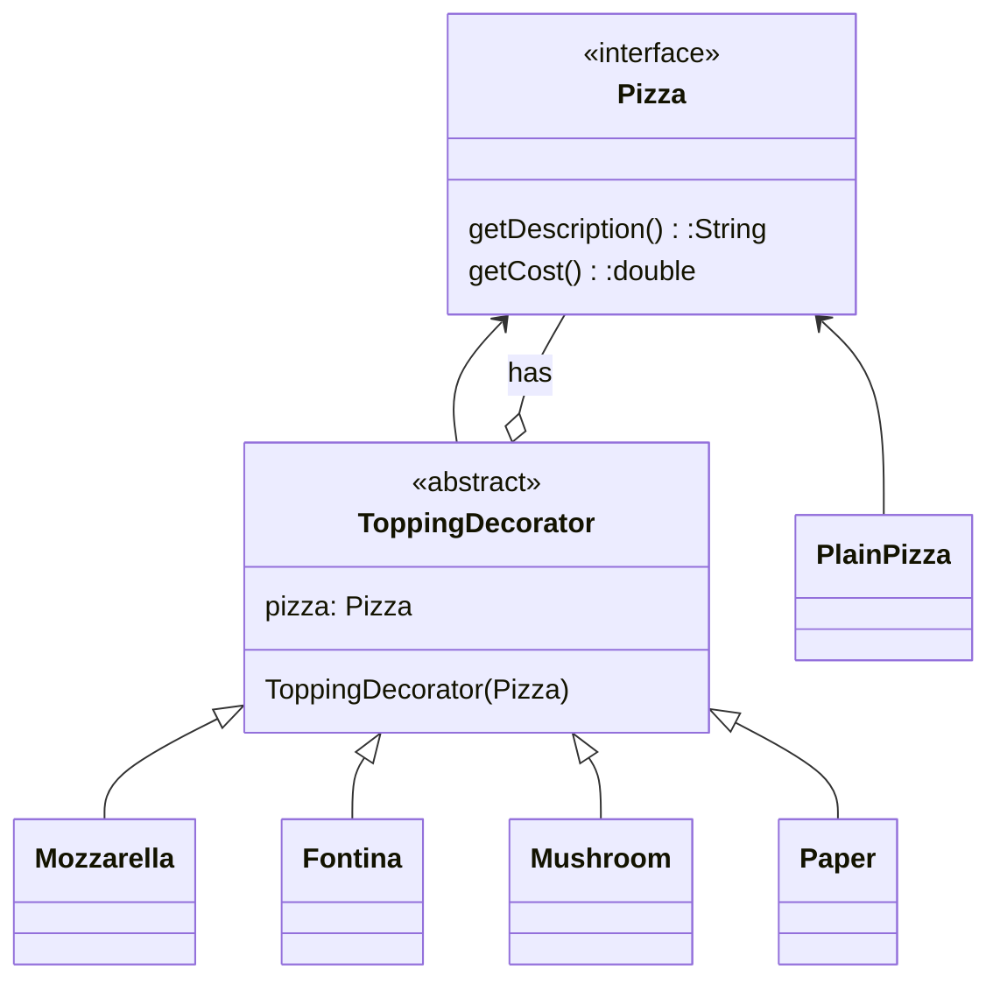
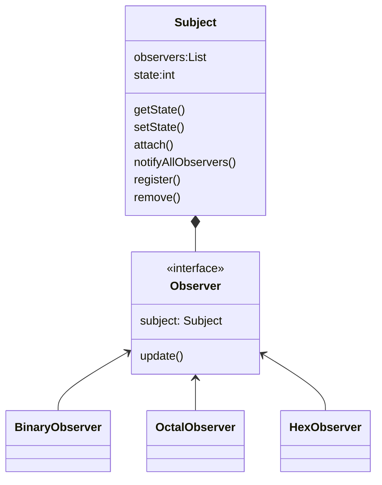

<h1>Java Design Pattern</h1>

- [Creational Pattern](#creational-pattern)
  - [Factory Pattern](#factory-pattern)
  - [Singleton Pattern](#singleton-pattern)
  - [Prototype Pattern](#prototype-pattern)
  - [Builder Pattern](#builder-pattern)
- [Structural Pattern](#structural-pattern)
  - [Adapter Pattern](#adapter-pattern)
  - [Brigde Patter](#brigde-patter)
  - [Composite Pattern](#composite-pattern)
  - [Decorator Pattern](#decorator-pattern)
  - [Facade Pattern](#facade-pattern)
  - [Proxy Pattern](#proxy-pattern)
- [Behavioral Pattern](#behavioral-pattern)
  - [Command Pattern](#command-pattern)
  - [Iterator Pattern](#iterator-pattern)
  - [Observer Pattern](#observer-pattern)
  - [State Pattern](#state-pattern)
  - [Strategy Pattern](#strategy-pattern)
  - [Template Pattern](#template-pattern)
- [References](#references)

## Creational Pattern

### Factory Pattern
* [Factory pattern test](../designPattern/src/creational/singleton/FactoryPatternTester.java)

### Singleton Pattern
* [Singleton pattern test](../designPattern/src/creational/singleton/SingletonTest.java)
  
### Prototype Pattern

### Builder Pattern

## Structural Pattern
### Adapter Pattern

### Brigde Patter

### Composite Pattern

### Decorator Pattern
> 1. Allow to modify an object dynamically
> 2. add functionality at run time
> 3. it is more flexible than inheritance

* [Pizza without pattern](../designPattern/src/structural/decorator/ThreeCheesPizza.java)

* [Decorator Pattern](../designPattern/src/DecoratorTest.java)

* [Pizza Topping](../designPattern/src/structural/decorator/PizzaTest.java)

### Facade Pattern

### Proxy Pattern

## Behavioral Pattern

### Command Pattern

### Iterator Pattern

### Observer Pattern

* [Observer pattern](../designPattern/src/behavioral/ObserverTest.java)

### State Pattern

### Strategy Pattern

### Template Pattern

## References
[👍😄 Better design patter website](https://www.tutorialspoint.com/design_pattern/observer_pattern.htm)
[Design pattern website](https://www.javatpoint.com/design-patterns-in-java)