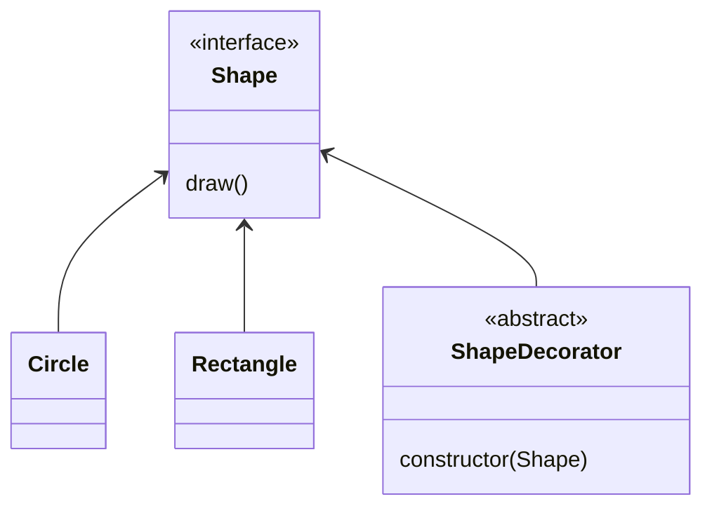
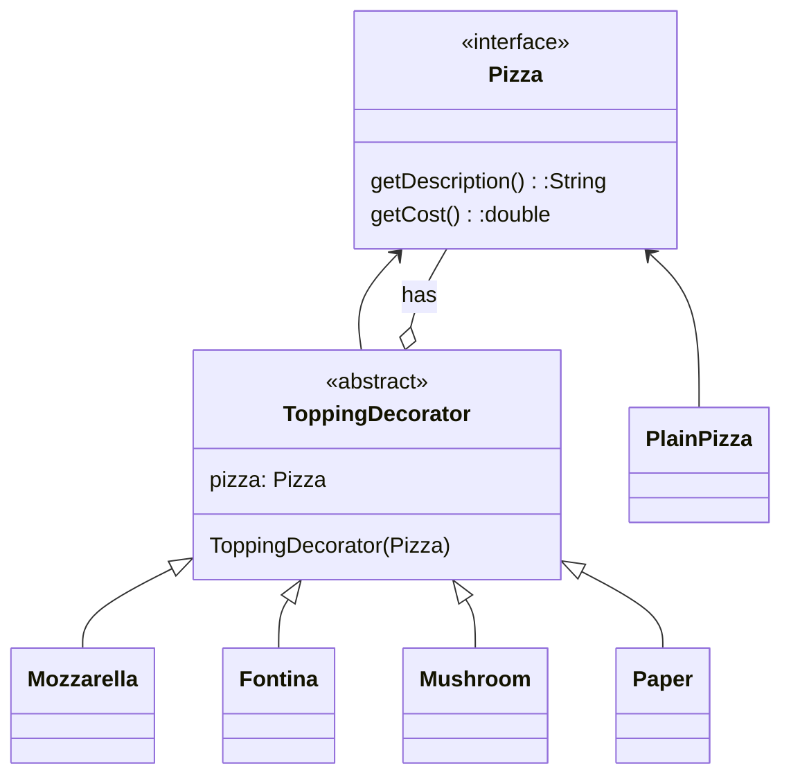
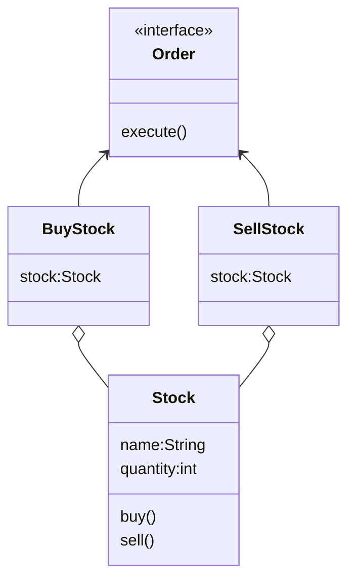
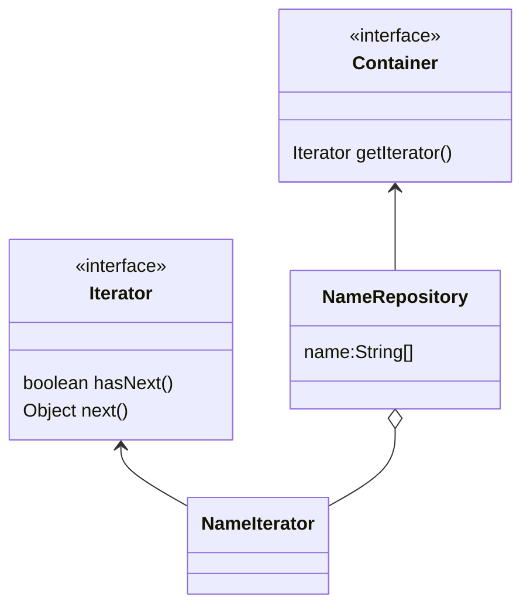
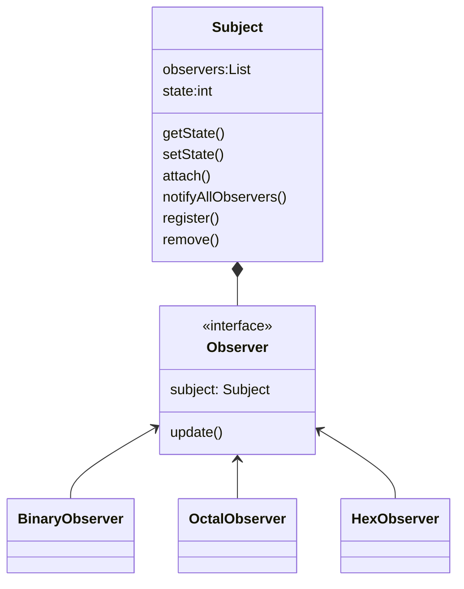
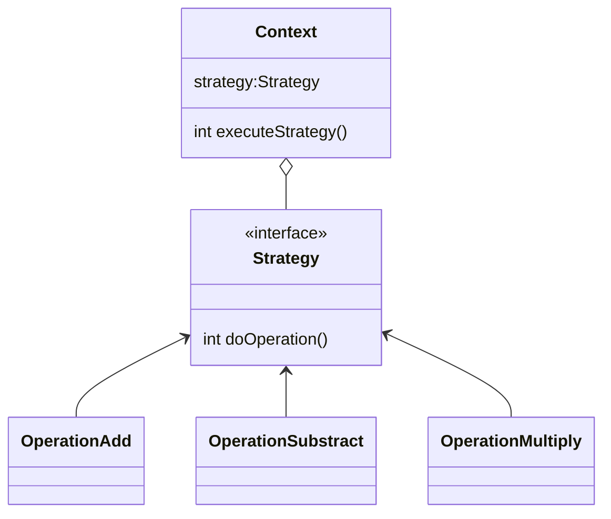
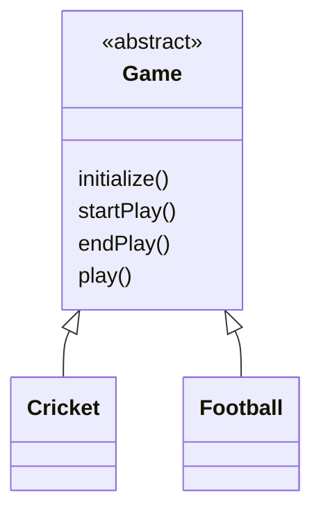

<h1>Java Design Pattern</h1>

- [Creational Pattern](#creational-pattern)
  - [Factory Pattern](#factory-pattern)
  - [Singleton Pattern](#singleton-pattern)
  - [Prototype Pattern](#prototype-pattern)
  - [Builder Pattern](#builder-pattern)
- [Structural Pattern](#structural-pattern)
  - [Adapter Pattern](#adapter-pattern)
  - [Brigde Patter](#brigde-patter)
  - [Composite Pattern](#composite-pattern)
  - [Decorator Pattern](#decorator-pattern)
  - [Facade Pattern](#facade-pattern)
  - [Proxy Pattern](#proxy-pattern)
- [Behavioral Pattern](#behavioral-pattern)
  - [Command Pattern](#command-pattern)
  - [Iterator Pattern](#iterator-pattern)
  - [Observer Pattern](#observer-pattern)
  - [State Pattern](#state-pattern)
  - [Strategy Pattern](#strategy-pattern)
  - [Template Pattern](#template-pattern)
- [References](#references)

## Creational Pattern

### Factory Pattern
* [Factory pattern test](../designPattern/src/creational/singleton/FactoryPatternTester.java)

### Singleton Pattern
* [Singleton pattern test](../designPattern/src/creational/singleton/SingletonTest.java)
  
### Prototype Pattern
* [Prototype pattern test](../designPattern/src/creational/prototype/PrototypeTest.java)

### Builder Pattern
* [Builder pattern test](../designPattern/src/creational/builder/BuilderTest.java)

## Structural Pattern
### Adapter Pattern
* [Adapter pattern test](../designPattern/src/structural/adapter/AdapterTest.java)

### Brigde Patter
* [Bridge pattern test](../designPattern/src/structural/bridge/BridgeTest.java)

### Composite Pattern
* [Composite pattern test](../designPattern/src/structural/composite/CompositeTest.java)

### Decorator Pattern
> 1. Allow to modify an object dynamically
> 2. add functionality at run time
> 3. it is more flexible than inheritance

* [Pizza without pattern](../designPattern/src/structural/decorator/ThreeCheesPizza.java)

* [Decorator Pattern](../designPattern/src/DecoratorTest.java)

* [Pizza Topping](../designPattern/src/structural/decorator/PizzaTest.java)

### Facade Pattern
* [Facade Pattern test](../designPattern/src/structural/facade/FacadeTest.java)

### Proxy Pattern
* [Proxy Pattern test](../designPattern/src/structural/proxy/ProxyTest.java)

## Behavioral Pattern
### Command Pattern

where Order is acting as command. there will be two commands for stock: 1. buy; 2. sell.

* [Command pattern test](../designPattern/src/structural/command/CommandTest.java)

### Iterator Pattern

* [Iterator pattern test](../designPattern/src/structural/iterator/IteratorTest.java)

### Observer Pattern

* [Observer pattern test](../designPattern/src/behavioral/observer/ObserverTest.java)

### State Pattern

* [State pattern test](../designPattern/src/behavioral/state/StateTest.java)
 
### Strategy Pattern

One Context run different operations.

> **strategy**: a detailed plan for achieving success in situations such as war, politics, business, industry, or sports, or the skill of planning for such situations.

* [Strategy pattern test](../designPattern/src/behavioral/strategy/StrategyTest.java)

### Template Pattern

where Game class as an template for all different games.

* [Template pattern test](../designPattern/src/behavioral/template/TemplateTest.java)

## References
[👍😄 Better design patter website](https://www.tutorialspoint.com/design_pattern/observer_pattern.htm)
[Design pattern website](https://www.javatpoint.com/design-patterns-in-java)