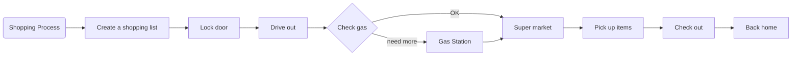
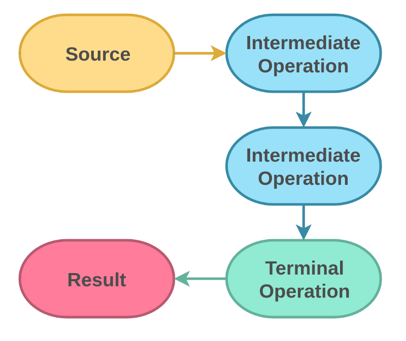
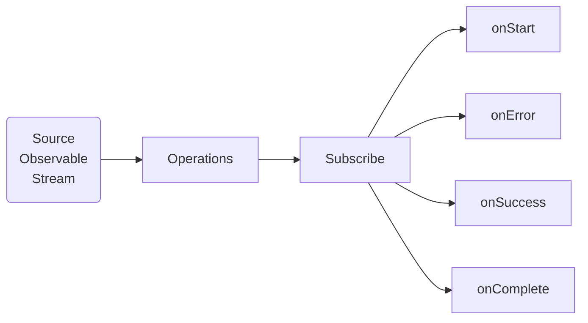
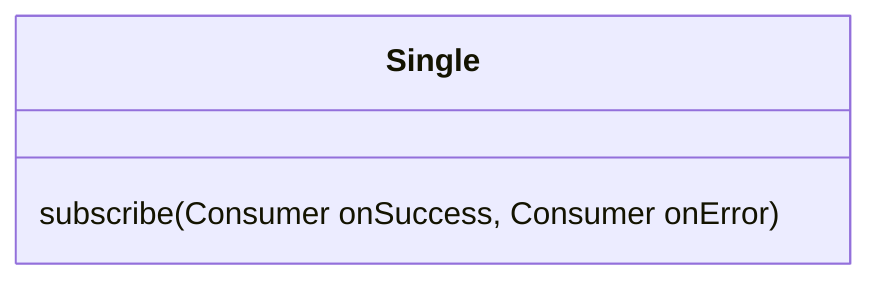

<h1>Functional Programing</h1>

- [Anonymous class](#anonymous-class)
- [lambda expression](#lambda-expression)
- [map](#map)
- [filter](#filter)
- [reduce](#reduce)
- [stream()](#stream)
- [pass function as parameter](#pass-function-as-parameter)
- [Function Interface](#function-interface)
- [callback](#callback)
- [RxJava](#rxjava)
- [Error Handling](#error-handling)
- [References](#references)


❓ What is Functional Programing?
>✔️ Basically, functional programming is a style of writing computer programs that treat computations as evaluating mathematical functions.

In mathematics, a function is an expression that relates an input set to an output set.

$$ f(x) = ax^3 + bx^2 + cx + d$$


Company Main Office send calculation function series to subbranch.

## Anonymous class

```java
Collections.sort(numbers, new Comparator<Integer>() { // anonymous class
    @Override
    public int compare(Integer n1, Integer n2) {
        return n1.compareTo(n2);
    }
});
```

[Functional programming](https://belief-driven-design.com/functional-programm-with-java-map-filter-reduce-77e479bd73e/)


## lambda expression
* [Simple lambda expression](../functional/src/functional/Lambda01.java)
* [Function lambda expression](../functional/src/functional/Lambda02.java)

## map
* [Java map() function](../datastructure/src/functional/Map.java)

## filter

* [Java filter() function](../datastructure/src/functional/Filter.java)

## reduce

```
stream.reduce(initialValue, func);
stream.reduce(func);
```
* [Java reduce() function](../datastructure/src/functional/Reduce.java)

## stream()



* [stram, map, average()](../datastructure/src/array/array5.java)
* [Vector, stream, map, average()](../datastructure/src/builtins/MyVector.java)
* [normal loop vs. functional](../datastructure/src/functional/Stream.java)
* [Stream sort](../datastructure/src/functional/StreamSort.java)

## pass function as parameter

* [Pass interface as parameter](../functional/src/functional/PassFunction.java)
* [Pass function by reflect](../functional/src/functional/PassFunction1.java)
* [Pass function by reflect](../functional/src/functional/PassFunction2.java)

## Function Interface

```java
interface Function<T,R>{
    play(T);
}
```
T: input Type
R: Return type

```java
String s = "John";
int i = 10;
Function f = <Lambda Expression>;
```

* [Quadratic function](../functional/src/functional/CreateFunction01.java)
* [Lambda half](../functional/src/functional/CreateFunction02.java)
* [andThen](../functional/src/functional/CreateFunction03.java)
* [Compose](../functional/src/functional/CreateFunction04.java)
* [Compose null](../functional/src/functional/CreateFunction05.java)

## callback

* [Java Callback Function](../datastructure/src/functional/Callback.java)

## RxJava
❓ What are the issues RxJava try to solve?
> 1. Null point
> 2. Error Handling
> 3. pre-defined execution functions
> 4. execution chain
> 5. repeat job without loop
> 6. filter selection without if-else

```java
source
  .operator1()
  .operator2()
  .operator3()
  .subscribe(consumer)
```




[RxJava API Documentation](https://javadoc.io/doc/io.reactivex.rxjava3/rxjava/latest/index.html)
* [Flowable Just](../functional/src/functional/RxTest.java)
* []()
* [Single just](../functional/src/functional/ObservableTest00.java)

> The Single class implements the Reactive Pattern for a single value response.



* [Maybe Single](../functional/src/functional/ObservableTest01.java)
* [Completable](../functional/src/functional/ObservableTest02.java)
* [Observable](../functional/src/functional/ObservableTest03.java)
* [Observable](../functional/src/functional/ObservableTest04.java)
* [Observable](../functional/src/functional/ObservableTest05.java)
* [Observable](../functional/src/functional/ObservableTest06.java)
* [Observable](../functional/src/functional/ObservableTest07.java)
* [Observable](../functional/src/functional/ObservableTest08.java)
* [Observable](../functional/src/functional/ObservableTest09.java)
* [Observable](../functional/src/functional/ObservableTest10.java)
* [Observable](../functional/src/functional/ObservableTest11.java)
* [Observable](../functional/src/functional/ObservableTest12.java)

## Error Handling

## References
* [Optional Parameters](https://devwithus.com/java-optional-parameters/)
* [Pass function](https://www.delftstack.com/howto/java/how-to-pass-a-function-as-a-parameter-in-java/)
* [RxJava tutorial](https://www.tutorialspoint.com/rxjava/rxjava_environment_setup.htm)
* [RxJava jar files download ](https://jar-download.com/artifact-search/rxjava)
* [YouTube Channel Function interface](https://www.youtube.com/channel/UCVIWn7o3162j_lJFJfs7mDA)