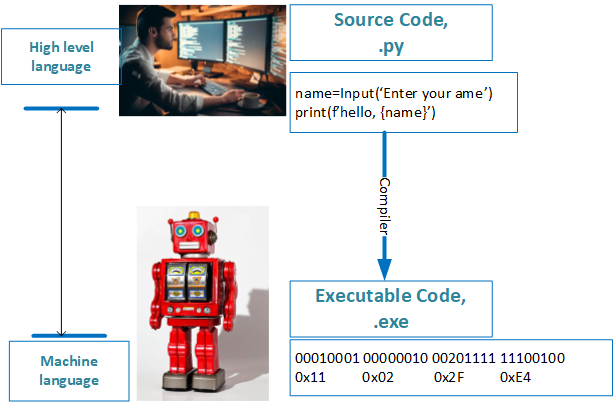
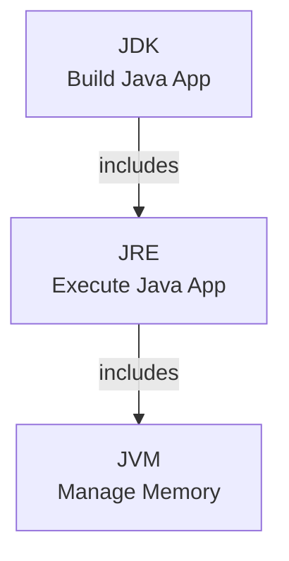
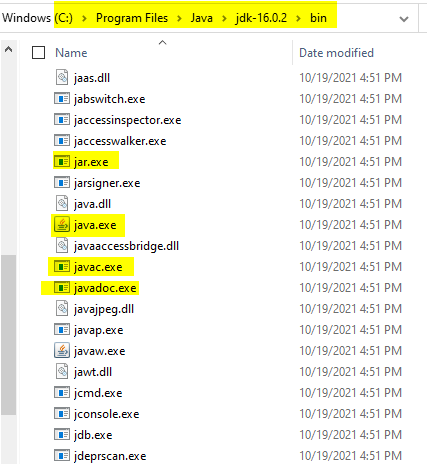
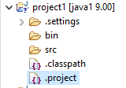
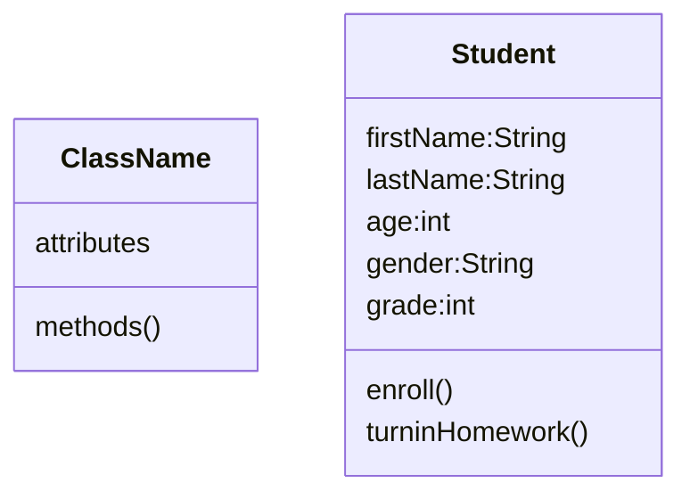
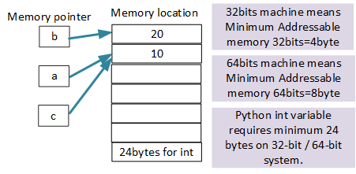

f<h1>Getting Started</h1>

## Check Software Installation
```DOS
java -version
javac -version
```
* here is a sample output:
```DOS
C:\Users\12818\workspace\java>java -version
java version "16.0.2" 2021-07-20
Java(TM) SE Runtime Environment (build 16.0.2+7-67)
Java HotSpot(TM) 64-Bit Server VM (build 16.0.2+7-67, mixed mode, sharing)

C:\Users\12818\workspace\java>javac -version
javac 16.0.2
```

❓ What is computer?
>✔️ the computer is nothing but CPU and memory.


❓ Why we need programing language? 
>✔️ tell CPU what to do through programing language.
> people write the code using the programing language to make the computer understand and to what has been told.




❓ Why different language?
> 1. from low level to high level development;
> 2. server different purpose;
> 3. the old language dies, new comes, some of the old language still in service.

❓What is Java?
✔️ Java is a general-purpose, class-based, object-oriented programming language ~~designed for having lesser implementation dependencies~~. It is a computing platform for application development. 
1. define data type
2. create object use the data type
3. use the object to do the job (OOP)

📌❗️ **Knowlodge Base**
> No class no Java.
> In order to run java application, you need JRE installed on your computer.
> In order to compile java source code, you need JDK installed on your computer.

❓ what is JVM?
✔️ The JVM stands for Java Virtual Machine, which manages system memory and provides a portable execution environment for Java-based applications

❓ What is JRE? (java.exe)
✔️ The JRE stands for Java Runtime Environment, which provides the minimum requirements for executing a Java application. It includes JVM, core classes, and supporting files.

❓ What is JDK? (javac.exe)
✔️ THe JDK stands for Java Development Kit, which is a software development environment used for developing Java applications and applets. It includes JRE, an interpreter/loader (java.exe), a compiler (javac.exe) and archiver (jar.exe), a documentation generator (javadoc.exe), and more...





❓ What is java project in Eclipse?
✔️ A java project in eclipse is a structured files system which include definition and configuration about the project, such as [.project] and [.classpath] files, [src], [bin] folder and more. the [src] folder is used for storing Java source code, and the [bin] folder is used for storing compiled bytecode files.

[Online documentation and tutorial](https://www.tutorialspoint.com/eclipse/eclipse_create_java_project.htm)

❓ What is package?
✔️ A package in Java is used to group related classes. Think of it as **a folder in a file directory**.




```
1. Create Java Project: langbasic
2. Create Package: langbasic (by package name convention)
<com, org>.<company name>.<project name>.<package name>...
3. Create class: Hello.java
for any class name by convention, use Upercase for first letter

```

❓ What does class means?
>✔️ write Java is nothing but design class, which is user defined data type can be used to create new instance of that class.



💡🔑 **Knowlodge Base**
> 1. public modifier on main() method (funtion) is part of main() cannot be removed.
> 2. write Java program means to create class.

### method signature:
1. method name
2. number of arguments
3. type of arguments
4. return data type(it may not belong to signature, but is part of method declaration)

### static method

* [](../huaxia/src/com/huaxia/java1/MyMath.java)

💡👉 **Knowlodge Base**
> 1. static method can be called by using the class name;
> 2. static meshod can be called by instance;
> 2. static method cannot use instance variables. (indipendent from instance)


❓ How to learn new computer language?
✔️
1. do it by yourself
2. learn from mistakes
3. take good learning notes
4. programming practice 
5. teach someone else
   


**Lǔbān** is a famous master carpenter of ancient China. **Lǔbān** studied hard for three years and learned all the skills. The old master want to try him more, and destroy all the models, let him build them all over again. He made one by one exactly the same as the original all based on his memory. The old master created a lot of new models for him to build. He pondered and did it, and the results were made according to the style of the master. The old master was very satisfied.

鲁班是著名的中国古代的木匠师傅。鲁班苦学了三年，把所有的手艺都学会了。老师傅还要试试他，把模型全部毁掉，让他重新造。他凭记忆，一件一件都造得跟原来的一模一样。老师傅又提出好多新模型让他造。他一边琢磨一边做，结果都按师傅说的式样做出来了。老师傅非常满意。

>Everything you have learned, you need do it all by yourself, until then, whatever you've learned indeed belongs to yourself.


### Basic skills(questions and answers)

* ❓How do I create a Java project?
✔️Right-Click on explore window ⟹ New ⟹ Java Project ⟹ enter project name

* ❓How do I create Java package?
✔️Right-click src folder ⟹ New ⟹ package ⟹ enter package name

* ❓How do I cerate a Java class?
✔️Right-click package name ⟹ New ⟹ class ⟹ enter class name

* ❓Hod wo I run a Java class?
✔️Click the green run button on toolbar 

* ❓Can I rename the main() method?
✔️No❗️❗️❗️

* ❓How can I save the class file?
```output
✔️there are more than one way to save the file:
1. Ctrl+s
2. File ⟹ Save
3. File ⟹ Save All
4. click save button on toolbar
```

### File Structure
Organize Class Notes File Structure
```
<java>
    ├── ReadMe.md
    ├── doc/
    |    ├── images/
    |    ├── homeworks/
    |    |      ├── mardown01.md
    |    |      └── mardown02.md
    |    ├── eclipseTrics.md     
    |    ├── markdownTrics.md     
    |    ├── utilities.md     
    |    └── java.md   
    ├── langbasic/bin/ (byte code)
    └── langbasic/src/ (source code)          
```

[Homework 1](../homeworks/markdown01.md)
[Homework 2](../homeworks/markdown02.md)

### My First Java Program
```
1. Create Java Project: javaclass
2. Create Package: com.huaxia.javaclass (by package name convention)
<com, org>.<company name>.<project name>.<package name>...
3. Create class: Hello.java
for any class name by convention, use Upercase for first letter
```
* [My First Java Program](../huaxia/src/com/huaxia/java1/Hello.java)

💡🔑 **Knowlodge Base**
> System.out.println()
>    - // single line comment
>    - every Java statement line ends with ;
>    - public before the class is not important
>    - main() method must be public
>    - main() method must be static
>    - void on main() method is return type
>    - main() method name is special, change it will cause main() not found error.
>    - String[] is part of main() method signature, cannot be changed
>    - args is variable name which can be changed.

👍😄 **Conclusion**
  1. java reserved keyword in purple color: package,public,class,static,void
  2. public and static is modifier which can be used to modify class, method, or variable
  3. class is used to declare a java class
  4. void is a method return data type, which means nothinbg to return
  5. package is actual file folders
  6. cannot use private modifier for class
  7. default class can be used within same package
  8. package declaration line cannot be removed
  9. ❓how to rename class name: ✔️highlight class name > right-click > refactor > Rename
  10. cannot remove public or static modifier and void return type from main() method.
  11. cannot change main() method name. JRE will use it to run the class.
  12. cannot change argument String[] in main() method, it is part of the signature of main().
  13. the args variable name can be changed to something else.
  14. ; cannot be removed, it is used to complete the java statement.
  15. "" define a String object.
  16. 😢System.out.println([String]), there are more than one signature for println() method, such as println([int]);

>method signature:
1. method name
2. number of arguments
3. type of arguments
4. return data type(it may not belong to signature, but is part of method declaration)

### Getting farmiliar with your keyboard
[Keyboard definition](keyboard.md) 

### Print
* [Print.java](../huaxia/src/com/huaxia/java1/Print.java)
1. System.out.printf(), is a formatted print out.
2. %d placeholder for integer
3. \n new line character
4. // single line comment
5. /**  ... */ multilines comment
6. System.out.println()
7. System.out.print()
8. System.out.printf()

* place holder (%s, %d, %f)
* print with tuple
* formated print: print(f"x={x}") 

❓ What is ASCII code?
>✔️ASCII Table: American Standard Code for Information Interchange


[ASCII website](https://ascii-tables.com/)


❓ how to make eclipse console display utf-8?

```
1. Window -> Preferences -> Expand General and click Workspace, text file encoding (near bottom) has an encoding chooser.
2. Select "Other" radio button -> Select UTF-8 from the drop down.
3. Click Apply and OK button OR click simply OK button.
```

❓ What is a binary number?
>✔️ a binary number is 2 based number.

$$0\cdot 2^7+ 1\cdot 2^6 + 0\cdot 2^5+ 0\cdot 2^4+ 0\cdot 2^3+ 0\cdot 2^2+ 0\cdot 2^1+ 1\cdot 2^0 = 65$$
$$1 ⋅ 2^6 = 2^3 × 2^3 = 2\cdot 2 \cdot 2\times2\cdot 2 \cdot 2=8\times 8=64 $$

* Hexadecimal number is 16 based number: 0xFF= 0b1111_1111; from 0x00 to 0xFF, 0==>9,A→F, 0,1,2,3,4,5,6,7,8,9,A,B,C,D,E,F, add 0x1 to 0xF make it 0x10=16

$$4\cdot 16^1 + 1\cdot 16^0 = 4\times 16 + 1= 65$$

$$ 2^0=16^0=10^0=1$$
  
* Decimal NUmber is based on 10, 0→9, add 1 to 9 make 10
  
$$6\cdot 10^1 + 5\cdot 10 ^0 = 65$$


* Homeworks
    - [Math Competition](../homeworks/12023%20Harmoney%20School%20Houston.pdf)
    - [print-01](homeworks/print01.md)
    - [print-02](homeworks/print02.md)
    - 
❓ What are the differences between print(), println(), and printf() methods?
✔️ (homework)

* Homeworks
  1. [Math Competition](../homeworks/12023%20Harmoney%20School%20Houston.pdf)
  2. [variable01](../homeworks/variable01.md)
  3. [variable02](../homeworks/variable02.md)

### Variable
❓ What is a variable?
>✔️ a variable in Java has 3 parts:
> 1. data type;
> 2. name of the variable;
> 3. a value of the variable.

💡🔑 **Knowlodge Base**
> 1. you have to define a data type and name when you declare a variable.
> 2. you have to assign a value to the declared variable when you use it.
> 3. variable be defined once, and used many times;
> 4. if you make change, it changs all over the place;

❓ Why using variable?
✔️ we can define variable once, and use it at many place, so that you only make less change when you need change the value.

#### variable naming rules
1. any variable name cannot start with number.
2. variable name can be combination of letters and numbers $, _, a->z, A->Z, 0->9, no other special characters
3. cannot use Java reservered keywords as variable name.


4. cannot define same variable name within same code scope.
5. you can re-assign new value on same variable without declaration.
6. Never ever use java core class name as your variable name, or that class cannot be used.

```java
int System = 9; // override System from existing class System
System.out.println(System); // does NOT work.
```



[define variable, assign value](../huaxia/src/com/huaxia/java1/Variable.java)

💡🔑 **Knowlodge Base**
>**the naming rules above is also apply for class name, method name.**

### Comment
comment is used in java to document your source code, so that other team member can understand your code, include yourself.
> 1. inline comment: //...; JDK will ignore the text from // to end of line
> 2. flexible comment: /* ... */ can be used inline or block
> 3. document comment: /** ... */, will be used for javadoc 
> 4. everything within the above comments will be ignored.


### Scanner
❓ What is Scanner?
✔️ Scanner is Java built-in class which allow program to get user input from console.

[Scanner](../huaxia/src/com/huaxia/java1/ScannerTest.java)

1. System.in is the console
2. **new** is a Java keyword used to create instance of a class.
3. nextLine(), nextInt(), ..., find all other functions from Java API document👇 below.

[Java API Document](https://docs.oracle.com/javase/8/docs/api/)
seach for java.util.Scanner

🔑💡 **Knowlodge Base**
>❗️ public class name must to be the same as the java file name!

❓can we run java programs on command prompt?
✔️ Yes.
1. make sure your JDK java compiler installed on your machine correctly.
2. make sure your JDK bin path is set on your system path.
```
C:\Program Files\Java\jdk-15.0.1\bin
javac.exe: java compiler which compiles java source code to byte code(.class)
java.exe:  JRE, Java runtime environment
```
3. compile your source by using
```
javac <java file name include package folder and .jave extention>

```
4. Run your byte code by using JRE
```
java <full class name>
```
