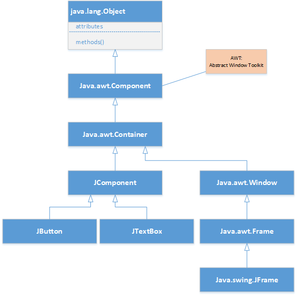

# Java Swing Class Level-I

## Table of Contents
- [Java Swing Class Level-I](#java-swing-class-level-i)
  - [Table of Contents](#table-of-contents)
  - [References](#references)
  - [Create a window frame](#create-a-window-frame)
  - [Add components to frame](#add-components-to-frame)
  - [Commonly used Methods of Component class](#commonly-used-methods-of-component-class)
  - [Anonymous Class](#anonymous-class)
  - [Swing Hierarchy](#swing-hierarchy)
  - [Swing JComponent](#swing-jcomponent)
  - [Swing Layout](#swing-layout)
  - [Pane](#pane)
  - [Menu](#menu)
  - [Applications](#applications)
  - [Applications & build.xml](#applications--buildxml)
  
[References](#References)

## References

## Create a window frame
* [x] OpenWindow.java
* [x] Frame2.java

## Add components to frame
* [x] AddButton.java
* [x] AddTextField.java
* [x] AddLabel.java

## Commonly used Methods of Component class
Method |	Description
|---|---|
public void add(Component c)	|add a component on another component.
public void setSize(int width,int height)	|sets size of the component.
public void setLayout(LayoutManager m)	|sets the layout manager for the component.
public void setVisible(boolean b)	|sets the visibility of the component. It is by default false.

## Anonymous Class
1. [x] GetInfo.java; interface
1. [x] Student.java; implements GetInfo
1. [x] Teacher.java; implements GetInfo
1. [ ] StudentTest.java; test GetInfo, build Polymorpythism concept. 3 way to use Interface.
1. [ ] JButton.addActionListener(ActionEvent) 

## Swing Hierarchy


## Swing JComponent
[Java Tutorial](https://docs.oracle.com/javase/tutorial/uiswing/components/scrollpane.html)
[JRadio Button](https://www.geeksforgeeks.org/jradiobutton-java-swing/?ref=lbp)
01. [x] OpenWindow.java; show JFrame window
02. [x] AddButton.java; add a button to JFrame
03. [x] AddTextField.java; add both TextField and Button in JFrame with button click response
04. [x] AddLabel.java; add JLabel in the JFrame
05. [x] Frame2.java; Extends JFrame
06. [x] DisplayImage.java & MyPanel.java; display an apple image, load some image from internet
07. [ ] FourCornersImages.java; Homework, display images in JFrame
08. [x] MovingImage.java & MyPanel1.java
09. [x] RandomMovineImage.java & MyPanel3.java
10. [x] KeyboardControl.java & MyPanel2.java
11. [x] CheckBoxExample.java & CheckBoxExample1.java; (with icon)
12. [x] RadioButtonExample.java; 2 ways to add an ActionListener for jButton
13. [x] TextAreaExample.java; copy large file to see some text been hidden.
14. [x] ScrolledPaneExample.java; add JScroll Pane around the TextArea
15. [x] ListExample.java; without layout(FlowLayout), use GridLayout(), use BorderLayout() 
16. [x] ListExample2.java; with scroll and BorderLayout
17. [x] listExample1.java; select birthday
18. [ ] OptionPaneExample.java;
19. [x] ComboBoxExample.java 
20. [ ] ComboBoxExample1.java; ActionListener, ItemListener; ask student add clear button to clear label message.

## Swing Layout
[Swing Layout](https://www.tutorialspoint.com/swing/swing_layouts.htm)

The layout manager automatically positions all the components within the container. 
Layout Manager

* [x] remove setLayout(null) from FourCornersImages.java
* [x] FlowLayout.java; change the window size feel the button position changes. remove frame.pack() function call, see the result. 
    - ask student add code for button click response
    - ask student add more component in the panel, such as JTextField, and JLabel
* [ ] BorderLayoutExample.java; resize the window. 
    - BorderLayoutExample1.java; ask student add more components in the center as FlowLayout.
* [ ] CardLayoutExample.java; class level attributes, JFrame.getContentPanel()
* [ ] BoxLayoutExample.java; disappare when change Window size.
* [ ] GridLayoutExample.java;
* [ ] GridBagLayoutExample.java;
* [ ] SpringLayoutExample.java; Fixed relationship between components
* [ ] GroupLayoutExample.java; need set both Horizontal and Vertical

## Pane
1. [ ] ScrolledPaneExample.java; add JScrollPane around the TextArea
1. [ ] OptionPaneExample.java;
1. [ ] TabbedPaneExmple.java;
1. [ ] DesktopPaneExample.java;
1. [ ] EditorPaneExample.java;
1. [ ] EditorPaneExample1.java;

## Menu
1. [ ] MenuExample.java; build simple menu and sub menu
1. [ ] MenuExample1.java; add Edit menu for cut, copy, paste, selectAll
1. [ ] MenuExample2.java; surround JTextArea with JScrollPane.
1. [ ] PopupMenuExample.java; build simple popup menu, no action
1. [ ] PopupMenuExample1.java; anonymous class for ActionListener
1. [ ] PopupMenuExample.java; implements ActionListener.
1. [ ] SeparatorExample.java; add separator line between menu item.


## Applications
1. [ ] Calculator.java; Default layout=FlowLayout, JFrame, JPanel, JTextField, JButton 
1. [ ] Tic Tac Toe; com.huaxia.tictactoe; layout=null, resizable=false; getClass().getResource() refer to MyPanel.java; CheckBox, JOptionPane,
```java
    Toolkit t = Toolkit.getDefaultToolkit();
    URL iconUrl = this.getClass().getResource("resources/tiger.jpeg");
    apple = t.getImage(iconUrl);
```
1. [ ] Snake
1. [ ] Kingdomino

## Applications & build.xml
* [ ] Calculator.java; add BorderLayout and GridLayout
* [ ] Snake-Game; Ant build.xml
* [ ] Tic Tac Toe, TT1.java; build jar; load image by using classpath
