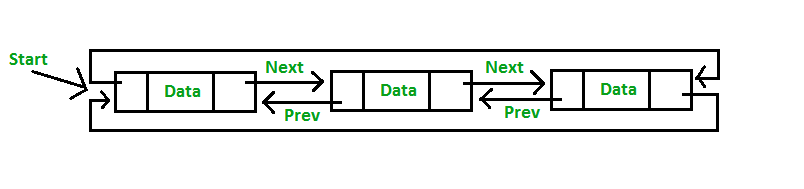
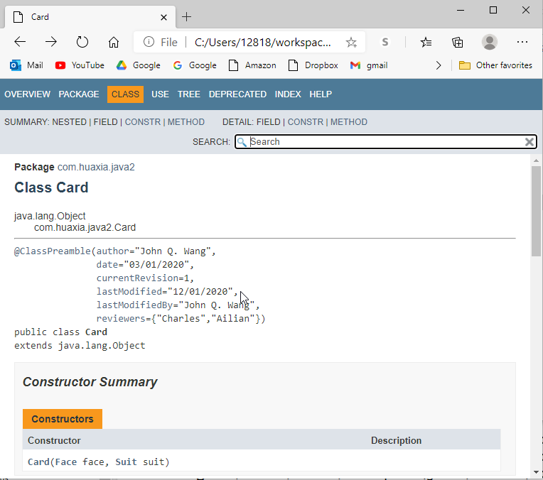
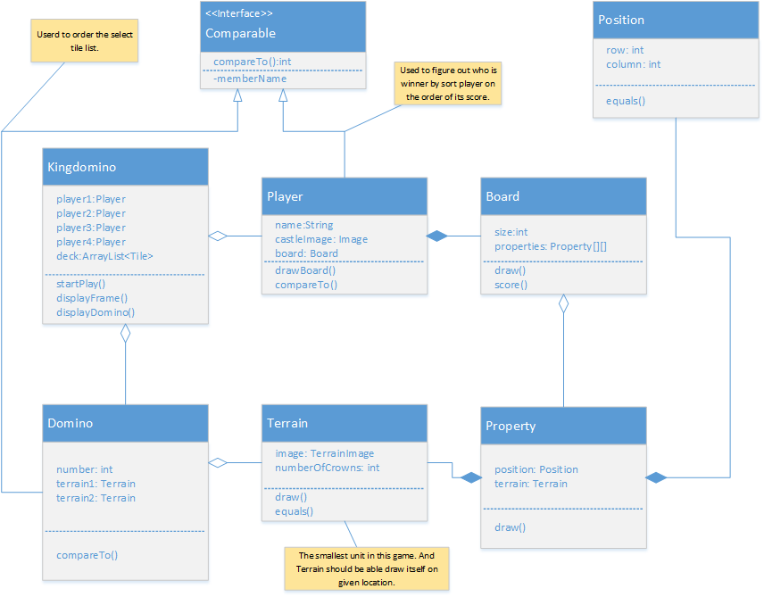
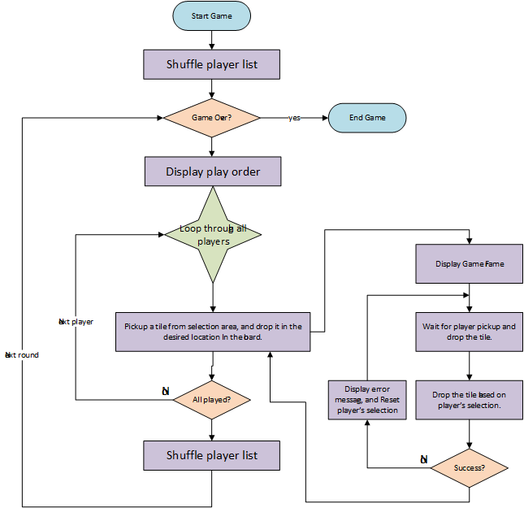
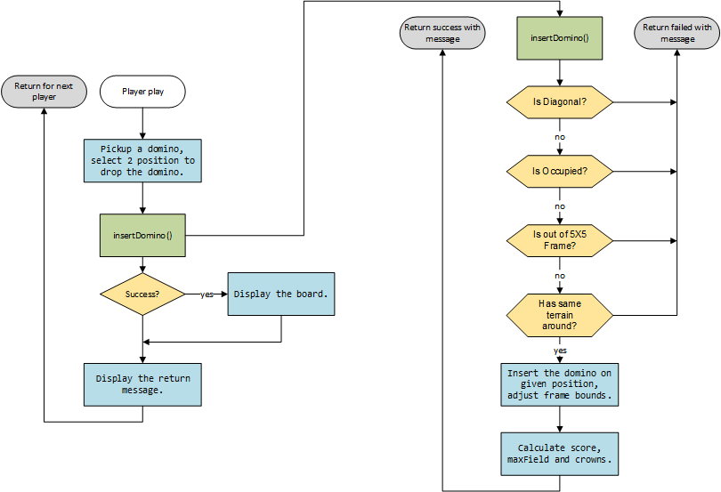
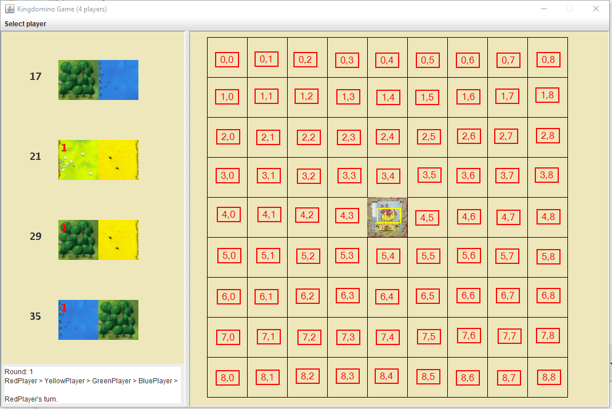
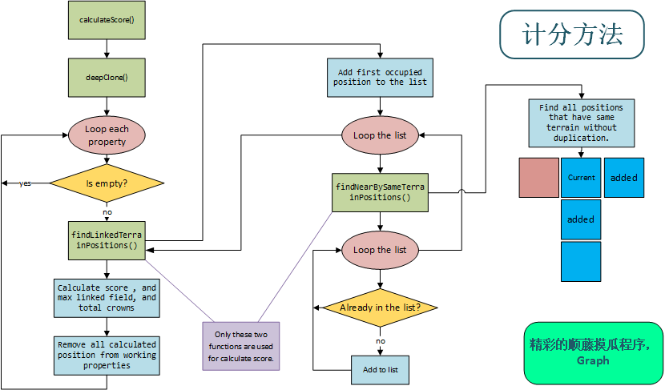

# Java Swing Class Level-II

## Table of Contents
1. [enum](#enum)
1. [Data Structure](#Data-Structure)
1. [Menu](#Menu)
1. [Swing JComponent](#Swing-JComponent)
1. [Pane](#Pane)
1. [Understand Kingdomino](#Understand-Kingdomino)
1. [Build Blackjack from scratch](#Build-Blackjack-from-scratch)
1. [Annotations](#Annotations)
1. [Applications](#Applications)

1. [](#)
1. [](#)

## enum
* enum1.java (Weekdays.java)
* Planet.java (args in main method, Run> Run Configurations...> Arguments > Program arguments)
* Exercises: Card.java, Face.java, Suit.java, Deck.java
---
[Table of Contents](#Table-of-Contents)

## Data Structure
* LinkedList.java
* linkedlist (java project)


WordChecker.pdf
---
[Table of Contents](#Table-of-Contents)

## Annotations
```java
@Override
public String toString(){
    ...    
}
```
* ClassPreamble.java


* JsonSerializable.java; define class level annotation
* JsonElement.java; define element level annotation
* Init.java; define method level annotation
* Person.java; annotate class, attribute and method
* ObjectToJsonConverter.java; convert Person object to Json String.
---
[Table of Contents](#Table-of-Contents)


## Gson
---
[Table of Contents](#Table-of-Contents)


## Menu
1. MenuExample.java; build simple menu and sub menu
1. MenuExample1.java; add Edit menu for cut, copy, paste, selectAll
1. MenuExample2.java; surround JTextArea with JScrollPane.
1. PopupMenuExample.java; build simple popup menu, no action
1. PopupMenuExample1.java; anonymous class for ActionListener
1. PopupMenuExample.java; implements ActionListener.
1. SeparatorExample.java; add separator line between menu item.
---
[Table of Contents](#Table-of-Contents)


## Swing JComponent
1. ListExample.java; without layout(FlowLayout), use GridLayout(), use BorderLayout() 
1. ListExample2.java; with scroll
1. listExample1.java; select birthday
1. OptionPaneExample.java;
1. ComboBoxExample.java 
1. ComboBoxExample1.java; ActionListener, ItemListener; ask student add clear button to clear label message.
---
[Table of Contents](#Table-of-Contents)


## Pane
1. ScrolledPaneExample.java; add JScrollPane around the TextArea
1. OptionPaneExample.java;
1. TabbedPaneExmple.java;
1. DesktopPaneExample.java;
1. EditorPaneExample.java;
1. EditorPaneExample1.java;
---
[Table of Contents](#Table-of-Contents)


## Understand Kingdomino
* Keep Reading Existing Source Code
* Debug Existing Code
* Create unit test for Existing Code
* Document Existing Code (Java Doc, Markdown)
* Relationship between classes
---
[Table of Contents](#Table-of-Contents)



* Game logic


* Pick up Domino (Player>DominoPositionListener)
* Place Domino (Board.insertDomino())




* load images (Terrain.java, Player.java)
* is Diagnal? (Board Unit test)
* is Occupied? (Board Unit test)
* is Out of 5X5 frame?
* Has Same Terrain arround?
* About Message.java
* Calculate score (Board.calculateScore())
* Display Result
* Configure the Kingdomino Game (think about the future)


---
[Table of Contents](#Table-of-Contents)

## Design Pattern
* Creational Design Pattern
    - Singleton Pattern
    - Factory Pattern
    - Abstract Factory Pattern
    - Builder Pattern
    - Prototype Pattern
* Structural Design Pattern
---
[Table of Contents](#Table-of-Contents)

## Build Blackjack from scratch
[Blackjack Rules](https://casinorange.com/how-to/how-to-play-blackjack#)
* Big Picture


* Card.java
* BlackJackCard.java
* Deck.java
* Blackjack.java
* BlackJackFrame.java
* Player.java
* Dealer.java
---
[Table of Contents](#Table-of-Contents)

## Applications
1. √ Calculator.java; Default layout=FlowLayout, JFrame, JPanel, JTextField, JButton 
1. Tic Tac Toe; com.huaxia.tictactoe; layout=null, resizable=false; getClass().getResource() refer to MyPanel.java; CheckBox, JOptionPane,
```java
    Toolkit t = Toolkit.getDefaultToolkit();
    URL iconUrl = this.getClass().getResource("resources/tiger.jpeg");
    apple = t.getImage(iconUrl);
```
1. Snake
1. Kingdomino
1. notepad
---
[Table of Contents](#Table-of-Contents)
