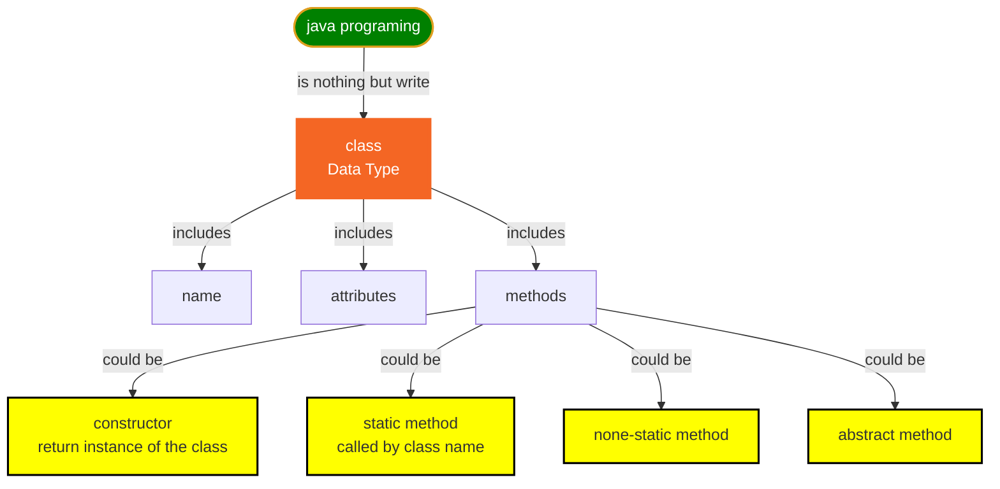
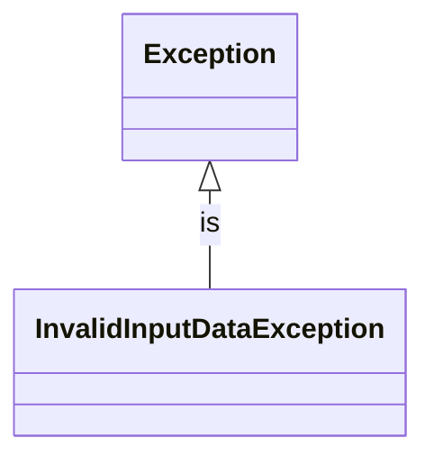
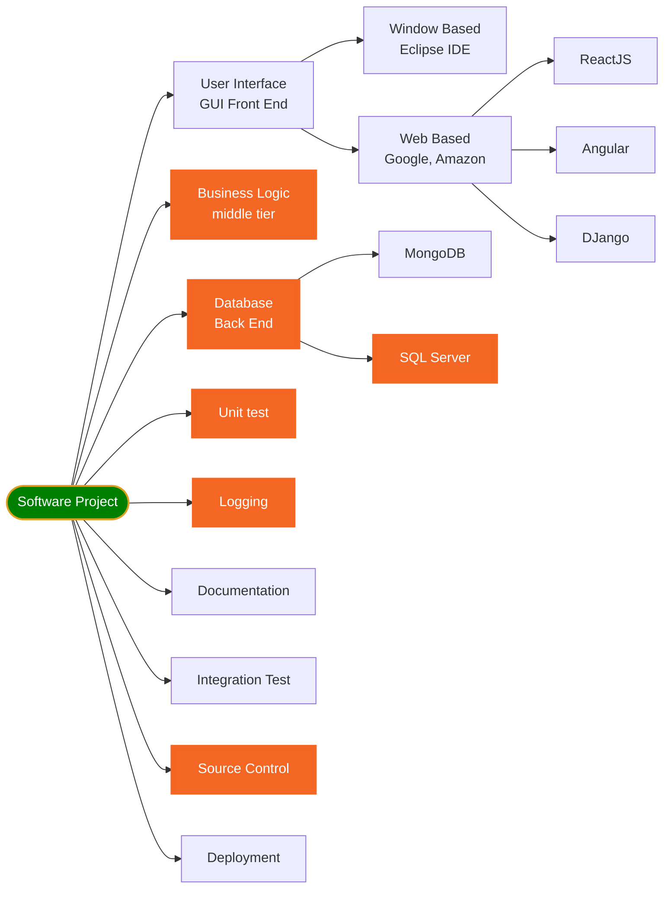
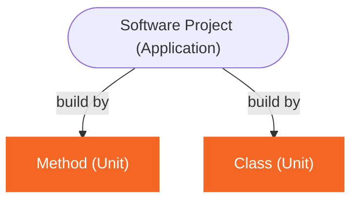
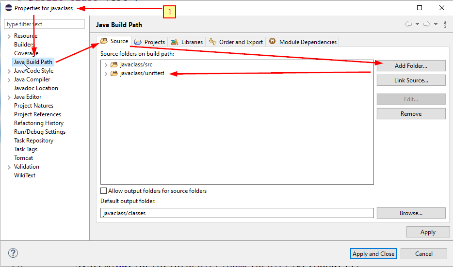
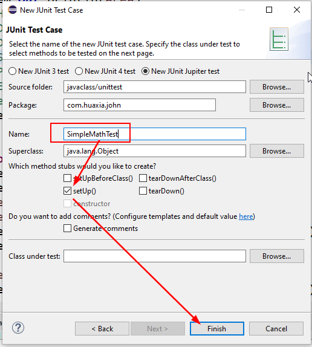
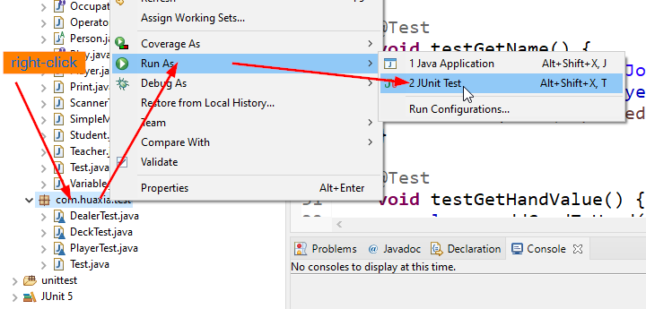
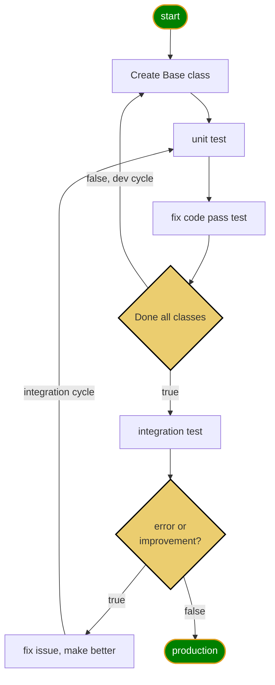
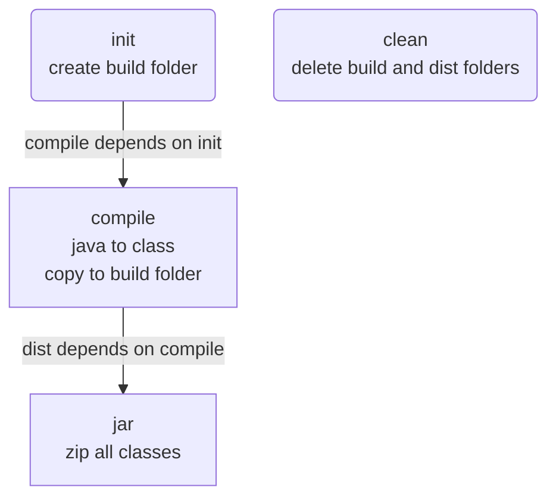

<h1> 休斯顿华夏中文学校-Java Class Notes</h1>

* [Google Classroom](https://classroom.google.com/c/NDcyOTM2NjE2MzAx?cjc=eq2qw5x)
* [Java 8 API Document](https://docs.oracle.com/javase/8/docs/api/)
* [Java 16 API Document](https://docs.oracle.com/en/java/javase/16/docs/api/index.html)

* [Useful icons and mermaid](utilities.md)
  
* [编程入门该学哪门语言?](https://www.youtube.com/watch?v=6B9Olpve4n0)

## Table of Contents
- [Table of Contents](#table-of-contents)
- [Getting Start](#getting-start)
- [Language Basics](#language-basics)
- [Java Programing](#java-programing)
- [OOP](#oop)
- [Exception](#exception)
- [Parts of Softwere development](#parts-of-softwere-development)
- [Unit test](#unit-test)
- [TDD (Test Driving Development)](#tdd-test-driving-development)
- [Blackjack Card Game](#blackjack-card-game)
- [chart](#chart)
- [Logging](#logging)
- [using logging](#using-logging)
	- [load logging.properties from file](#load-loggingproperties-from-file)
	- [load logging.properties from classpath](#load-loggingproperties-from-classpath)
	- [load logging.properties from InputSream](#load-loggingproperties-from-inputsream)
	- [Understand log message format](#understand-log-message-format)
- [Integration Test](#integration-test)
- [Documentation](#documentation)
	- [Java Doc](#java-doc)
- [Software development life cycle](#software-development-life-cycle)
- [Deployment(jar file)](#deploymentjar-file)
	- [create jar file use ant](#create-jar-file-use-ant)
	- [use jar](#use-jar)
	- [view jar](#view-jar)
- [Data Structure & Algorithms](#data-structure--algorithms)
- [Java Multithreaded processing](#java-multithreaded-processing)
- [Java Regular Expressions](#java-regular-expressions)
- [Java Collections](#java-collections)
- [Java IO](#java-io)
- [Simple Math](#simple-math)
- [Java Properties](#java-properties)
- [Design Pattern](#design-pattern)
- [MongoDB](#mongodb)
- [SQL](#sql)
- [Java Module](#java-module)
- [References](#references)


## Getting Start

* [Getting Started](gettingStart.md)

## Language Basics

* [Language basics](languageBasics.md)

## Java Programing



## OOP

* [Object Oriented Programing](oop.md)

## Exception
* calculate Circle Area without throwing Exception
[Circle area with radius=-2](../huaxia/src/com/huaxia/java1/NeedException.java)

❓ What is Exception?
✔️ In java, Exception is a root class for all Exceptions.


* Using Exception root class in general cases
* 
[SimpleMath.div()](../huaxia/src/com/huaxia/java1/math/SimpleMath.java)

* Create your own specific Exception
[Create my own Exception](../huaxia/src/com/huaxia/java1/math/InvalidInputDataException.java)

* try-catch block

❓ throw Exception is good enough for java app?
✔️ No. most of times it is too late.

## Parts of Softwere development

👎😢 throw Exception can help developer locate the problem, and root reason which causes the issues, but sometimes it is too late.
 
## Unit test
❓What is Unit Test?
>✔️A unit is a specific piece of code to test other unit code block, such as a function or a class. Unit tests are then other pieces of code that specifically exercise the code unit with a full range of different inputs, including boundary and edge cases.



In order to make the project or application work well, we need make sure each small unit works correctly.

[Simple math Unittest](../huaxia/test/com/huaxia/java2/SimpleMathTest.java)


## TDD (Test Driving Development)
1. create new folder under project folder: unittest
2. add unittest folder to the source
right-click project name ==> Properties ==> Java Build Path ==> Source (tab) ==> Add Folder (button) ==> unittest folder to source.



3. create a new package: com.huaxia.javaclass
4. right-click package name ==> New ==> JUnit Test Case ==> enter the class name ==> finish(button)
   


❓ How to run all unit test in once?
✔️ Right-click unittest package name ==> Run As ==> JUnit Test or,

Highlight unittest package name ==> Run(menu) ==> Run As ==> JUnit Test or,

Highlight unittest package name ==> Alt+shift+x, t



❓ What is TDD?
✔️

## Blackjack Card Game

* [Blackjack Card game document](blackjack.md)


## chart
* [Java chart](chart.md)


## Logging

❓What is logging in programming?
✔️Logging is keeping a record of all data input, processes, data output, and final results in a program to a file or database.
❓Why we need logging?
✔️There are multiple reasons why we may need to capture the application activity.
1. Recording unusual circumstances or errors that may be happening in the program
2. Getting the info about whats going in the application

[console log message](../huaxia/src/com/huaxia/java1/LoggingTest.java)
[log to File](../huaxia/src/com/huaxia/java1/loggerExample2.java)
[console log message](../huaxia/src/com/huaxia/java1/loggerExample1.java)
[log to File](../huaxia/src/com/huaxia/java1/loggerExample3.java)

## using logging
1. create a static logger instance of Logger class in Game class.
2. insert fine, info, severe message in our program.
3. While running the game, we setup logger lever to Level.WARNING for production, and setup Level.FINE for debugging.
4. insert log message into other classes by using logger defined in Game class.
5. send log message to a file so we can do analysis in the future.
   
❓How do I setup log level to SEVERE for Console?
✔️😢the file handler also no output❌
```java
logger.setLevel(Level.SEVERE);
```
❌😢it does NOT work for ConsoleHandler!
❌Set System property also faild
✔️😄try logging.properties file
❓How can I make Console Handler and File Handler different log level?
✔️use LogMager and provide logging.properties file.

1. create conf folder
2. create logging.properies file
3. add key-value pair
4. set System property fir the file
```java
	static {
		System.setProperty("java.util.logging.config.file", "/Users/12818/workspace/java0/john/conf/logging.properties");
	}
	public static Logger logger = Logger.getLogger("JOHN");

```

❓What is .properties file?
✔️It is a plain text file holds key-value pair separated by '=' for configuration.

```properties
handlers= java.util.logging.FileHandler, java.util.logging.ConsoleHandler
.level=FINEST

java.util.logging.FileHandler.level = FINE

java.util.logging.FileHandler.pattern = %h/workspace/java/mylogs%u.log
java.util.logging.FileHandler.limit = 50000
java.util.logging.FileHandler.count = 1
java.util.logging.FileHandler.maxLocks = 100
java.util.logging.FileHandler.formatter = java.util.logging.XMLFormatter

java.util.logging.ConsoleHandler.level = INFO
java.util.logging.ConsoleHandler.formatter = java.util.logging.SimpleFormatter
java.util.logging.SimpleFormatter.format=[%1$tF %1$tT] [%4$-7s] %5$s %n
```

Level setting Rule:
1. .level=FINE defined parent logger level for all handlers
2. java.util.logging.ConsoleHandler.level=WARNING defined log level for ConsoleHandler
3. log level overridden: which ever is more severe, logger will use that level

❓How do I send log message to file?
✔️

### load logging.properties from file
```java
static Logger logger = null;
static {
      System.setProperty("java.util.logging.config.file",
              "/Users/12818/workspace/java/huaxia/conf/logging.properties");
      //must initialize loggers after setting above property
      logger = Logger.getLogger("JOHN");
  }
```
😢👎This is not a good way, since if you deploy your application to different machine, the absolute folder path may not exists❗️

### load logging.properties from classpath
😄✔️Copy logging.properties into src folder is a good idea.👍

```java
private static Logger logger;

  static {
      String path = LoggerExample4.class.getClassLoader()
                                  .getResource("logging.properties")
                                  .getFile();
      System.setProperty("java.util.logging.config.file", path);
      logger = Logger.getLogger("WANG");
  }
```

### load logging.properties from InputSream
👌ok way to do logging configuration, but the code looks little complicated, 
❓why choose it?

[LoggerExample4.java](../huaxia/src/com/huaxia/java2/LoggerExample4.java)
```java
  static {
    InputStream stream = LoggerExample4.class
        .getClassLoader()
        .getResourceAsStream("logging.properties");
    try {
      LogManager manager = LogManager.getLogManager();
      manager.readConfiguration(stream);
    } catch (IOException e) {
      e.printStackTrace();
    }
  }
```
❗️⚡️ the logging.properties file is put under ./src folder, and then copied to bin folder by compiler.

### Understand log message format
1. java.util.logging.XMLFormatter (FileHandler default)
2. java.util.logging.SimpleFormatter
```properties
java.util.logging.SimpleFormatter.format=[%1$tF %1$tT] [%4$-7s] %5$s %n
```  
```output
[2021-08-04 14:17:02] [SEVERE ] this is a severe message 
```
```java
String.format(format, date, source, logger, level, message, thrown);
//position:             1     2       3       4       5       6   
```
❓what is the simple example below?
```java
java.util.logging.SimpleFormatter.format="%4$s: %5$s [%1$tc]%n"
```
✔️This prints 1 line with the log level (4$), the log message (5$) and the timestamp (1$) in a square bracket.
```
WARNING: warning message [Tue Mar 22 13:11:31 PDT 2011]
```

refer to java.util.Formatter class

where %s means String output, 4$ means 4th item in the String.format which is level.
%tc means date/time output, 1$ means 1th item in the String.format which is date.

[Sample logging.properties file](../huaxia/src/logging.properties)
[Use logging.properties](../huaxia/src/com/huaxia/java2/LoggerExample4.java)


## Integration Test
❓What is Integration Test?
✔️Play the Blackjack game by running Game class.

## Documentation
### Java Doc

```DOS
cd blackjack/doc
mkdir api
cd api
javadoc -sourcepath ../../src -subpackages com.huaxia
```


## Software development life cycle
* Test Driven Development (TDD)

## Deployment(jar file)

### create jar file use ant
[build.xml](../blackjack/build.xml)

```xml
<project name="blackjack" default="dist" basedir=".">
	<!-- set global properties for this build -->
	<property name="src" location="src" />
	<property name="build" location="build" />
	<property name="dist" location="dist" />

	<path id="project.classpath">
		<pathelement location="bin" />
	</path>

	<target name="init">
		<!-- Create the time stamp -->
		<tstamp />
		<!-- Create the build directory structure used by compile -->
		<mkdir dir="${build}" />
	</target>

	<target name="compile" depends="init" description="compile the source">
		<!-- Compile the Java code from ${src} into ${build} -->
		<javac srcdir="${src}" destdir="${build}"/>
	</target>

	<target name="dist" depends="compile" description="generate the distribution">
		<!-- Create the distribution directory -->
		<mkdir dir="${dist}/lib" />

		<!-- Put everything in ${build} into the snake.jar file -->
		<jar jarfile="${dist}/lib/blackjack.jar" basedir="${build}">
			<manifest>
				<attribute name="Built-By" value="John Wang" />
				<attribute name="Main-Class" value="com.huaxia.blackjack.Game" />
			</manifest>
		</jar>
	</target>
	<target name="run">
		<java fork="yes" classname="com.huaxia.blackjack.Game" failonerror="true">
			<classpath refid="project.classpath" />
		</java>
	</target>

	<target name="clean" description="clean up">
		<!-- Delete the ${build} and ${dist} directory trees -->
		<delete dir="${build}" />
		<delete dir="${dist}" />
	</target>
</project>
```
* Targets
  1. init
  2. compile
  3. dist
  4. clean


### use jar 

```DOS
cd blackjack/dist/lib
java -jar blackjack.jar
```

### view jar
Help menu ⟹ Eclipse Marketplace... ⟹ Eclipse Archive Utility 0.1.0

Window ⟹ show view ⟹ Project Explore ⟹ click arrow on the jar file

## Data Structure & Algorithms

* [Data Structures](dataStructures.md)


## Java Multithreaded processing

## Java Regular Expressions

## Java Collections

## Java IO
* [read file](../basics/src/languagebasics/fileio/ReadFile.java)
* [write file](../basics/src/languagebasics/fileio/WriteFile.java)
* [Reac CSV file](../basics/src/languagebasics/fileio/ReadCSV.java)
* [JSon file handler](../basics/src/languagebasics/fileio/GsonExample1.java)

## Simple Math
* [Prime](../basics/src/simplemath/Prime.java)
* [GCD: Greatest Common Divisor](../basics/src/simplemath/GCD1.java)
* [GCD: Greatest Common Divisor](../basics/src/simplemath/GCD2.java)
* [GCF: Greatest Common Factor](../basics/src/simplemath/GCF.java)
* [LCM: Least Common Multiple](../basics/src/simplemath/LCM.java)
* [Linear algebra:赶集](../basics/src/simplemath/Linear1.java)
* [Linear algebra:年龄](../basics/src/simplemath/Linear2.java)
* [RollDice 1](../basics/src/simplemath/RollDice1.java)
* [RollDice 2](../basics/src/simplemath/RollDice2.java)
* [RollDice 3](../basics/src/simplemath/RollDice3.java)

## Java Properties

## Design Pattern
* [Design pattern](designPattern.md)

## MongoDB

* [Mongo Database](mongodb.md)

## SQL

* [SQL Database basics](sql.md)
  

## Java Module
[YouTube Understand Java Module](https://www.youtube.com/watch?v=22OW5t_Mbnk)

## References
* [👍 All excercises](https://www.w3resource.com/java-exercises/index.php)
  1. [Loop Excercises](http://www.beginwithjava.com/java/loops/questions.html)
  2. [method Excercises](http://www.beginwithjava.com/java/methods/questions.html)
  3. [class excercises](http://math.hws.edu/eck/cs124/javanotes4/c5/exercises.html)
  4. [OOP Excercises](https://www3.ntu.edu.sg/home/ehchua/programming/java/J3f_OOPExercises.html)
  5. [Operator Excercise](https://docs.oracle.com/javase/tutorial/java/nutsandbolts/QandE/questions_operators.html)
* [Java Tutorial](http://www.beginwithjava.com/java/)
* [Good Java Tutorial WebSite](https://beginnersbook.com/2014/07/how-to-sort-a-treemap-by-value-in-java/)
* [Java Point](https://www.javatpoint.com/java-tutorial)
* [Linked List](https://www.javatpoint.com/singly-linked-list-vs-doubly-linked-list)