<h1> 休斯顿华夏中文学校-Java Class Notes</h1>

[](myIcons.md)
[编程入门该学哪门语言?](https://www.youtube.com/watch?v=6B9Olpve4n0)
酒店注册

To-Do List
1. java1: add more many-to-many sample
2. python1: add sticker sample app
3. python1: add notepad app
4. python1: complete blackjack tkinter game
5. 

## Table of Contents
- [Table of Contents](#table-of-contents)
- [Getting Start](#getting-start)
  - [Check Software Installation](#check-software-installation)
  - [Basic skills(questions and answers)](#basic-skillsquestions-and-answers)
  - [File Structure](#file-structure)
  - [My First Java Program](#my-first-java-program)
  - [Getting farmiliar with your keyboard](#getting-farmiliar-with-your-keyboard)
  - [Print](#print)
  - [Variable](#variable)
    - [naming rules](#naming-rules)
  - [Comment](#comment)
  - [Scanner](#scanner)
- [Language Basics](#language-basics)
- [Data Type](#data-type)
- [Array](#array)
- [Operator](#operator)
- [Excution Control](#excution-control)
  - [if-else](#if-else)
  - [switch](#switch)
- [Loop](#loop)
- [Java class](#java-class)
- [OOP](#oop)
- [class](#class)
  - [Construtor](#construtor)
  - [Inhritance](#inhritance)
- [interface](#interface)
- [abstract class](#abstract-class)
- [concrete class](#concrete-class)
  - [Method Overloading vs. Overriding](#method-overloading-vs-overriding)
  - [An Abstract Class Example](#an-abstract-class-example)
- [Unit test](#unit-test)
- [Logging](#logging)
- [Blackjack Card Game](#blackjack-card-game)
  - [Object relationship](#object-relationship)
  - [Game logic](#game-logic)
  - [Code Optimization](#code-optimization)
- [using logging](#using-logging)
  - [load logging.properties from file](#load-loggingproperties-from-file)
  - [load logging.properties from classpath](#load-loggingproperties-from-classpath)
  - [load logging.properties from InputSream](#load-loggingproperties-from-inputsream)
  - [Understand log message format](#understand-log-message-format)
- [Integration Test](#integration-test)
- [Documentation](#documentation)
  - [Java Doc](#java-doc)
- [Software development life cycle](#software-development-life-cycle)
- [Deployment(jar file)](#deploymentjar-file)
  - [create jar file use ant](#create-jar-file-use-ant)
  - [use jar](#use-jar)
  - [view jar](#view-jar)
- [MongoDB](#mongodb)
  - [one-to-one relation](#one-to-one-relation)
  - [one-to-many relation](#one-to-many-relation)
  - [many-to-many relation](#many-to-many-relation)
- [SQLite](#sqlite)
  - [one-to-one relationship](#one-to-one-relationship)
  - [one-to-many relationship](#one-to-many-relationship)
  - [many-to-many relationship](#many-to-many-relationship)
- [References](#references)

## Getting Start
❓✔️❌✔️
```
1. Create Java Project: javaclass
2. Create Package: com.huaxia.javaclass (by package name convention)
<com, org>.<company name>.<project name>.<package name>...
3. Create class: Hello.java
for any class name by convention, use Upercase for first letter
```
* [My First Java Program](../huaxia/src/com/huaxia/java1/Hello.java)

❓ How to learn new computer language?
✔️
1. do it by yourself
2. learn from mistakes
   
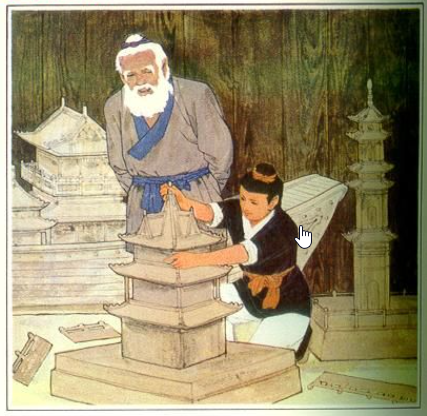

**Lǔbān** is a famous master carpenter of ancient China. **Lǔbān** studied hard for three years and learned all the skills. The old master want to try him more, and destroy all the models, let him build them all over again. He made one by one exactly the same as the original all based on his memory. The old master created a lot of new models for him to build. He pondered and did it, and the results were made according to the style of the master. The old master was very satisfied.

鲁班是著名的中国古代的木匠师傅。鲁班苦学了三年，把所有的手艺都学会了。老师傅还要试试他，把模型全部毁掉，让他重新造。他凭记忆，一件一件都造得跟原来的一模一样。老师傅又提出好多新模型让他造。他一边琢磨一边做，结果都按师傅说的式样做出来了。老师傅非常满意。

>Everything you have learned, you need do it all by yourself, until then, whatever you've learned indeed belongs to yourself.


### Check Software Installation
```DOS
java -version
javac -version
```

### Basic skills(questions and answers)

* ❓How do I create a Java project?
✔️Right-Click on explore window ⟹ New ⟹ Java Project ⟹ enter project name

* ❓How do I create Java package?
✔️Right-click src folder ⟹ New ⟹ package ⟹ enter package name

* ❓How do I cerate a Java class?
✔️Right-click package name ⟹ New ⟹ class ⟹ enter class name

* ❓Hod wo I run a Java class?
✔️Click the green run button on toolbar 

* ❓Can I rename the main() method?
✔️No❗️❗️❗️

* ❓How can I save the class file?
```output
✔️there are more than one way to save the file:
1. Ctrl+s
2. File ⟹ Save
3. File ⟹ Save All
4. click save button on toolbar
```

### File Structure
Organize Class Notes File Structure
```
<java root>
    ├── ReadMe.md
    └── doc/
         ├── images/
         ├── homeworks/
         |      ├── mardown01.md
         |      └── mardown02.md
         ├── eclipseTrics.md     
         ├── markdownTrics.md     
         ├── myIcons.md     
         └── java.md     
```

[Homework 1](../homeworks/markdown01.md)
[Homework 2](../homeworks/markdown02.md)

### My First Java Program
```
1. Create Java Project: javaclass
2. Create Package: com.huaxia.javaclass (by package name convention)
<com, org>.<company name>.<project name>.<package name>...
3. Create class: Hello.java
for any class name by convention, use Upercase for first letter
```
* [My First Java Program](../src/com/huaxia/john/Hello.java)
    - System.out.println()
    - // single line comment
    - every Java statement line ends with ;
    - public before the class is not important
    - main() method must be public
    - main() method must be static
    - void on main() method is return type
    - main() method name is special, change it will cause main() not found error.
    - String[] is part of main() method signature, cannot be changed
    - args is variable name which can be changed.
  1. java reserved keyword in purple color: package,public,class,static,void
  2. public and static is modifier which can be used to modify class, method, or variable
  3. class is used to declare a java class
  4. void is a method return data type, which means nothinbg to return
  5. package is actual file folders
  6. cannot use private modifier for class
  7. default class can be used within same package
  8. package declaration line cannot be removed
  9. ❓how to rename class name: ✔️highlight class name > right-click > refactor > Rename
  10. cannot remove public or static modifier and void return type from main() method.
  11. cannot change main() method name. JRE will use it to run the class.
  12. cannot change argument String[] in main() method, it is part of the signature of main().
  13. the args variable name can be changed to something else.
  14. ; cannot be removed, it is used to complete the java statement.
  15. "" define a String object.
  16. 😢System.out.println([String]), there are more than one signature for println() method, such as println([int]);

>method signature:
1. method name
2. number of arguments
3. type of arguments
4. return data type(it may not belong to signature, but is part of method declaration)

### Getting farmiliar with your keyboard
[Keyboard definition](keyboard.md) 

### Print
* [Print.java](../src/Print.java)
1. System.out.printf(), is a formatted print out.
2. %d placeholder for integer
3. \n new line character
4. // single line comment

* Homeworks
  1. [Math Competition](../homeworks/12023%20Harmoney%20School%20Houston.pdf)
  2. [variable01](../homeworks/variable01.md)
  3. [variable02](../homeworks/variable02.md)

### Variable
❓ Why using variable?
✔️ we can define variable once, and use it at many place, so that you only make less change when you need change the value.

#### naming rules
1. any variable name cannot start with number.
2. variable name can be a combination of letters and numbers and '$', '_', not other special characters.
3. cannot use Java reservered keywords as variable name.
4. cannot define same variable name within same code scope.
5. you can re-assign new value on same variable without declaration.

1. variable name cannot start with number
2. variable can be combination of letters and numbers _, a~z, A~Z, 0~9, no other special characters
3. don't use reserved keywords as variable name
   


[define variable, assign value](../src/com/huaxia/javaclass/Variable.java)

>**the naming rules above is also apply for class name, method name.**

### Comment
1. single line comment
2. multiple line comment
3. for document
4. block code from executing

### Scanner
❓ What is Scanner?
✔️ is Java built-in class which allow program to get user input from console.
[Scanner](../src/MyScanner.java)
1. System.in is the console
2. **new** is a Java keyword used to create instance of a class.
3. nextLine(), nextInt(), ..., find all other functions from Java API document👇 below.

[Java API Document](https://docs.oracle.com/javase/8/docs/api/)
seach for java.util.Scanner

>❗️ public class name must to be the same as the java file name!

## Language Basics


## Data Type
* [DataType.java](../src/DataType.java)
  - primitive data type (boolean, byte, char, short, int, long, float, double)
>cast: small value can assign to large container; must cast large value before assign to small container.

  - Java built in data type (String, )
  - User defined data type

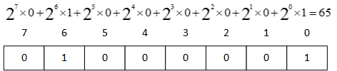

## Array
* [Array.java](../src/Array.java)
  - int[]
  - String[]
  - Hello[]

## Operator
* [Operator.java](../src/Operator.java)
  - Arithmatic operator: +,-,*,/,%
  - compound assignment operator: +=, -=, *=, /=, %= 
  - binary operator: ++, --,
  - comparison operator: >, <, >=, <=, ==, !=
  - logical operator: && and, || or, ! not
  - ternary operator: a<b?a:b
  - bitwise operator: &, |, ^
  - precendence: *, /; +, -; ()
``` 
		 &: bitwise and
		 |: bitwise or
		 ^: bitwise xor
		 ~: bitwise compliment
```
* Homeworks
    1. [quiz02.md](../homeworks/quiz02.md)
    2. [operator01.md](../homeworks/operator01.md)
    3. [operator02.md](../homeworks/operator02.md)

## Excution Control
### if-else
Execution control

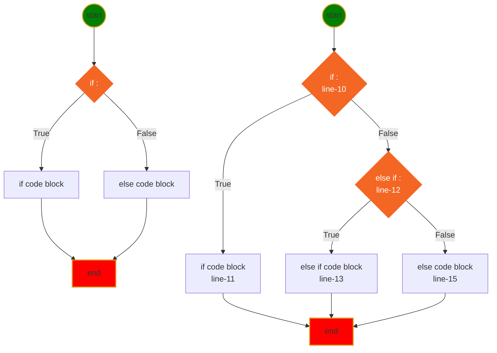
* [if-else syntax](../src/IfElse.java)
  
### switch
[switch]
  - Homeworks

## Loop
* For loop
  
* [for/while loop/do-while](../src/Loop.java)
* While loop
    
* do-while loop
    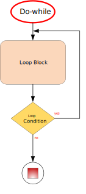

```
while loop has 3 part:
1. initialize variable, a=0
2. variable condition, a<10
3. adjust variable, a +=1
```
❓ What is **static** method?
✔️ a static method can be called by the class name, the method has nothing to do with the class attributes.

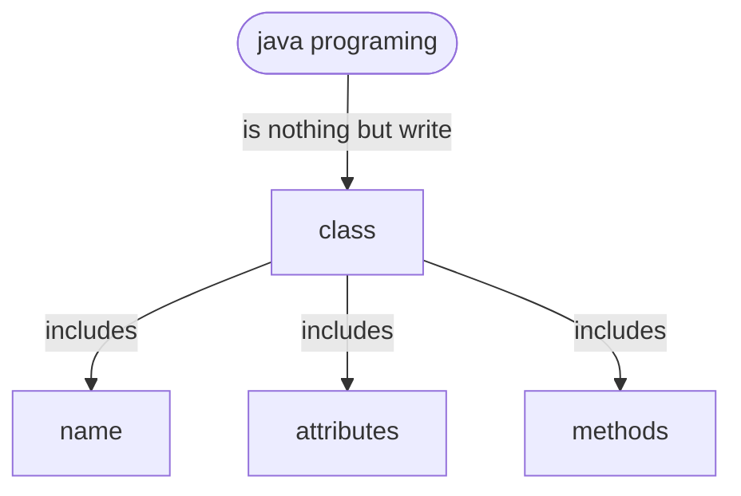

## Java class
❓ What is java class?
✔️ Java class is a software developer defined code blocks as a **data type** can be used to create an instance of that class. It includes class name, attributes and methods.

❓ What is constructor?
✔️ the class constructor is special method which returns an instance of that class.
1. Constructor must use class name as its name;
2. the constructor can be modified by modifiers such as: private, public, default;
3. the constructor has no return data type, since it retuens the instance of this class;
4. there can be more than one constructors with different signatures so called method overloading;


❓ What is method signature?
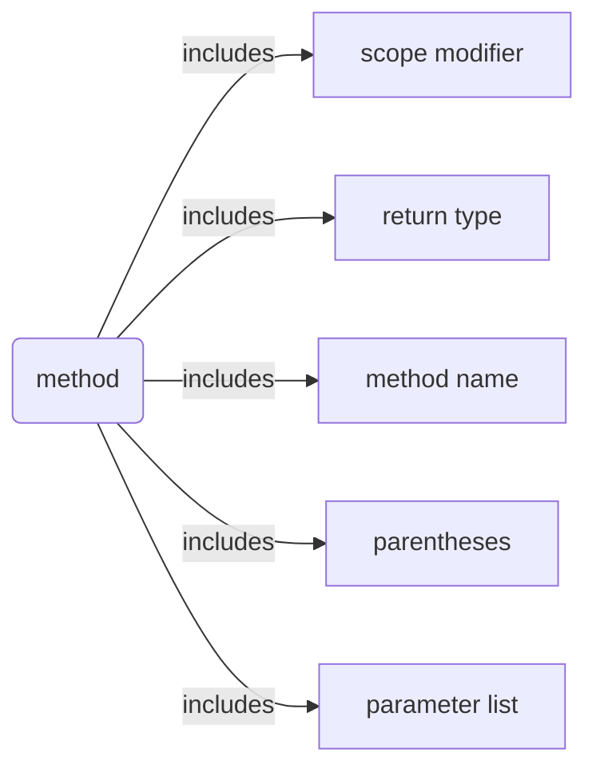
✔️ includes 1. method name; 2. parameter data type; 3. number of parameters;

may concern a return type also as part of the signature;

❓ Parameter vs. argument
✔️ 
> An **argument** is a value passed to a function when the function is called. An argument when passed with a function replaces with those variables which were used during the function;
> In other hand, a **parameter** is a variable used to define a particular value during a function definition. In the example below, a and b are **parameters**. 

[params vs. argument](../huaxia/src/com/huaxia/java1/Example1.java)

```java
public class Example {

	public static int multiply(int a, int b)
	{
		return a + b;
	}

	public static void main(String[] args)
	{
		int x = 2;
		int y = 5;

		// the variables x and y are arguments
		int sum = multiply(x, y);

		System.out.println("SUM IS: " + sum);
	}
}
```
where x, y are the arguments.

## OOP
❓ What is OOP?
✔️ Object Oriented Programming concept

  

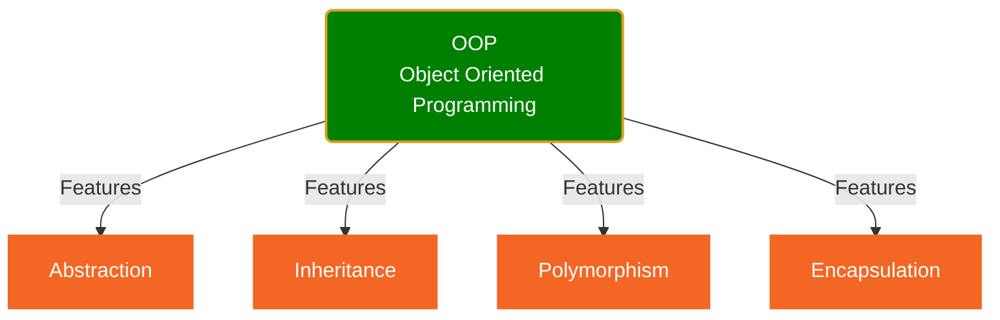
1. Encapsulation: private, protected
❓What is private modifier?
>✔️private modifier make variable or method in the class can only be used within the class, which makes encapsulation possible.
2. Abstraction: abstract object in the real world to write a class.
  
[First class](../src/com/huaxia/java1/Air.java)
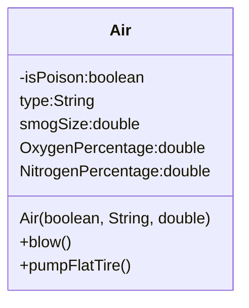
3. Inheritance: subclass inherits features from super class.
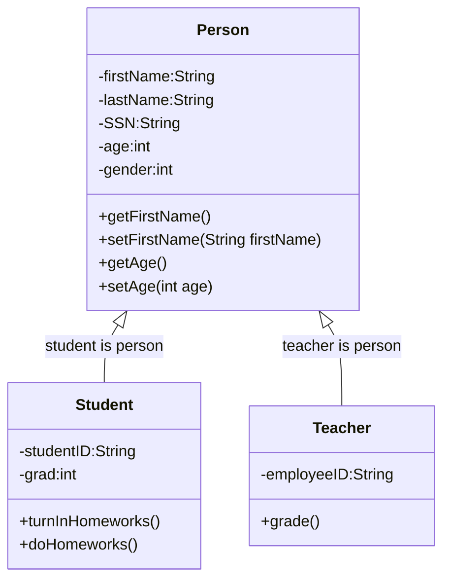

Student is a Person, the relationship between Student and Person is **is relation**.
where the Student class is subclass of Person class, we call the Person as Superclass of Student class.

* [Person, Superclass](../src/com/huaxia/java1/Person.java)
* [Student, Subclass of Person](../src/com/huaxia/java1/Student.java)
* [Teacher, Subclass of Person](../src/com/huaxia/java1/Teacher.java)

4. Polymorphism: 
> allows a single task to be performed in different ways.
> Polymorphism in Java is the ability of an object to take many forms, it allows us to perform the same action in many different ways. (method Overriding, Overloading, runtime polymorphism)
> give different answer for the same question from different classes which inherit from same superclas or interface. (异类同功)
   
[Test Polymorphism](../src/com/huaxia/test/TestMethod.java)

## class
❓What functions defined in Object class which are useful for us?
✔️the functions available in Object are
1. default constructor
2. toString()

❓What is construtor?
✔️Constructor is used to create an instance of the class.
### Construtor
1. Constructor looks like a method which does NOT have return type since it always return the instance.
2. Constructor can use public, package, private and protected modifier
3. 😢👎If you defined your own constructor with arguments, the default constructor no longer works
	- ✔️create a default constructor which does **NOT** have any aruments.
	- ✔️add arguments when you call the constructor
4. 👌You can define many different constructors which has different signature. 
5. 😢Subclass can NOT use Superclass constructor.
6. 😄Subclass can use public or protected methods defined in the superclass.
7. 😢👎👎👎class defined in the same package can call protected method.
8. 👍protected method cannot be called from different package.

❓What is protected modifier?
✔️protected modifier allow subclass to access the superclass attributes or methods. protect from using by other classes.

[getter, setter, toString, default constructor](../src/com/huaxia/java1/Superclass1.java)

❓How do I create getter/setter?
✔️
❓How do I override toString() method?
✔️
❓Why I want to override toString()?
✔️

### Inhritance
* Inherit from class
  [Super class: Person](Person.java)
  [Subclass Student](Student.java)
  [Subclass Teacher](Teacher.java)
  - class can only inherit from one class, Java does NOT allow multiple inheritance

* Implements from Interface
  [](Occupation.java)
  [](Teacher.java)
  [](Engineer.java)
  [](TestOccupation.java)
  
❓What is interface?

👎 An interface is a completely "abstract class" that is used to group related methods with empty bodies:

✔️👍 An interface is a special java code block that defined collection of abstract methods without implementation, and possible constants. 
1. All methods defined in interface are ***abstract***.
2. All methods defined in interface are ***public***.
3. All vriables defined in interface are ***static***, ***final*** constants.
4. One class can implements more than one interface
5. to ***implements*** an interface, all methods defined in the interface need to be implemented (provide method body).
6. 😄An interface cannot be used to create an object.
7. Interface can be used to declare variable as a data type.

❓ How do I create interface?
✔️

❓How do I use the interface?
✔️implements the interface in the class

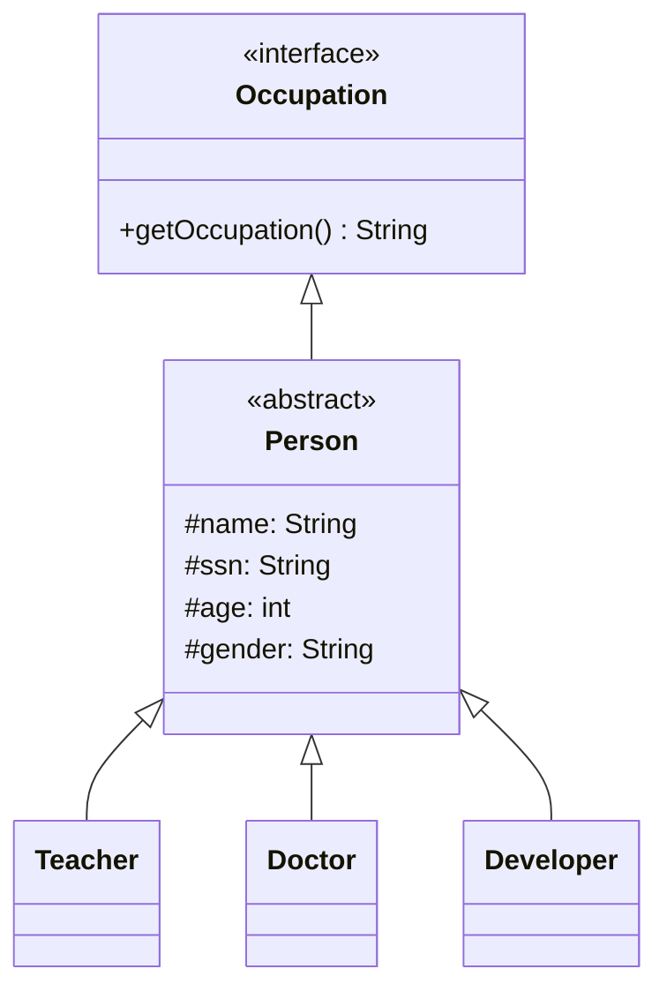

* Annotations on classes
  1. << interface >>
  2. << abstract >>
  3. << Service >>
  4. << enumeration >>

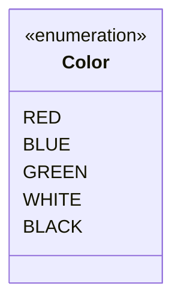

## interface
❓ What is interface?

✔️ the following definition

❌👎Bad definition: An interface is a completely "abstract class" that is used to group related methods with empty bodies.
> ✔️👍 Better definition: An interface is a special java code block that define abstract methods, and possible constants.

❓ What is an abstract methond?

✔️ a method with an ***abstract*** modifier with all method signatures without implementation.

1. All methods defined in interface are ***abstract***.
2. All methods defined in interface are ***public***.
3. All vriables defined in interface are ***static***, ***final*** constants.
4. All classes implement the interface need implement all methods defined in the interface.
5. An interface can not be used to create object.

## abstract class
❓ What is an abstract class?
✔️
1. the abstract class can leave method as abstract. (can have abstract methods)
2. An abstract class can not used to create object.
3. if the abstract class implements an abstract method defined in the interface, its subclass won't be necessary to implement that method.

## concrete class
❓ What is an concrete class?
✔️
1. A concrete class can be used to create an object.
2. A concrete class cannot include abstract method.


3. use **abstract** modifier to make the class abstract which allow no implementation of the abstract method defined in interface.
 
❓What is abstract class?
✔️Abstract classes are similar to interfaces. You cannot instantiate them, and they may contain a mix of methods declared with or without an implementation. Abstract class: is a restricted class 💡that cannot be used to create objects (to access it, it must be inherited from another class).

1. it can define abstract method; 
2. avoid to be instantiated(Cannot instantiate the type Person); 
3. only implements common used methods.


* Inherit from Abstract class
  1. need implements all abstract methods or make itself to be abstract 
  
❓What is abstract method
Abstract method: can only be used in an abstract class, and it does not have a body. The body is provided by the subclass (inherited from).

❓Which should you use, abstract classes or interfaces?
>✔️👇Consider using abstract classes if any of these statements apply to your situation:
  * You want to share code among several closely related classes.
  * You expect that classes that extend your abstract class have many common methods or fields, or require access modifiers other than public (such as protected and private).
  * You want to declare non-static or non-final fields. This enables you to define methods that can access and modify the state of the object to which they belong.
>✔️👇Consider using interfaces if any of these statements apply to your situation:
  * You expect that unrelated classes would implement your interface. For example, the interfaces Comparable and Cloneable are implemented by many unrelated classes.
  * You want to specify the behavior of a particular data type, but not concerned about who implements its behavior.
  * You want to take advantage of multiple inheritance of type.

(🔥polymorphism) 👇see sample code below👇.

[Person.java](../src/com/huaxia/java1/Person.java)

[TestMethod.java](../src/com/huaxia/java1/TestMethod.java)  

### Method Overloading vs. Overriding
* Overloading:
* Overriding: 
  
### An Abstract Class Example

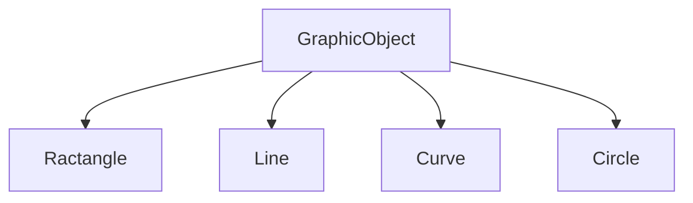
```java
//AbstractSum.java
//abstract class
abstract class Sum{
   /* These two are abstract methods, the child class
    * must implement these methods
    */
   public abstract int sumOfTwo(int n1, int n2);
   public abstract int sumOfThree(int n1, int n2, int n3);
	
   //Regular method 
   public void disp(){
	System.out.println("Method of class Sum");
   }
}

//ConcreteSum.java
//Regular class extends abstract class
class Demo extends Sum{

   /* If I don't provide the implementation of these two methods, the
    * program will throw compilation error.
    */
   public int sumOfTwo(int num1, int num2){
	return num1+num2;
   }
   public int sumOfThree(int num1, int num2, int num3){
	return num1+num2+num3;
   }
   public static void main(String args[]){
	Sum obj = new Demo();
	System.out.println(obj.sumOfTwo(3, 7));
	System.out.println(obj.sumOfThree(4, 3, 19));
	obj.disp();
   }
}
```
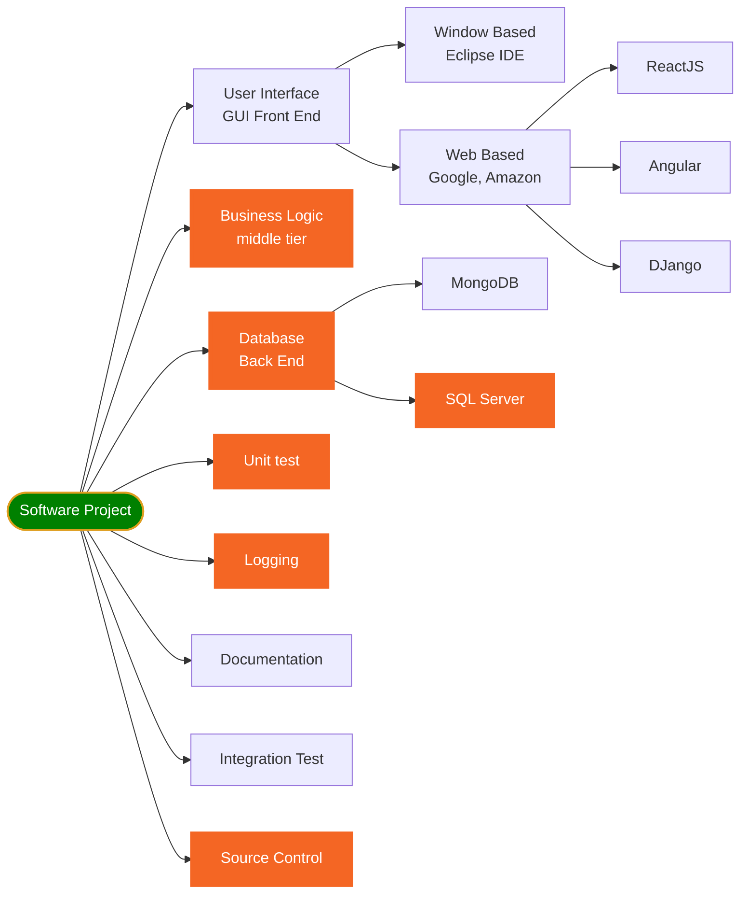

## Unit test
❓What is Unit Test?
>✔️A unit is a specific piece of code to be tested, such as a function or a class. Unit tests are then other pieces of code that specifically exercise the code unit with a full range of different inputs, including boundary and edge cases.


In order to make the project or application work well, we need make sure each small unit works correctly.

[](SimpleMathTest.java)

## Logging

❓What is logging in programming?
✔️Logging is keeping a record of all data input, processes, data output, and final results in a program to a file or database.
❓Why we need logging?
✔️There are multiple reasons why we may need to capture the application activity.
1. Recording unusual circumstances or errors that may be happening in the program
2. Getting the info about whats going in the application

[console log message](loggerExample1.java)
[log to File](loggerExample2.java)

## Blackjack Card Game
* [Black Jack Rules](https://bicyclecards.com/how-to-play/blackjack/)
1. Object of the game: 
>beat the dealer by getting a count as close to 21 as possible, without going over 21
2. Card Values 
>ace is worth 1 or 11, J,Q,K are 10, other card is its pip value
3. Betting
>for simplicity, we don't bet.
4. Shuffle and cut
>the dealer shuffles the pack of card, no need player cut
5. Deal
>dealer gives one card face up to each player, and one card face up for himself. Another round of cards is then dealt face up to each player, but the dealer takes the second card face down.
6. Naturals
>If a player's first two cards are an ace and a "ten-card" (a picture card or 10), giving a count of 21 in two cards, this is a natural or "blackjack." If any player has a natural and the dealer does not, the dealer lose.  If the dealer has a natural, other doesn't, dealer win. If both dealer and player have natural, no body wins.
7. The Play
>any player on his turn must decide whether to "stand" (not ask for another card) or "hit" (ask for another card in an attempt to get closer to a count of 21, or even hit 21 exactly). Thus, a player may stand on the two cards originally dealt to them, or they may ask the dealer for additional cards, one at a time, until deciding to stand on the total (if it is 21 or under), or goes "bust" (if it is over 21). In the latter case, play loses the game. The dealer then turns to the next player and serves them in the same manner. The combination of an ace with a card other than a ten-card is known as a "soft hand," because the player can count the ace as a 1 or 11, and either draw cards or not. For example with a "soft 17" (an ace and a 6), the total is 7 or 17. While a count of 17 is a good hand, the player may wish to draw for a higher total. If the draw creates a bust hand by counting the ace as an 11, the player simply counts the ace as a 1 and continues playing by standing or "hitting" (asking the dealer for additional cards, one at a time).
8. The Dealer's Play
>When the dealer has served every player, the dealers face-down card is turned up. If the total is 17 or more, it must stand. If the total is 16 or under, they must take a card. The dealer must continue to take cards until the total is 17 or more, at which point the dealer must stand. If the dealer has an ace, and counting it as 11 would bring the total to 17 or more (but not over 21), the dealer must count the ace as 11 and stand. The dealer's decisions, then, are automatic on all plays, whereas the player always has the option of taking one or more cards.
9. No Splitting Pairs
10. No Doubing Down
11. No Insurance
12. Reshuffling when start new game.


### Object relationship
  
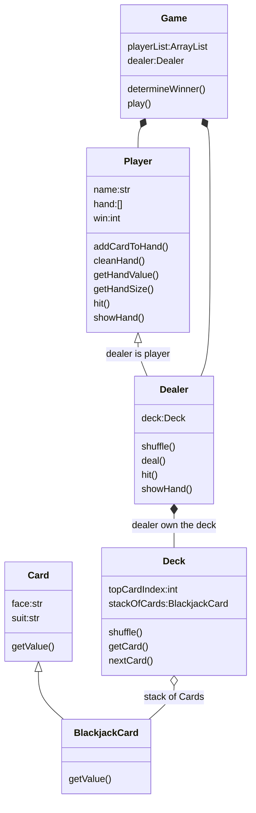
### Game logic

### Code Optimization


* player get 4 Ace
* player get 3 Ace
* player get 2 Ace
* player get 1 Ace busted
* player get 1 Ace not busted
  
* [Face.java](../john/src/com/john/blackjack/Face.java)
* [Suit.java](../john/src/com/john/blackjack/Suit.java)
* [Card.java](../john/src/com/john/blackjack/Card.java)
* [Deck.java](../john/src/com/john/blackjack/Deck.java)
* [Player.java](../john/src/com/john/blackjack/Player.java)
* [Dealer.java](../john/src/com/john/blackjack/Dealer.java)
* [Game.java](../john/src/com/john/blackjack/Game.java)

## using logging
1. create a static logger instance of Logger class in Game class.
2. insert fine, info, severe message in our program.
3. While running the game, we setup logger lever to Level.WARNING for production, and setup Level.FINE for debugging.
4. insert log message into other classes by using logger defined in Game class.
5. send log message to a file so we can do analysis in the future.
   
❓How do I setup log level to SEVERE for Console?
✔️😢the file handler also no output❌
```java
logger.setLevel(Level.SEVERE);
```
❌😢it does NOT work for ConsoleHandler!
❌Set System property also faild
✔️😄try logging.properties file
❓How can I make Console Handler and File Handler different log level?
✔️use LogMager and provide logging.properties file.

1. create conf folder
2. create logging.properies file
3. add key-value pair
4. set System property fir the file
```java
	static {
		System.setProperty("java.util.logging.config.file", "/Users/12818/workspace/java0/john/conf/logging.properties");
	}
	public static Logger logger = Logger.getLogger("JOHN");

```

❓What is .properties file?
✔️It is a plain text file holds key-value pair separated by '=' for configuration.

```properties
handlers= java.util.logging.FileHandler, java.util.logging.ConsoleHandler
.level=FINEST

java.util.logging.FileHandler.level = FINE

java.util.logging.FileHandler.pattern = %h/workspace/java/mylogs%u.log
java.util.logging.FileHandler.limit = 50000
java.util.logging.FileHandler.count = 1
java.util.logging.FileHandler.maxLocks = 100
java.util.logging.FileHandler.formatter = java.util.logging.XMLFormatter

java.util.logging.ConsoleHandler.level = INFO
java.util.logging.ConsoleHandler.formatter = java.util.logging.SimpleFormatter
java.util.logging.SimpleFormatter.format=[%1$tF %1$tT] [%4$-7s] %5$s %n
```

Level setting Rule:
1. .level=FINE defined parent logger level for all handlers
2. java.util.logging.ConsoleHandler.level=WARNING defined log level for ConsoleHandler
3. log level overridden: which ever is more severe, logger will use that level

❓How do I send log message to file?
✔️

### load logging.properties from file
```java
static Logger logger = null;
static {
      System.setProperty("java.util.logging.config.file",
              "/Users/12818/workspace/java/huaxia/conf/logging.properties");
      //must initialize loggers after setting above property
      logger = Logger.getLogger("JOHN");
  }
```
😢👎This is not a good way, since if you deploy your application to different machine, the absolute folder path may not exists❗️

### load logging.properties from classpath
😄✔️Copy logging.properties into src folder is a good idea.👍

```java
private static Logger logger;

  static {
      String path = LoggerExample4.class.getClassLoader()
                                  .getResource("logging.properties")
                                  .getFile();
      System.setProperty("java.util.logging.config.file", path);
      logger = Logger.getLogger("WANG");
  }
```

### load logging.properties from InputSream
👌ok way to do logging configuration, but the code looks little complicated, ❓why choose it?

```java
  static {
    InputStream stream = LoggerExample4.class
        .getClassLoader()
        .getResourceAsStream("logging.properties");
    try {
      LogManager manager = LogManager.getLogManager();
      manager.readConfiguration(stream);
    } catch (IOException e) {
      e.printStackTrace();
    }
  }
```

### Understand log message format
1. java.util.logging.XMLFormatter (FileHandler default)
2. java.util.logging.SimpleFormatter
```properties
java.util.logging.SimpleFormatter.format=[%1$tF %1$tT] [%4$-7s] %5$s %n
```  
```output
[2021-08-04 14:17:02] [SEVERE ] this is a severe message 
```
```java
String.format(format, date, source, logger, level, message, thrown);
//position:             1     2       3       4       5       6   
```
❓what is the simple example below?
```java
java.util.logging.SimpleFormatter.format="%4$s: %5$s [%1$tc]%n"
```
✔️This prints 1 line with the log level (4$), the log message (5$) and the timestamp (1$) in a square bracket.
```
WARNING: warning message [Tue Mar 22 13:11:31 PDT 2011]
```

refer to java.util.Formatter class

where %s means String output, 4$ means 4th item in the String.format which is level.
%tc means date/time output, 1$ means 1th item in the String.format which is date.

[Sample logging.properties file](../huaxia/src/logging.properties)
[Use logging.properties](../huaxia/src/com/huaxia/java2/LoggerExample4.java)


## Integration Test
❓What is Integration Test?
✔️Play the Blackjack game by running Game class.

## Documentation
### Java Doc

```DOS
cd blackjack/doc
mkdir api
cd api
javadoc -sourcepath ../../src -subpackages com.huaxia
```


## Software development life cycle
* Test Driven Development (TDD)

## Deployment(jar file)

### create jar file use ant
[build.xml](../blackjack/build.xml)
```xml
<project name="blackjack" default="dist" basedir=".">
	<!-- set global properties for this build -->
	<property name="src" location="src" />
	<property name="build" location="build" />
	<property name="dist" location="dist" />

	<path id="project.classpath">
		<pathelement location="bin" />
	</path>

	<target name="init">
		<!-- Create the time stamp -->
		<tstamp />
		<!-- Create the build directory structure used by compile -->
		<mkdir dir="${build}" />
	</target>

	<target name="compile" depends="init" description="compile the source">
		<!-- Compile the Java code from ${src} into ${build} -->
		<javac srcdir="${src}" destdir="${build}"/>
	</target>

	<target name="dist" depends="compile" description="generate the distribution">
		<!-- Create the distribution directory -->
		<mkdir dir="${dist}/lib" />

		<!-- Put everything in ${build} into the snake.jar file -->
		<jar jarfile="${dist}/lib/blackjack.jar" basedir="${build}">
			<manifest>
				<attribute name="Built-By" value="John Wang" />
				<attribute name="Main-Class" value="com.huaxia.blackjack.Game" />
			</manifest>
		</jar>
	</target>
	<target name="run">
		<java fork="yes" classname="com.huaxia.blackjack.Game" failonerror="true">
			<classpath refid="project.classpath" />
		</java>
	</target>

	<target name="clean" description="clean up">
		<!-- Delete the ${build} and ${dist} directory trees -->
		<delete dir="${build}" />
		<delete dir="${dist}" />
	</target>
</project>

```
* Targets
  1. init
  2. compile
  3. dist
  4. clean

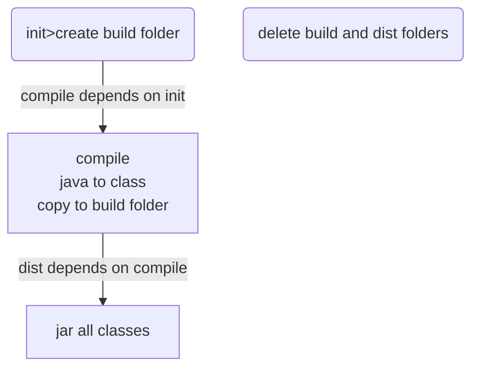
### use jar 
```DOS
cd blackjack/dist/lib
java -jar blackjack.jar
```
### view jar
Help menu ⟹ Eclipse Marketplace... ⟹ Eclipse Archive Utility 0.1.0

Window ⟹ show view ⟹ Project Explore ⟹ click arrow on the jar file

## MongoDB
[Using MongoDB in Java](https://www.tutorialspoint.com/mongodb/mongodb_java.htm)
❓What is MongoDB?
✔️One of NoSQL database application written in C++.
1. stores data in JSON-like documents that can have various structures
2. uses dynamic schemas, which means that we can create records without predefining structure such as SQL relational database table.
3. the structure of a record can be changed simply by adding new fields or deleting existing ones.

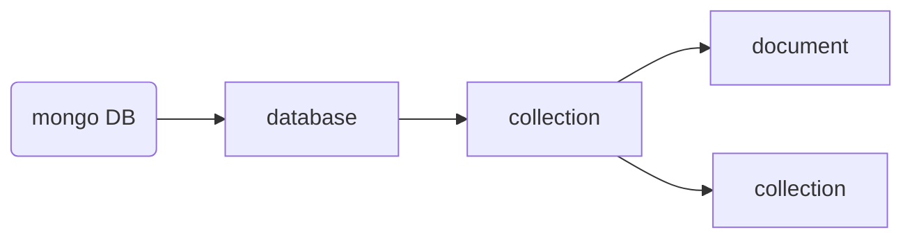
4. document database
5. key-value database 

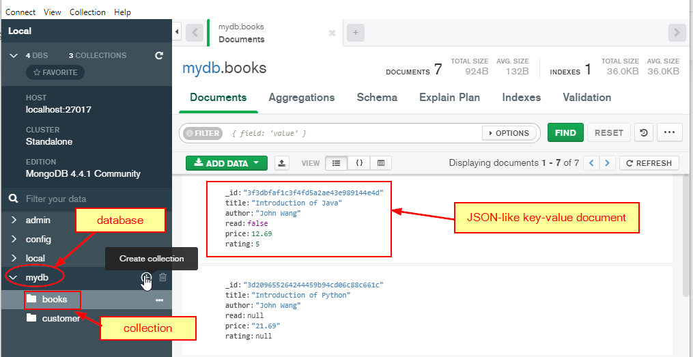

❓What is NoSQL database?
✔️NoSQL databases (aka "not only SQL") are non tabular, and store data differently than relational tables. NoSQL databases come in a variety of types based on their data model. The main types are document, key-value, wide-column, and graph. They provide flexible schemas and scale easily with large amounts of data and high user loads.

❓What is SQL?
✔️SQL stands for Structured Query Language specially for relational database.
SQLite: Python built in SQL database.

* [Java MongoDB API](http://mongodb.github.io/mongo-java-driver/3.6/javadoc/org/bson/Document.html)

* [MongoDB Connection, Collection, CRUD](../mongodb/src/main/java/org/huaxia/mongodb/MongoDB_CRUD.java)
* [Book.java](../mongodb/src/main/java/org/huaxia/mongodb/Book.java)

>In NoSQL, you don't design your database based on the relationships between data entities. You design your database based on the queries you will run against it. Use the same criteria you would use to denormalize a relational database: if it's more important for data to have cohesion (think of values in a comma-separated list instead of a normalized table), then do it that way.

Incremental Map/Reduce

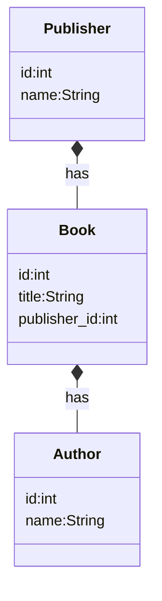

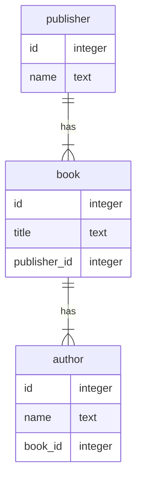
SQL==>Join vs. NoSQL==>Collation

```sql
SELECT 
  publisher.id, publisher.name, book.title
FROM publisher
JOIN book ON publisher.id=book.publisher_id
ORDER BY publisher.id, book.title
```

```json
{
  "_id":"oreilly",
  "collection":"publisher",
  "name":"O'Reilly Media",
  "books":[
    {"title":"CouchDB: The Definitive Guide"},
    {"title":"RESTful Web Services"},
    {"title":"DocBook: The definitive Guide"},
    {"title":"Building iPhone Apps with HTML, CSS, and JavaScript"}
  ]
}
```

[Entity Relationships in a Document Database](https://www.youtube.com/watch?v=lQLTiX93PL8)

### one-to-one relation
```mermaid
erDiagram

user{
  name text
  gender text
  age integer
  account_id integer
}

account{
  id integer
  name text
}

user ||--o| account:one-to-one
```
* when there is an exclusive need for getting the account data without the user data.

### one-to-many relation
```mermaid
erDiagram

user{
  name text
  gender text
  age integer
  account_id integer
}

account{
  id integer
  name text
}

user ||--o{ account:one-to-many
```
### many-to-many relation
```mermaid
erDiagram

user{
  name text
  gender text
  age integer
}

product{
  id integer
  name text
}

user }o--o{ product:many-to-many
```


## SQLite
❓ What is relational database (RDBMS)?
✔️A relational database is a type of database that stores and provides access to data points that are related to one another.

```mermaid
graph TB

CUST[Customer]
PROD[Product]

```
[SQLiteDB Connection, CRUD](../sqlite/src/main/java/sqlitedb/SQLiteDB_CRUD.java)
1. create()
2. retrieve()
3. update()
4. delete()

* Prepare for Relational database
1. create database (file)
2. create tables in the database

* to access the database
```mermaid
graph TB

A[Create Connection]
B[Create SQL Statement]
C["Create Statement <br> or (PrepareStatement)"]
D[Execute SQL Statement]
E[Commit the change]
F[close connection]

A-->B
B-->C
C-->D
D-->E
E-->F
```
* [Book.java](../sqlite/src/main/java/sqlitedb/Book.java)
  - hide database complexity from Book user
* [Test.java](../sqlite/src/main/java/sqlitedb/Test.java)
* [Hide db access complexity](../sqlite/src/main/java/sqlitedb/DBHelper.java)
* [Test DB access function](../sqlite/src/main/java/sqlitedb/Test.java)

* Create Syntax
```sql
INSERT INTO <table name> VALUES (?,?,...)
INSERT INTO <table name> (column1, column2, ...) VALUES (?, ?, ...)
```

* Retrieve Syntax
```sql
SELECT * FROM <table name>
SELECT * FROM <table name> WHERE <condition>
```

* Update Syntax
```sql
UPDATE <table name> Set column1=?, column2=?, ... WHERE <condition>
```

* Delete Syntax
```sql
DELETE FROM <table name> WHERE <condition>
```

* Create [Book.writeBookToDB()]
* Retrieve All [Book.getAll()](../sqlite/src/main/java/sqlitedb/Book.java)
* Retrieve [Book.loadBookFromDB()](../sqlite/src/main/java/sqlitedb/Book.java)
* Update [Book.updateBookInDB()](../sqlite/src/main/java/sqlitedb/Book.java)
* Delete [Book.deleteBookInDB()]
* Book can CRUD itself to DB.
* Use DBHelper to reduce duplicated code
* Use DBSetting to set default database file connection

Practice:

### one-to-one relationship
* Passenger vs. ticket
```mermaid
erDiagram
passenger{
  id integer
  name text
  gender text
  age integer
  ticket_id integer
}

ticket{
  id integer
  flight text
  depature text
  arrival text
  airport text
  gate text
  airline text
  passenger_id integer
}

passenger ||--o| ticket:one-to-one
```
[Passenger Database Access](../../java/sqlite/src/main/java/sqlitedb/Passenger.java)

[Ticket Database Access](../../java/sqlite/src/main/java/sqlitedb/Ticket.java)

[Ticket-Passenger Test](../../java/sqlite/src/main/java/sqlitedb/Test.java)

```mermaid
erDiagram
families{
  id integer
  reference text
  name text
  unite text
  article_id int
}

articles{
  id integer
  reference text
  name text
  quantity real
  unite text
  purchased integer
  reserved integer
  sold integer
  available integer
  minimum integer
  family_id integer
}

families ||--o| articles:one-to-one
```
### one-to-many relationship
```mermaid
 erDiagram
    PROJECT ||--o{ TASK : contains
    PROJECT {
        int id
        string name
        date begineDate
        date endDate
    }
    TASK {
        int id
        string name
        date beginDate
        date endDate
    }
```
* [one to many](../sqlite/src/main/java/sqlitedb/Project.java)
* [Project > Task](../sqlite/src/main/java/sqlitedb/Task.java)
* [Test.java](../sqlite/src/main/java/sqlitedb/Test.java)
* load project with all task
* get project from task
* 
### many-to-many relationship
```mermaid
 erDiagram
    Student ||--o{ Enrollment:one-to-many
    Course ||--o{ Enrollment:one-to-many
    Student {
        int sid
        string name
    }
    Course {
        int cid
        string name
    }
    Enrollment{
      int sid
      int cid
    }
```
where the intermediate table **Enrollment** is called linking or conjunction table.

SQL = SELECT Student.name FROM Student JOIN Enrollment On(Student.sid=Enrollment.sid) WHERE Course.name='CS4320'

[many to many, Course:Student](../sqlite/src/main/java/sqlitedb/Course.java)
[Student.java](../sqlite/src/main/java/sqlitedb/Student.java)
[Test.java](../sqlite/src/main/java/sqlitedb/Test.java)

```mermaid
classDiagram
class Student{
  name:String
  id:int
  load()
  loadCourses()
}

class Course{
  name:String
  id:int
  load()
  loadStudents()
}
```

⚡️❗️🐛👎Infinite Circle causes application died.

```mermaid
graph TB
DB[(Database)]
S[Load Student]
C[Load Course]
SC["Load Courses<br/>By Student"]
CS["Load Students<br/>By Course"]
DB-->S
S-->SC
DB-->C
C-->CS
CS-->S
SC-->C
```

✔️💡 Load all courses while loading student by the same SQL statement.

```sql
SELECT project.id, project.name, project.begin_date, project.end_date, task.id, task.name, task.priority, task.begin_date, task.end_date
FROM project JOIN task on project.id=task.project_id
```
## References
* [👍 All excercises](https://www.w3resource.com/java-exercises/index.php)
  1. [Loop Excercises](http://www.beginwithjava.com/java/loops/questions.html)
  2. [method Excercises](http://www.beginwithjava.com/java/methods/questions.html)
  3. [class excercises](http://math.hws.edu/eck/cs124/javanotes4/c5/exercises.html)
  4. [OOP Excercises](https://www3.ntu.edu.sg/home/ehchua/programming/java/J3f_OOPExercises.html)
  5. [Operator Excercise](https://docs.oracle.com/javase/tutorial/java/nutsandbolts/QandE/questions_operators.html)
* [Java Tutorial](http://www.beginwithjava.com/java/)
* [Good Java Tutorial WebSite](https://beginnersbook.com/2014/07/how-to-sort-a-treemap-by-value-in-java/)
* [Java Point](https://www.javatpoint.com/java-tutorial)
* [Linked List](https://www.javatpoint.com/singly-linked-list-vs-doubly-linked-list)