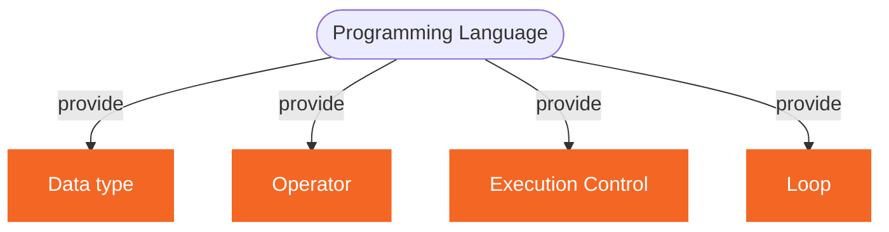
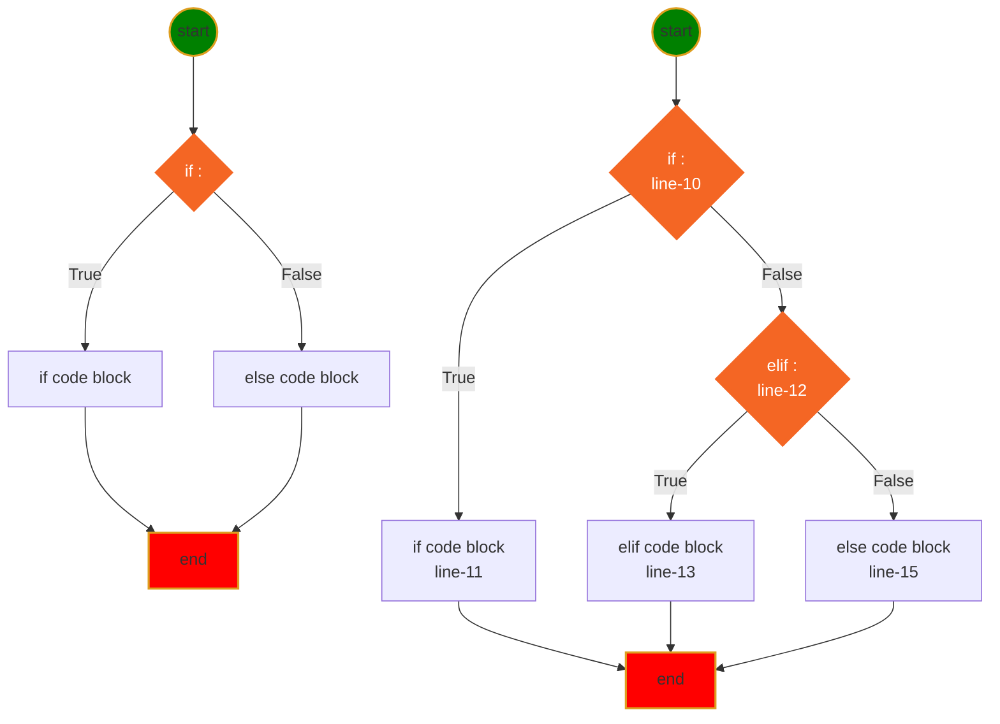

<h1> 休斯顿华夏中文学校-Java Class Notes</h1>

[](myIcons.md)

- [Getting Start](#getting-start)
  - [Check Software Installation](#check-software-installation)
  - [questions and anwers](#questions-and-anwers)
- [File Structure](#file-structure)
- [My First Java Program](#my-first-java-program)
- [Language Basics](#language-basics)
- [Print](#print)
- [Variable Naming](#variable-naming)
- [Variable and memory](#variable-and-memory)
- [Comment](#comment)
- [Scanner](#scanner)
- [Data Type](#data-type)
- [Array](#array)
- [Operator](#operator)
- [Excution Control](#excution-control)
  - [if-else](#if-else)
  - [switch](#switch)
- [Loop](#loop)
- [References](#references)

## Getting Start

### Check Software Installation
```DOS
java -version
javac -version
```

### questions and anwers

* ❓How do I create a Java project?
✔️Right-Click on explore window ⟹ New ⟹ Java Project ⟹ enter project name

* ❓How do I create Java package?
✔️Right-click src folder ⟹ New ⟹ package ⟹ enter package name

* ❓How do I cerate a Java class?
✔️Right-click package name ⟹ New ⟹ class ⟹ enter class name

* ❓Hod wo I run a Java class?
✔️Click the green run button on toolbar 

* ❓Can I rename the main() method?
✔️No❗️❗️❗️

* ❓How can I save the class file?
```output
✔️there are more than one way to save the file:
1. Ctrl+s
2. File ⟹ Save
3. File ⟹ Save All
4. click save button on toolbar
```

## File Structure
Organize Class Notes File Structure
```
<java root>
    ├── ReadMe.md
    └── doc/
         ├── images/
         ├── homeworks/
         |      ├── mardown01.md
         |      └── mardown02.md
         ├── eclipseTrics.md     
         ├── markdownTrics.md     
         ├── myIcons.md     
         └── java.md     
```

[Homework 1](../homeworks/markdown01.md)
[Homework 2](../homeworks/markdown02.md)

## My First Java Program
* [Hello.java](../src/com/huaxia/john/Hello.java)
    - System.out.println()
    - // single line comment
    - every Java statement line ends with ;
    - public before the class is not important
    - main() method must be public
    - main() method must be static
    - void on main() method is return type
    - main() method name is special, change it will cause main() not found error.
    - String[] is part of main() method signature, cannot be changed
    - args is variable name which can be changed.

## Language Basics


## Print
* [Print.java](../src/Print.java)
* Homeworks
  1. [Math Competition](../homeworks/12023%20Harmoney%20School%20Houston.pdf)
  2. [variable01](../homeworks/variable01.md)
  3. [variable02](../homeworks/variable02.md)

## Variable Naming
1. variable name cannot start with number
2. variable can be combination of letters and numbers _, a~z, A~Z, 0~9, no other special characters
3. don't use reserved keywords as variable name
   


## Variable and memory


## Comment
1. single line comment
2. multiple line comment
3. for document
4. block code from executing

## Scanner
[Scanner](../src/MyScanner.java)

## Data Type
* [DataType.java](../src/DataType.java)
  - primitive data type (boolean, byte, char, short, int, long, float, double)
  - Java built in data type (String, )
  - User defined data type

## Array
* [Array.java](../src/Array.java)
  - int[]
  - String[]
  - Hello[]

## Operator
* [Operator.java](../src/Operator.java)
  - Arithmatic operator: +,-,*,/,%
  - compound assignment operator: +=, -=, *=, /=, %= 
  - binary operator: ++, --,
  - comparison operator: >, <, >=, <=, ==, !=
  - logical operator: && and, || or, ! not
  - ternary operator: a<b?a:b
  - bitwise operator:
``` 
		 &: bitwise and
		 |: bitwise or
		 ^: bitwise xor
		 ~: bitwise compliment
```
* Homeworks
    1. [quiz02.md](../homeworks/quiz02.md)
    2. [operator01.md](../homeworks/operator01.md)
    3. [operator02.md](../homeworks/operator02.md)

## Excution Control
### if-else
Execution control


* [if-else syntax](../src/IfElse.java)
  
### switch
[switch]
  - Homeworks

## Loop
* For loop
  
* [for/while loop/do-while](../src/Loop.java)
* While loop
    
* do-while loop
    

```
while loop has 3 part:
1. initialize variable, a=0
2. variable condition, a<10
3. adjust variable, a +=1
```

## References
* [👍 All excercises](https://www.w3resource.com/java-exercises/index.php)
  1. [Loop Excercises](http://www.beginwithjava.com/java/loops/questions.html)
  2. [method Excercises](http://www.beginwithjava.com/java/methods/questions.html)
  3. [class excercises](http://math.hws.edu/eck/cs124/javanotes4/c5/exercises.html)
  4. [OOP Excercises](https://www3.ntu.edu.sg/home/ehchua/programming/java/J3f_OOPExercises.html)
  5. [Operator Excercise](https://docs.oracle.com/javase/tutorial/java/nutsandbolts/QandE/questions_operators.html)
* [Java Tutorial](http://www.beginwithjava.com/java/)
* [Good Java Tutorial WebSite](https://beginnersbook.com/2014/07/how-to-sort-a-treemap-by-value-in-java/)
* [Java Point](https://www.javatpoint.com/java-tutorial)
* [Linked List](https://www.javatpoint.com/singly-linked-list-vs-doubly-linked-list)