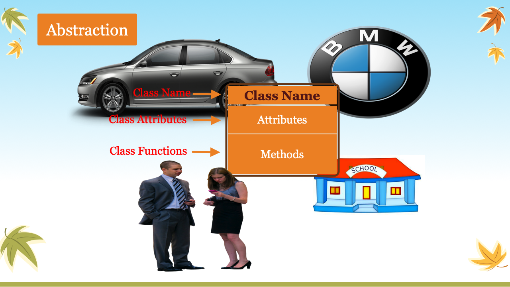
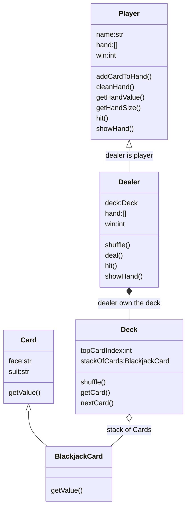

<h1> 休斯顿华夏中文学校-Java Class Notes</h1>

[](myIcons.md)

- [Getting Start](#getting-start)
  - [Check Software Installation](#check-software-installation)
  - [questions and anwers](#questions-and-anwers)
- [File Structure](#file-structure)
- [My First Java Program](#my-first-java-program)
- [Language Basics](#language-basics)
- [Print](#print)
- [Variable Naming](#variable-naming)
- [Variable and memory](#variable-and-memory)
- [Comment](#comment)
- [Scanner](#scanner)
- [Data Type](#data-type)
- [Array](#array)
- [Operator](#operator)
- [Excution Control](#excution-control)
  - [if-else](#if-else)
  - [switch](#switch)
- [Loop](#loop)
- [OOP](#oop)
- [class](#class)
  - [Construtor](#construtor)
  - [Inhritance](#inhritance)
  - [Method Overloading vs. Overriding](#method-overloading-vs-overriding)
  - [An Abstract Class Example](#an-abstract-class-example)
- [Unit test](#unit-test)
- [Logging](#logging)
- [Blackjack Card Game](#blackjack-card-game)
  - [Object relationship](#object-relationship)
- [References](#references)

## Getting Start

### Check Software Installation
```DOS
java -version
javac -version
```

### questions and anwers

* ❓How do I create a Java project?
✔️Right-Click on explore window ⟹ New ⟹ Java Project ⟹ enter project name

* ❓How do I create Java package?
✔️Right-click src folder ⟹ New ⟹ package ⟹ enter package name

* ❓How do I cerate a Java class?
✔️Right-click package name ⟹ New ⟹ class ⟹ enter class name

* ❓Hod wo I run a Java class?
✔️Click the green run button on toolbar 

* ❓Can I rename the main() method?
✔️No❗️❗️❗️

* ❓How can I save the class file?
```output
✔️there are more than one way to save the file:
1. Ctrl+s
2. File ⟹ Save
3. File ⟹ Save All
4. click save button on toolbar
```

## File Structure
Organize Class Notes File Structure
```
<java root>
    ├── ReadMe.md
    └── doc/
         ├── images/
         ├── homeworks/
         |      ├── mardown01.md
         |      └── mardown02.md
         ├── eclipseTrics.md     
         ├── markdownTrics.md     
         ├── myIcons.md     
         └── java.md     
```

[Homework 1](../homeworks/markdown01.md)
[Homework 2](../homeworks/markdown02.md)

## My First Java Program
* [Hello.java](../src/com/huaxia/john/Hello.java)
    - System.out.println()
    - // single line comment
    - every Java statement line ends with ;
    - public before the class is not important
    - main() method must be public
    - main() method must be static
    - void on main() method is return type
    - main() method name is special, change it will cause main() not found error.
    - String[] is part of main() method signature, cannot be changed
    - args is variable name which can be changed.

## Language Basics


## Print
* [Print.java](../src/Print.java)
* Homeworks
  1. [Math Competition](../homeworks/12023%20Harmoney%20School%20Houston.pdf)
  2. [variable01](../homeworks/variable01.md)
  3. [variable02](../homeworks/variable02.md)

## Variable Naming
1. variable name cannot start with number
2. variable can be combination of letters and numbers _, a~z, A~Z, 0~9, no other special characters
3. don't use reserved keywords as variable name
   


## Variable and memory


## Comment
1. single line comment
2. multiple line comment
3. for document
4. block code from executing

## Scanner
[Scanner](../src/MyScanner.java)

## Data Type
* [DataType.java](../src/DataType.java)
  - primitive data type (boolean, byte, char, short, int, long, float, double)
  - Java built in data type (String, )
  - User defined data type

## Array
* [Array.java](../src/Array.java)
  - int[]
  - String[]
  - Hello[]

## Operator
* [Operator.java](../src/Operator.java)
  - Arithmatic operator: +,-,*,/,%
  - compound assignment operator: +=, -=, *=, /=, %= 
  - binary operator: ++, --,
  - comparison operator: >, <, >=, <=, ==, !=
  - logical operator: && and, || or, ! not
  - ternary operator: a<b?a:b
  - bitwise operator:
``` 
		 &: bitwise and
		 |: bitwise or
		 ^: bitwise xor
		 ~: bitwise compliment
```
* Homeworks
    1. [quiz02.md](../homeworks/quiz02.md)
    2. [operator01.md](../homeworks/operator01.md)
    3. [operator02.md](../homeworks/operator02.md)

## Excution Control
### if-else
Execution control


* [if-else syntax](../src/IfElse.java)
  
### switch
[switch]
  - Homeworks

## Loop
* For loop
  
* [for/while loop/do-while](../src/Loop.java)
* While loop
    
* do-while loop
    

```
while loop has 3 part:
1. initialize variable, a=0
2. variable condition, a<10
3. adjust variable, a +=1
```
## OOP
Object Oriented Programming concept

  
1. Encapsulation: private, protected
❓What is private modifier?
>✔️private modifier make variable or method in the class can only be used within the class, which makes encapsulation possible.
2. Abstraction: abstract object in the real world to write a class.
  
[First class](../src/com/huaxia/java1/Air.java)

3. Inheritance: subclass inherits features from super class.


Student is a Person, the relationship between Student and Person is **is relation**.
where the Student class is subclass of Person class, we call the Person as Superclass of Student class.

* [Person, Superclass](../src/com/huaxia/java1/Person.java)
* [Student, Subclass of Person](../src/com/huaxia/java1/Student.java)
* [Teacher, Subclass of Person](../src/com/huaxia/java1/Teacher.java)

4. Polymorphism: give different answer for the same question from different classes which inherit from same superclas or interface. (异类同功)
   
[Test Polymorphism](../src/com/huaxia/test/TestMethod.java)

## class
❓What functions defined in Object class which are useful for us?
✔️the functions available in Object are
1. default constructor
2. toString()

❓What is construtor?
✔️Constructor is used to create an instance of the class.
### Construtor
1. Constructor looks like a method which does NOT have return type since it always return the instance.
2. Constructor can use public, package, private and protected modifier
3. 😢👎If you defined your own constructor with arguments, the default constructor no longer works
	- ✔️create a default constructor which does **NOT** have any aruments.
	- ✔️add arguments when you call the constructor
4. 👌You can define many different constructors which has different signature. 
5. 😢Subclass can NOT use Superclass constructor.
6. 😄Subclass can use public or protected methods defined in the superclass.
7. 😢👎👎👎class defined in the same package can call protected method.
8. 👍protected method cannot be called from different package.

❓What is protected modifier?
✔️protected modifier allow subclass to access the superclass attributes or methods. protect from using by other classes.

[getter, setter, toString, default constructor](../src/com/huaxia/java1/Superclass1.java)

❓How do I create getter/setter?
✔️
❓How do I override toString() method?
✔️
❓Why I want to override toString()?
✔️

### Inhritance
* Inherit from class
  [](Person.java)
  [](Student.java)
  [](Teacher.java)
  - class can only inherit from one class, Java does NOT allow multiple inheritance

* Implements from Interface
  [](Occupation.java)
  [](Teacher.java)
  [](Engineer.java)
  [](TestOccupation.java)
  
❓What is interface?
✔️
1. An interface is a completely "abstract class" that is used to group related methods with empty bodies:
2. An interface is a completely "abstract class" that is used to group related methods signature without implementation.(with 😢empty bodies.) 👍collection of definition of methods.
3. With interfaces, all fields are automatically public, static, and final, and all methods that you declare or define (as default methods) are public.
4. class can implements more than one interface


❓How do I create interface?
✔️
1. 😄I cannot instantiate an interface.
2. instance can define more than one methods.
3. instance cannot implement the method or get compiler error(Abstract methods do not specify a body).
4. interface only defined abstract methods whick all are public
5. one class can implements more than one interface

❓How do I use the interface?
✔️implements the interface from the class

5. use **abstract** modifier to make the class abstract which allow no implementation of the abstract method defined in interface.
 
❓What is abstract class?
✔️Abstract classes are similar to interfaces. You cannot instantiate them, and they may contain a mix of methods declared with or without an implementation. Abstract class: is a restricted class 💡that cannot be used to create objects (to access it, it must be inherited from another class).

1. it can define abstract method; 
2. avoid to be instantiated(Cannot instantiate the type Person); 
3. only implements common used methods.


* Inherit from Abstract class
  1. need implements all abstract methods or make itself to be abstract 
  
❓What is abstract method
Abstract method: can only be used in an abstract class, and it does not have a body. The body is provided by the subclass (inherited from).

❓Which should you use, abstract classes or interfaces?
>✔️👇Consider using abstract classes if any of these statements apply to your situation:
  * You want to share code among several closely related classes.
  * You expect that classes that extend your abstract class have many common methods or fields, or require access modifiers other than public (such as protected and private).
  * You want to declare non-static or non-final fields. This enables you to define methods that can access and modify the state of the object to which they belong.
>✔️👇Consider using interfaces if any of these statements apply to your situation:
  * You expect that unrelated classes would implement your interface. For example, the interfaces Comparable and Cloneable are implemented by many unrelated classes.
  * You want to specify the behavior of a particular data type, but not concerned about who implements its behavior.
  * You want to take advantage of multiple inheritance of type.

(🔥polymorphism) 👇see sample code below👇.

[Person.java](../src/com/huaxia/java1/Person.java)

[TestMethod.java](../src/com/huaxia/java1/TestMethod.java)  

### Method Overloading vs. Overriding
* Overloading:
* Overriding: 
  
### An Abstract Class Example


```java
//AbstractSum.java
//abstract class
abstract class Sum{
   /* These two are abstract methods, the child class
    * must implement these methods
    */
   public abstract int sumOfTwo(int n1, int n2);
   public abstract int sumOfThree(int n1, int n2, int n3);
	
   //Regular method 
   public void disp(){
	System.out.println("Method of class Sum");
   }
}

//ConcreteSum.java
//Regular class extends abstract class
class Demo extends Sum{

   /* If I don't provide the implementation of these two methods, the
    * program will throw compilation error.
    */
   public int sumOfTwo(int num1, int num2){
	return num1+num2;
   }
   public int sumOfThree(int num1, int num2, int num3){
	return num1+num2+num3;
   }
   public static void main(String args[]){
	Sum obj = new Demo();
	System.out.println(obj.sumOfTwo(3, 7));
	System.out.println(obj.sumOfThree(4, 3, 19));
	obj.disp();
   }
}
```

## Unit test
[](SimpleMathTest.java)

## Logging
[console log message](loggerExample1.java)
[log to File](loggerExample2.java)

## Blackjack Card Game
* [Black Jack Rules](https://bicyclecards.com/how-to-play/blackjack/)
1. Object of the game: 
>beat the dealer by getting a count as close to 21 as possible, without going over 21
2. Card Values 
>ace is worth 1 or 11, J,Q,K are 10, other card is its pip value
3. Betting
>for simplicity, we don't bet.
4. Shuffle and cut
>the dealer shuffles the pack of card, no need player cut
5. Deal
>dealer gives one card face up to each player, and one card face up for himself. Another round of cards is then dealt face up to each player, but the dealer takes the second card face down.
6. Naturals
>If a player's first two cards are an ace and a "ten-card" (a picture card or 10), giving a count of 21 in two cards, this is a natural or "blackjack." If any player has a natural and the dealer does not, the dealer lose.  If the dealer has a natural, other doesn't, dealer win. If both dealer and player have natural, no body wins.
7. The Play
>any player on his turn must decide whether to "stand" (not ask for another card) or "hit" (ask for another card in an attempt to get closer to a count of 21, or even hit 21 exactly). Thus, a player may stand on the two cards originally dealt to them, or they may ask the dealer for additional cards, one at a time, until deciding to stand on the total (if it is 21 or under), or goes "bust" (if it is over 21). In the latter case, play loses the game. The dealer then turns to the next player and serves them in the same manner. The combination of an ace with a card other than a ten-card is known as a "soft hand," because the player can count the ace as a 1 or 11, and either draw cards or not. For example with a "soft 17" (an ace and a 6), the total is 7 or 17. While a count of 17 is a good hand, the player may wish to draw for a higher total. If the draw creates a bust hand by counting the ace as an 11, the player simply counts the ace as a 1 and continues playing by standing or "hitting" (asking the dealer for additional cards, one at a time).
8. The Dealer's Play
>When the dealer has served every player, the dealers face-down card is turned up. If the total is 17 or more, it must stand. If the total is 16 or under, they must take a card. The dealer must continue to take cards until the total is 17 or more, at which point the dealer must stand. If the dealer has an ace, and counting it as 11 would bring the total to 17 or more (but not over 21), the dealer must count the ace as 11 and stand. The dealer's decisions, then, are automatic on all plays, whereas the player always has the option of taking one or more cards.
9. No Splitting Pairs
10. No Doubing Down
11. No Insurance
12. Reshuffling when start new game.


### Object relationship
  


## References
* [👍 All excercises](https://www.w3resource.com/java-exercises/index.php)
  1. [Loop Excercises](http://www.beginwithjava.com/java/loops/questions.html)
  2. [method Excercises](http://www.beginwithjava.com/java/methods/questions.html)
  3. [class excercises](http://math.hws.edu/eck/cs124/javanotes4/c5/exercises.html)
  4. [OOP Excercises](https://www3.ntu.edu.sg/home/ehchua/programming/java/J3f_OOPExercises.html)
  5. [Operator Excercise](https://docs.oracle.com/javase/tutorial/java/nutsandbolts/QandE/questions_operators.html)
* [Java Tutorial](http://www.beginwithjava.com/java/)
* [Good Java Tutorial WebSite](https://beginnersbook.com/2014/07/how-to-sort-a-treemap-by-value-in-java/)
* [Java Point](https://www.javatpoint.com/java-tutorial)
* [Linked List](https://www.javatpoint.com/singly-linked-list-vs-doubly-linked-list)