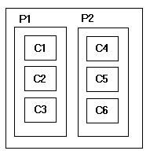
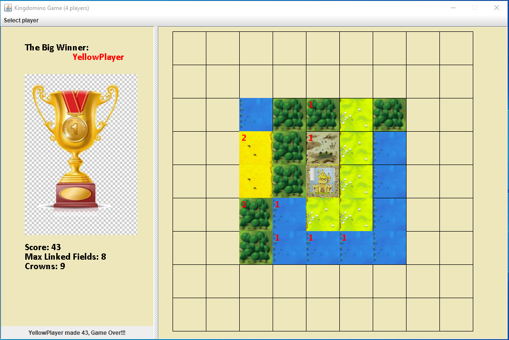

# Java Swing Class

[Tutorial website](https://www.javatpoint.com/java-swing)
[javax.swing api](https://docs.oracle.com/javase/7/docs/api/javax/swing/package-summary.html)
[Java API](https://docs.oracle.com/javase/8/docs/api/)
[Image download website](http://www.pngmart.com/image/)
[Official Java Tutorial](https://docs.oracle.com/javase/tutorial/tutorialLearningPaths.html)

## Applications & build.xml
* [Calculator.java](../huaxia/src/com/huaxia/calculator/Calculator.java); add BorderLayout and GridLayout
* [Snake-Game](../Snake-Game/build.xml)
* √ Tic Tac Toe, TT1.java; build jar; load image by using classpath

## Swing Layout
[Swing Layout](https://www.tutorialspoint.com/swing/swing_layouts.htm)

The layout manager automatically positions all the components within the container. 
Layout Manager

* √ remove setLayout(null) from FourCornersImages.java
* √ FlowLayout.java; change the window size feel the button position changes. remove frame.pack() function call, see the result. 
    - ask student add code for button click response
    - ask student add more component in the panel, such as JTextField, and JLabel
* √ BorderLayoutExample.java; resize the window. 
    - BorderLayoutExample1.java; ask student add more components in the center as FlowLayout.
* √ CardLayoutExample.java; class level attributes, JFrame.getContentPanel()
* √ BoxLayoutExample.java; disappare when change Window size.
* √ GridLayoutExample.java;
* √ GridBagLayoutExample.java;
* √ SpringLayoutExample.java; Fixed relationship between components
* √ GroupLayoutExample.java; need set both Horizontal and Vertical

## Swing Hierarchy


## Swing JComponent
[Java Tutorial](https://docs.oracle.com/javase/tutorial/uiswing/components/scrollpane.html)
[JRadio Button](https://www.geeksforgeeks.org/jradiobutton-java-swing/?ref=lbp)

1. [Open Window](../huaxia/src/com/huaxia/swing/OpenWindow.java)
7. [Add Label](../huaxia/src/com/huaxia/swing/AddLabel.java)
4. [Add Button](../huaxia/src/com/huaxia/swing/AddButton.java)
6. [Add TextField](../huaxia/src/com/huaxia/swing/AddTextField.java)
8. [Open Frame](../huaxia/src/com/huaxia/swing/Frame2.java)
9. √ DisplayImage.java & MyPanel.java; display an apple image, load some image from 
10. [DisplayImage](../huaxia/src/com/huaxia/swing/DisplayImage.java)
11. [Image Panel](../huaxia/src/com/huaxia/swing/MyPanel.java)
13. [Button switch image](../huaxia/src/com/huaxia/swing/FourCornersImage.java)
14. √ MovingImage.java & MyPanel1.java
15. [Moving Image](../huaxia/src/com/huaxia/swing/MoveImage.java) 
16. [Moving Image Panel](../huaxia/src/com/huaxia/swing/MyPanel1.java)
25. [Key Controlled Image](../huaxia/src/com/huaxia/swing/KeyboardControl.java)
26. [Key Controlled Image Panel](../huaxia/src/com/huaxia/swing/MyPanel2.java)
21. [Random Moving Image](../huaxia/src/com/huaxia/swing/RandomMoveImage.java)
22. [Random Moving Imabe Panel](../huaxia/src/com/huaxia/swing/MyPanel3.java)
17. [Bounced Image](../huaxia/src/com/huaxia/swing/DisplayBouncedImage.java)
18. [Bounced Image Panel](../huaxia/src/com/huaxia/swing/MyPanel4.java)
19. [Bufferred Image](../huaxia/src/com/huaxia/swing/DisplayBufferedImage.java)
20. [Bufferend Image Panel](../huaxia/src/com/huaxia/swing/MyPanel5.java)
23. [Random Ball Image](../huaxia/src/com/huaxia/swing/DiaplayBallImage.java)
24. [Ball Image Panel](../huaxia/src/com/huaxia/swing/MyPanel6.java)
25. [Simple add math](../huaxia/src/com/huaxia/swing/MyMath.java)
26. [Check Box](../huaxia/src/com/huaxia/swing/CheckBoxExample.java)
27. [CheckBoxExample1.java](../huaxia/src/com/huaxia/swing/component/CheckBoxExample1.java); (with icon)
28. [Radio Button](../huaxia/src/com/huaxia/swing/RadioButtonExample.java)2 ways to add an ActionListener for jButton
29. [Text Area](../huaxia/src/com/huaxia/swing/TextAreaExample.java) copy large file to see some text been hidden.
30. [Scrolled Pane](../huaxia/src/com/huaxia/swing/ScrolledPaneExample.java)Scrolled Pane around the TextArea
31. [List](../huaxia/src/com/huaxia/swing/ListExample.java)
32. [List 1](../huaxia/bin/com/huaxia/swing/ListExample1.class)
33. [List 2](../huaxia/src/com/huaxia/swing/ListExample2.java) without layout(FlowLayout), use GridLayout(), use BorderLayout() 
36. [OptionPane](../huaxia/src/com/huaxia/swing/pane/OptionPaneExample.java);
37. [ComboBox](../huaxia/src/com/huaxia/swing/component/ComboBoxExample.java) 
38. [ComboBox1](../huaxia/src/com/huaxia/swing/component/ComboBoxExample1.java); ActionListener, ItemListener; ask student add clear button to clear label message.

## Layout
* [Flow Layout](../huaxia/src/com/huaxia/swing/layout/FlowLayoutExample.java)
* [Border Layout](../huaxia/src/com/huaxia/swing/layout/BorderLayoutExample.java)
* [Embedded Border Layout](../huaxia/src/com/huaxia/swing/layout/BorderLayoutExample1.java)
* [Grid Layout](../huaxia/src/com/huaxia/swing/layout/GridLayoutExample.java)
* [Grid Bag Layout](../huaxia/src/com/huaxia/swing/layout/GridBagLayoutExample.java)
* [Box Layout](../huaxia/src/com/huaxia/swing/layout/BoxLayoutExample.java)

* [Box Vertical](../huaxia/src/com/huaxia/swing/layout/BoxVertical.java)
* [Box Horizontal](../huaxia/src/com/huaxia/swing/layout/BoxHorizontal.java)
* [Box Glue](../huaxia/src/com/huaxia/swing/layout/BoxLayoutVerticalGlueTest.java)
* [Group Layout](../huaxia/src/com/huaxia/swing/layout/GroupLayoutExample.java)
* [Group Layout 2](../huaxia/src/com/huaxia/swing/layout/GroupLayoutExample2.java)
* [Card Layout](../huaxia/src/com/huaxia/swing/layout/CardLayoutExample.java)
* [Spring Layout](../huaxia/src/com/huaxia/swing/layout/SpringLayoutExample.java)
* 
## Pane
* [ScrolledPane](../huaxia/src/com/huaxia/swing/pane/ScrolledPaneExample.java); add JScrollPane around the TextArea
* [OptionPaneExample.java](../huaxia/src/com/huaxia/swing/pane/OptionPaneExample.java);
* [TabbedPaneExmple.java](../huaxia/src/com/huaxia/swing/pane/TabbedPaneExample.java);
* [DesktopPaneExample.java](../huaxia/src/com/huaxia/swing/pane/DesktopPaneExample.java);
* [EditorPaneExample.java](../huaxia/src/com/huaxia/swing/pane/EditorPaneExample.java);
* [EditorPaneExample1.java](../huaxia/src/com/huaxia/swing/pane/EditorPaneExample1.java);


## Applications
* [Calculator.java](../huaxia/src/com/huaxia/calculator/Calculator.java); Default layout=FlowLayout, JFrame, JPanel, JTextField, JButton 
* [Calculator1](../huaxia/src/com/huaxia/calculator/Calculator1.java)
* [Tic Tac Toe](../huaxia/src/com/huaxia/tictactoe/TTT1.java); com.huaxia.tictactoe; layout=null, resizable=false; getClass().getResource() refer to MyPanel.java; CheckBox, JOptionPane,
```java
    Toolkit t = Toolkit.getDefaultToolkit();
    URL iconUrl = this.getClass().getResource("resources/tiger.jpeg");
    apple = t.getImage(iconUrl);
```
1. [Kingdomino](https://www.youtube.com/watch?v=Wo7tLXgnzzI)

 
## Anonymous Class
1. √ GetInfo.java; interface
1. √ Student.java; implements GetInfo
1. √ Teacher.java; implements GetInfo
1. √ StudentTest.java; test GetInfo, build Polymorpythism concept. 3 way to use Interface.
1. √ JButton.addActionListener(ActionEvent) 

## Commonly used Methods of Component class
Method |	Description
|---|---|
public void add(Component c)	|add a component on another component.
public void setSize(int width,int height)	|sets size of the component.
public void setLayout(LayoutManager m)	|sets the layout manager for the component.
public void setVisible(boolean b)	|sets the visibility of the component. It is by default false.

## Create a window frame

* [OpenWindow.java](../huaxia/src/com/huaxia/swing/component/OpenWindow.java)
* [Frame2.java](../huaxia/src/com/huaxia/swing/component/Frame2.java)

## Add components to frame
* [AddButton.java](../huaxia/src/com/huaxia/swing/component/AddButton.java)
* AddTextField.java
* AddLabel.java

## Blackjack Card Game

Board or card game, no object motion

## Snake Eat Apple
object motion game
[](../snake/src/snake/SnakeEatApple.java)

## Kingdomino
Board or card game, no object motion

[](https://www.gamesweb.dk/spilleregler/kingdomino_eng.pdf)

[](../kingdomino/src/com/huaxia/kingdomino/Kingdomino.java)


🎯 Difficulty
> Calculate the score (顺藤摸瓜-Follow the trail)

## Five in line
[](../fiveinline/src/fiveinline/FiveInLine.java)
🎯 Difficulty
> How to determine 5 chesses in line?


## Tetris
[](../tetris/src/tetris/TetrisApp.java)
🎯 Difficulty
> 1. How to build a tetris shape?
> 2. how to turn the tetris shape?
> 3. how to figure out the tetris touch another onw?
> 4. how to determine the one line is filled up, so we can remove it.

## kick Brick down
🎯 Difficulty
> how to determine the ball hit the brick

## Yahtzee Rules

[Dice game](https://www.hasbro.com/common/instruct/yahtzee.pdf)

## Cannon Bumb


## JetFighter


## References
[Java tutorial](http://www.java2s.com/Tutorial/Java/0240__Swing/BoxcreateVerticalGlue.htm)