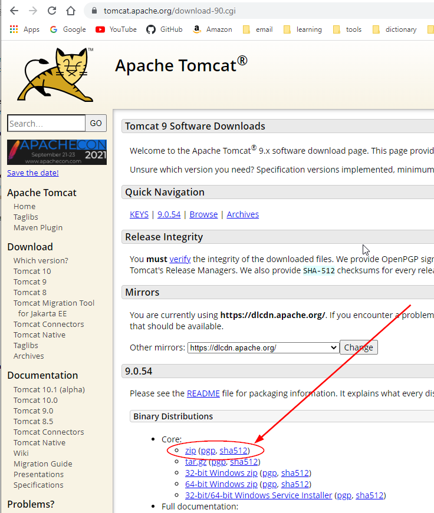
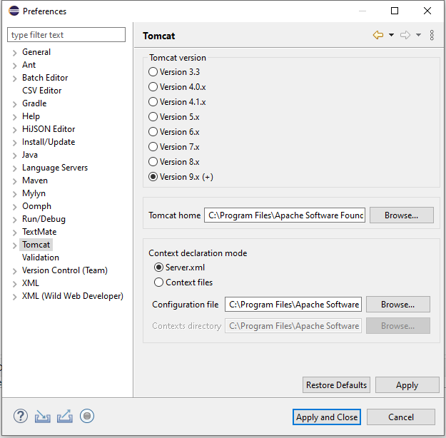
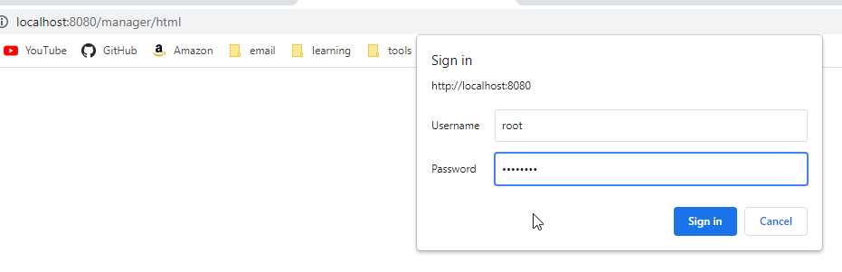
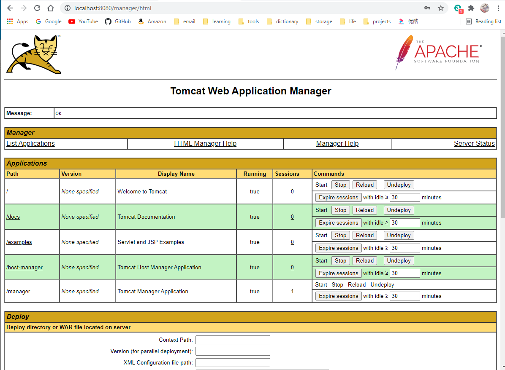
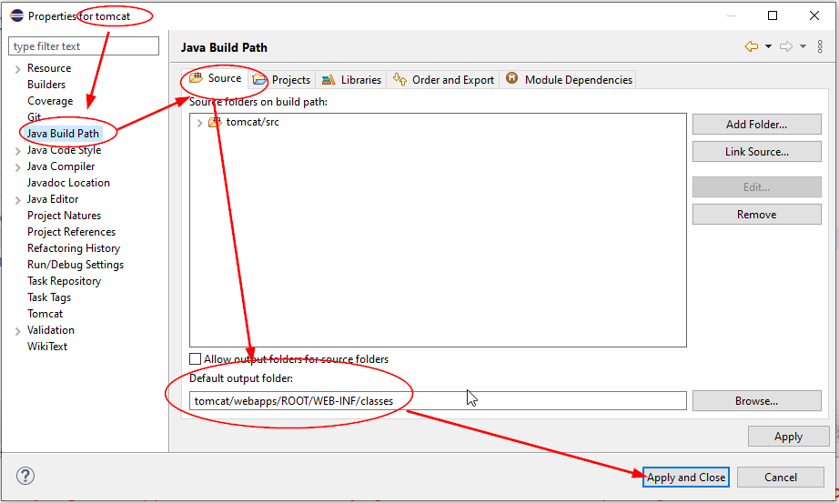

<h1>Build REST APIs with Java using Tomcat</h1>

## Install Tomcat dependencies

1. [Download page](https://tomcat.apache.org/download-90.cgi)
[Download File](apache-tomcat-9.0.54.zip)


2. Unzip and copy it into C:\Users\12818\workspace\java and rename to **tomcat** which is your project name.
3. Configure Tomcat
Window ⟹ Preferences ⟹  Tomcat ⟹ Version 9.x ⟹ Tomcat home ⟹ Server.xml ⟹ Configuration file

4. Run tomcat server
```DOS
   bin/startup.bat
```
5. check installation
[Open default page](http://localhost:8080/)
[Open manager page](http://localhost:8080/manager/html)


[open servlet examples](http://localhost:8080/examples/servlets/)

## tomcat file structure
```output
<tomcat root>
    ├── bin/
    |    ├── startup.bat (run tomcat server)
    |    ├── shutdown.bat 
    |    └── catalina.bat 
    ├── conf/
    |    ├── web.xml (web app settings)
    |    └── 🔨server.xml (define port)
    ├── lib/
    |    └── *.jar
    └── webapps
    |    ├── ROOT
    |    |    └── index.jsp (default starting page)
    |    ├── shutdown.bat 
    |    └── catalina.bat 

```
## server.xml
* port
```xml
<Server port="8005" shutdown="SHUTDOWN">

    <Connector port="8080" protocol="HTTP/1.1"
               connectionTimeout="20000"
               redirectPort="8443" />
</Server>
```
## web.xml
```xml
<web-app xmlns="http://xmlns.jcp.org/xml/ns/javaee"
  xmlns:xsi="http://www.w3.org/2001/XMLSchema-instance"
  xsi:schemaLocation="http://xmlns.jcp.org/xml/ns/javaee
                      http://xmlns.jcp.org/xml/ns/javaee/web-app_4_0.xsd"
  version="4.0">

    <servlet>
        <servlet-name>jsp</servlet-name>
        <servlet-class>org.apache.jasper.servlet.JspServlet</servlet-class>
        <init-param>
            <param-name>fork</param-name>
            <param-value>false</param-value>
        </init-param>
        <init-param>
            <param-name>xpoweredBy</param-name>
            <param-value>false</param-value>
        </init-param>
        <load-on-startup>3</load-on-startup>
    </servlet>
    <servlet-mapping>
        <servlet-name>jsp</servlet-name>
        <url-pattern>*.jsp</url-pattern>
        <url-pattern>*.jspx</url-pattern>
    </servlet-mapping>

    <mime-mapping>
        <extension>htm</extension>
        <mime-type>text/html</mime-type>
    </mime-mapping>
    <mime-mapping>
        <extension>html</extension>
        <mime-type>text/html</mime-type>
    </mime-mapping>
    <mime-mapping>
        <extension>css</extension>
        <mime-type>text/css</mime-type>
    </mime-mapping>
    <mime-mapping>
        <extension>csv</extension>
        <mime-type>text/csv</mime-type>
    </mime-mapping>
    <mime-mapping>
        <extension>jpeg</extension>
        <mime-type>image/jpeg</mime-type>
    </mime-mapping>
    <mime-mapping>
        <extension>jpg</extension>
        <mime-type>image/jpeg</mime-type>
    </mime-mapping>
    <mime-mapping>
        <extension>bmp</extension>
        <mime-type>image/bmp</mime-type>
    </mime-mapping>
    <mime-mapping>
        <extension>gif</extension>
        <mime-type>image/gif</mime-type>
    </mime-mapping>
    <mime-mapping>
        <extension>png</extension>
        <mime-type>image/png</mime-type>
    </mime-mapping>
    <mime-mapping>
        <extension>svg</extension>
        <mime-type>image/svg+xml</mime-type>
    </mime-mapping>
    <mime-mapping>
        <extension>mp3</extension>
        <mime-type>audio/mpeg</mime-type>
    </mime-mapping>
    <mime-mapping>
        <extension>mp4</extension>
        <mime-type>video/mp4</mime-type>
    </mime-mapping>
    <mime-mapping>
        <extension>mp4a</extension>
        <mime-type>audio/mp4</mime-type>
    </mime-mapping>
     <mime-mapping>
        <extension>js</extension>
        <mime-type>application/javascript</mime-type>
    </mime-mapping>
    <mime-mapping>
        <extension>xml</extension>
        <mime-type>application/xml</mime-type>
    </mime-mapping>
    <mime-mapping>
        <extension>json</extension>
        <mime-type>application/json</mime-type>
    </mime-mapping>
    <mime-mapping>
        <extension>txt</extension>
        <mime-type>text/plain</mime-type>
    </mime-mapping>
    <mime-mapping>
        <extension>text</extension>
        <mime-type>text/plain</mime-type>
    </mime-mapping>
    <mime-mapping>
        <extension>doc</extension>
        <mime-type>application/msword</mime-type>
    </mime-mapping>
    <mime-mapping>
        <extension>docx</extension>
        <mime-type>application/vnd.openxmlformats-officedocument.wordprocessingml.document</mime-type>
    </mime-mapping>
    <mime-mapping>
        <extension>ppt</extension>
        <mime-type>application/vnd.ms-powerpoint</mime-type>
    </mime-mapping>
    <mime-mapping>
        <extension>xls</extension>
        <mime-type>application/vnd.ms-excel</mime-type>
    </mime-mapping>
    <mime-mapping>
        <extension>xlsx</extension>
        <mime-type>application/vnd.openxmlformats-officedocument.spreadsheetml.sheet</mime-type>
    </mime-mapping>
    <mime-mapping>
        <extension>zip</extension>
        <mime-type>application/zip</mime-type>
    </mime-mapping>

    <welcome-file-list>
        <welcome-file>index.html</welcome-file>
        <welcome-file>index.htm</welcome-file>
        <welcome-file>index.jsp</welcome-file>
    </welcome-file-list>

</web-app>
```
## write index.html
```html
<html>

<body>
	<center>
		<h1>
			<font color="blue">Hello, the world!</font>
		</h1>
	</center>
	<hr>
	
	
</body>

</html>
```
save to
```
C:\Users\12818\workspace\java\tomcat\webapps\ROOT\index.html
```
[Default web-page](http://localhost:8080/)

## Use Java Servlet

1. [Hello World Servlet](../tomcat/src/org/huaxia/tomcat/HelloWorld.java)
2. add configuration on web.xml
```xml
	<servlet>
		<servlet-name>HelloWorld</servlet-name>
		<servlet-class>org.huaxia.tomcat.HelloWorld</servlet-class>
	</servlet>
		<servlet-mapping>
		<servlet-name>HelloWorld</servlet-name>
		<url-pattern>/HelloWorld</url-pattern>
	</servlet-mapping>
```
3. start tomcat server (run bin/startup.bat or Tomcat > Start Tomcat)
[Hello World from servlet](http://localhost:8080/HelloWorld)