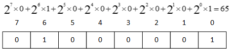

<h1>Language Basics</h1>

- [Data Type](#data-type)
  - [Understand data type casting](#understand-data-type-casting)
- [Array](#array)
- [ArrayList](#arraylist)
- [Operator](#operator)
- [Excution Control](#excution-control)
  - [if-else](#if-else)
  - [switch](#switch)
- [Loop](#loop)


## Data Type
* [DataType.java](../huaxia/src/com/huaxia/java1/DataType.java)
  - primitive data type (boolean, byte, char, short, int, long, float, double)
>cast: small value can assign to large container; must cast large value before assign to small container.

  - Java built in data type (String, Array, ArrayList, Hashtable, )
  - User defined data type

  1. primitive data type (boolean, byte, short, int, long, float, double)
  2. Java defined data type (String, StringBuffer, ... ...)
  3. Developer defined data type

> every class extends(inherits) from **java.lang.Object** which is the root class for all java classes
> you can override toString() method to represent different object
> if you create your own constructor, the default constructor no longer available

❓ What is differences between Primitive and Java defined data type?
>✔️ 1. java defined data type has a lot built in methods can be used.
    1. java defined data type you need use **new** keyword to create an instance.


🔑💡 **Knowlodge Base**
> Java programming is nothing but create and use data type.




### Understand data type casting
> Casting between primitive types enables you to convert the value of one type to another primitive type is called Primitive Type Casting.


🔑💡 **Knowlodge Base**
> 1. small value can be assigned to larger container automatically without casting.
> 2. large value need to be casted before assign to small container.


## Array
* [ArrayTester.java](../huaxia/src/com/huaxia/java1/ArrayTester.java)
  - int[] primitive array
  - String[] Java defined array
  - Cup[] Developer defined array
  - Arrays.toString() method
- 
## ArrayList
* [ArrayList Test](../huaxia/src/com/huaxia/java1/ArrayListTest.java)
👎😢 Arrays.asList(iList) return Arrays$ArrayList which cannot use add() operation.
✔️ iList = new ArrayList(iList); // then iList is a ArrayList.
[](../src/com/huaxia/john/ArrayListTest.java)

## Operator
❓ What are operators for java language?
* [Operators.java](../huaxia/src/com/huaxia/java1/Operators.java)
  - Arithmatic operator: +,-,*,/,%
  - compound assignment operator: +=, -=, *=, /=, %= 
  - binary operator: ++, --,
  - comparison operator: >, <, >=, <=, ==, !=
  - logical operator: && and, || or, ! not
  - ternary operator: a<b?a:b
  - bitwise operator: &, |, ^
  - . operator
  - precendence: *, /; +, -; ()
``` 
		 &: bitwise and
		 |: bitwise or
		 ^: bitwise xor
		 ~: bitwise compliment
```
* Homeworks
    1. [quiz02.md](../homeworks/quiz02.md)
    2. [operator01.md](../homeworks/operator01.md)
    3. [operator02.md](../homeworks/operator02.md)

## Excution Control
### if-else
Execution control


* [if-else syntax](../huaxia/src/com/huaxia/java1/ExecutionControl.java)
  
### switch
[switch]
  - Homeworks

## Loop
* For loop
* for loop (1. initial index; 2. loop condition; 3. adjust index), **continue**, **break**
* for each loop
> go through each element in the iterable variables such as array, ArrayList, ...
>   
  
* [for/while loop/do-while](../huaxia/src/com/huaxia/java1/Loop.java)
* While loop
    
* do-while loop
    

```
while loop has 3 part:
1. initialize variable, a=0
2. variable condition, a<10
3. adjust variable, a +=1
```
❓ What is **static** method?
✔️ a static method can be called by the class name, the method has nothing to do with the class attributes.

