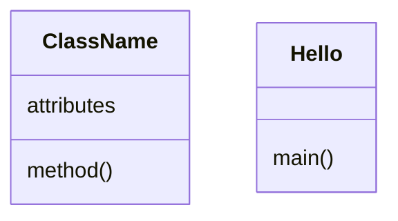

<h1>Markdown Document Cheatsheet</h1>

## Table of Contents
- [Table of Contents](#table-of-contents)
- [create table contents](#create-table-contents)
- [Title](#title)
- [Section](#section)
- [Link a file](#link-a-file)
- [Display a image file](#display-a-image-file)
- [Link to Website](#link-to-website)
- [Unordered List](#unordered-list)
- [Ordered List](#ordered-list)
- [Grave document block](#grave-document-block)

❓ What is markdown document?
> 1. Markdown document is plain text file, display fast. most of time read this document is good enough. It uses special characters to format the contents.
> 2. Markdown document is electronic document, which can connect to website, other document dynamically.
> 3. Markdown document allows you to organize your documents into small pieces, and easy to maintain.
> 4. Markdown docuemt can display image, generate graphics, display math formular in the preview.
> 5. Markdown docuemt can make pdf document for final output.
> 

## create table contents
❓ How to create table of contents?
>✔️ Put cursor on where you want the table contents to be ⟹ right-click ⟹ Command Palette... ⟹ Create Table of Contents

## Title
<h1>first level title</h1>
<h2>second level title</h2>
<h3>third level title</h3>

## Section
the two *##* make section tile

## Link a file
[My Java Electronic Text Book](java.md)

## Display a image file


## Link to Website
[Java API online Document](https://docs.oracle.com/en/java/javase/16/docs/api/index.html)
[Java API find what you know](https://docs.oracle.com/javase/8/docs/api/)

## Unordered List
* first item
* second item
* third item

## Ordered List
1. first item
2. second item
3. third item

## Grave document block
* dos block

```dos
C:\Users\12818\workspace\students\2022Summer\java-0900>dir
 Volume in drive C is Windows
 Volume Serial Number is F28A-8B4A

 Directory of C:\Users\12818\workspace\students\2022Summer\java-0900

06/06/2022  09:22 AM    <DIR>          .
06/06/2022  09:22 AM    <DIR>          ..
06/06/2022  09:07 AM    <DIR>          .metadata
06/06/2022  09:40 AM    <DIR>          summer
               0 File(s)              0 bytes
               4 Dir(s)  750,600,740,864 bytes free
```

* Language block

```java
public class Hello {
	public static void main(String[] args) {
		System.out.println("Hello, the world!");
    }
}
```

* Mermaid block


