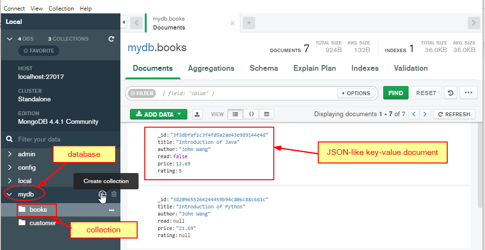

[Using MongoDB in Java](https://www.tutorialspoint.com/mongodb/mongodb_java.htm)
❓What is MongoDB?
✔️One of NoSQL database application written in C++.
1. stores data in JSON-like documents that can have various structures
2. uses dynamic schemas, which means that we can create records without predefining structure such as SQL relational database table.
3. the structure of a record can be changed simply by adding new fields or deleting existing ones.

4. document database
5. key-value database 

❓What is NoSQL database?
✔️NoSQL databases (aka "not only SQL") are non tabular, and store data differently than relational tables. NoSQL databases come in a variety of types based on their data model. The main types are document, key-value, wide-column, and graph. They provide flexible schemas and scale easily with large amounts of data and high user loads.
