<h1>Object Oriented Programing</h1>

## Java class
❓ What is java class?
✔️ Java class is a software developer defined code blocks as a **data type** can be used to create an instance of that class. It includes class name, attributes and methods.

❓ What is constructor?
✔️ the class constructor is special method which returns an instance of that class.
1. Constructor must use class name as its name;
2. the constructor can be modified by modifiers such as: private, public, default;
3. the constructor has no return data type, since it retuens the instance of this class;
4. there can be more than one constructors with different signatures so called method overloading;

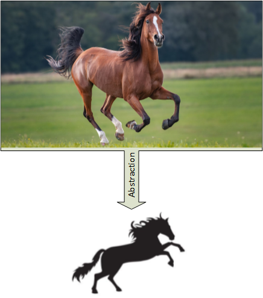

❓ What is method signature?

When we define a method which includes the following parts

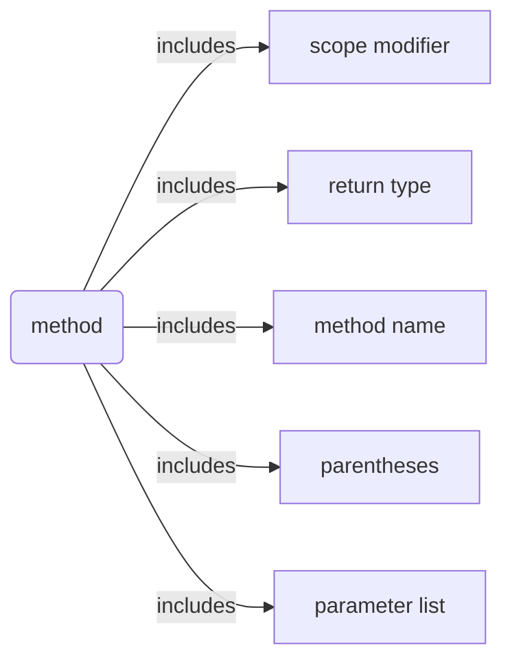


❓ What is method in Java?
>✔️ the method is a java code block. method has 5 parts.
> 1. method name;
> 2. arguments list;
> 3. code block;
> 4. return type;
> 5. modifier (public, static, private, protected)

```java syntax of method
[modifiers] <return type> <method name>([arguments list: type-name pair]){
	[code block]
	[return <type>]
}
```

❓ What is the signature(finger print) of method?
✔️ the method signature uniquely determine one method from another, which has 3 parts:
> 1. method name;
> 2. number of parameters; 
> 3. data type of each parameter.
> 4. and order of each parameter.

💡🔑 **Knowlodge Base**
> we can defined more than one method in same class as long as they have different signature.

❓ What is **method overloading** in Java?
✔️ the methods have **same name** with different signature in one class is called method overloading.👎😢

❓ What is **method overridden** in Java?
✔️ subclass defines same method (**same signature**) as its superclass is called **method overridden**.

📌❗️ **Knowlodge Base**
💡👉 may concern a return type also as part of the signature;
💡👉 in one class there is only one method signature allowed. or cause compiler error.

❓ Parameter vs. argument
✔️ 
> An **argument** is a value passed to a function when the function is called. An argument when passed with a function replaces with those variables which were used during the function;
> In other hand, a **parameter** is a variable used to define a particular value during a function definition. In the example below, a and b are **parameters**. 

[params vs. argument](../huaxia/src/com/huaxia/java1/Example1.java)

```java
public class Example {

	public static int multiply(int a, int b)
	{
		return a + b;
	}

	public static void main(String[] args)
	{
		int x = 2;
		int y = 5;

		// the variables x and y are arguments
		int sum = multiply(x, y);

		System.out.println("SUM IS: " + sum);
	}
}
```
where x, y are the arguments.

❓ How do I set arguments to main() method in eclipse?
✔️ Right-Click class name > Properties > Run/Debug Settings > Click class name > Edit > Arguments > enter argument list > Apply and Close

❓ How do I call java program from DOS command window?
✔️ 
1. Open DOS window
2. change directory to the classes(bin) folder
3. run java command on DOS window

```DOS
C:\Users\12818\workspace\java\huaxia\bin>java com.huaxia.java1.Example1 4 5
[4, 5]
4 x 5 = 20.000000
Hello, John
```
[](../huaxia/src/com/huaxia/java1/Example1.java)

## OOP
❓ What is OOP?
✔️ Object Oriented Programming concept

  

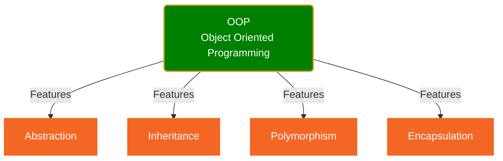
### Abstraction
❓ What is **Abstraction**?
✔️ Abstract object attributes and functionalities in the real world that only interested in the software to define a java class.

[Student.java](../huaxia/src/com/huaxia/java1/Student.java)
[Circle.java](../huaxia/src/com/huaxia/java1/math/SimpleMath.java)

❓ What is toString() method in java?
✔️ toString() is a method defined in **Object** class which returns a String representation of the object. Developer can always override it in different return.

❓ What is **Object** class in java
✔️ Class Object is the root of the class hierarchy. Every class has Object as a superclass.

### Inheritance
❓ What is **Inheritance**?
✔️ Subclass inherits features(attributes and methods) from superclass. (___is___ relationship)

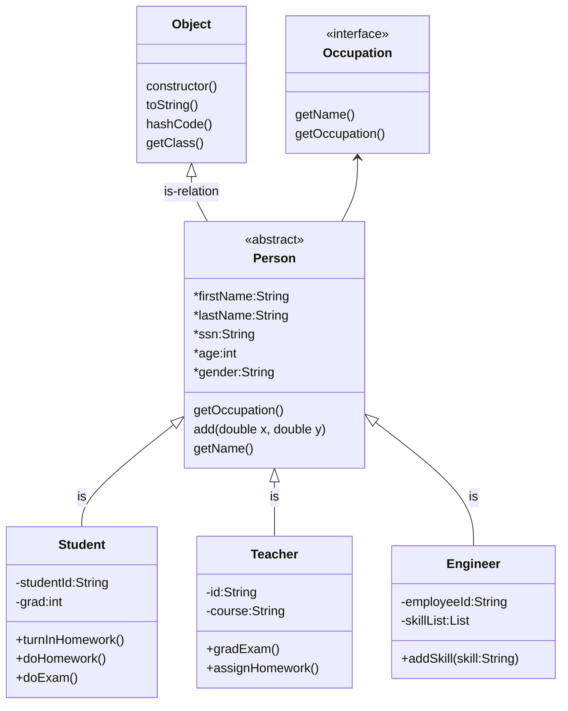
[Engineer.java](../src/com/huaxia/john/Engineer.java)
[Test.java](../src/com/huaxia/john/Test.java)
❓ How to check **is** relation in Java?
✔️ instanceof keyword
```java
if(s1 instanceof Person){
 ...
}
```

2. Abstraction: abstract object in the real world to write a class.
  
[First class](../huaxia/src/com/huaxia/java1/Cup.java)
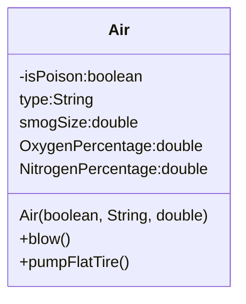
3. Inheritance: subclass inherits features from super class.
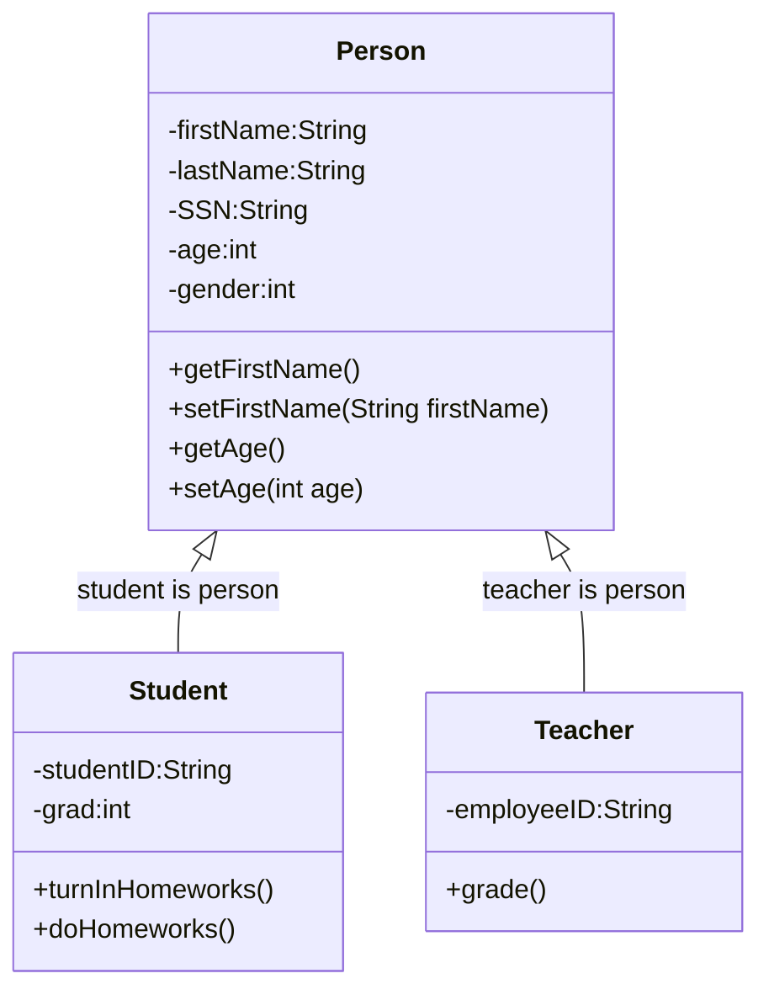

Student is a Person, the relationship between Student and Person is **is relation**.
where the Student class is subclass of Person class, we call the Person as Superclass of Student class.

* [Person, Superclass](../huaxia/src/com/huaxia/java1/Person.java)
* [Student, Subclass of Person](../huaxia/src/com/huaxia/java1/Student.java)
* [Teacher, Subclass of Person](../huaxia/src/com/huaxia/java1/Teacher.java)

### Polymorphism
Polymorphism: 
> allows a single task to be performed in different ways.
> Polymorphism in Java is the ability of an object to take many forms, it allows us to perform the same action in many different ways. (method Overriding, Overloading, runtime polymorphism)
> give different answer for the same question from different classes which inherit from same superclas or interface. (异类同功)
   
[Test Polymorphism](../huaxia/test/com/huaxia/java1/Test.java)

### Encapsulations
to make our java code isolated from unexpected changes. Encapsulation: private, protected

❓What is private modifier?
>✔️private modifier make variable or method in the class can only be used within the class, which makes encapsulation possible.

## class
❓What functions defined in Object class which are useful for us?
✔️the functions available in Object are
1. default constructor
2. toString()

❓What is construtor?
✔️Constructor is used to create an instance of the class.
### Construtor
1. Constructor looks like a method which does NOT have return type since it always return the instance.
2. Constructor can use public, package, private and protected modifier
3. 😢👎If you defined your own constructor with arguments, the default constructor no longer works
	- ✔️create a default constructor which does **NOT** have any aruments.
	- ✔️add arguments when you call the constructor
4. 👌You can define many different constructors which has different signature. 
5. 😢Subclass can NOT use Superclass constructor.
6. 😄Subclass can use public or protected methods defined in the superclass.
7. 😢👎👎👎class defined in the same package can call protected method.
8. 👍protected method cannot be called from different package.

❓What is protected modifier?
✔️protected modifier allow subclass to access the superclass attributes or methods. protect from using by other classes.

[getter, setter, toString, default constructor](../huaxia/src/com/huaxia/java1/Superclass1.java)

❓How do I create getter/setter?
✔️
❓How do I override toString() method?
✔️
❓Why I want to override toString()?
✔️

### Inhritance
* Inherit from class
  [Super class: Person](../huaxia/src/com/huaxia/java1/Person.java)
  [Subclass Student](../huaxia/src/com/huaxia/java1/Student.java)
  [Subclass Teacher](../huaxia/src/com/huaxia/java1/Teacher.java)
  - class can only inherit from one class, Java does NOT allow multiple inheritance

* Implements from Interface
  [](../huaxia/src/com/huaxia/java1/Occupation.java)
  [](../huaxia/src/com/huaxia/java1/Teacher.java)
  [](../huaxia/src/com/huaxia/java1/Engineer.java)
  [](../huaxia/src/com/huaxia/java1/TestOccupation.java)
  
❓What is interface?

👎 An interface is a completely "abstract class" that is used to group related methods with empty bodies:

✔️👍 An interface is a special java code block that defined collection of abstract methods without implementation, and possible constants. 
1. All methods defined in interface are ***abstract***.
2. All methods defined in interface are ***public***.
3. All vriables defined in interface are ***static***, ***final*** constants.
4. One class can implements more than one interface
5. to ***implements*** an interface, all methods defined in the interface need to be implemented (provide method body).
6. 😄An interface cannot be used to create an object.
7. Interface can be used to declare variable as a data type.

❓ How do I create interface?
✔️

❓How do I use the interface?
✔️implements the interface in the class

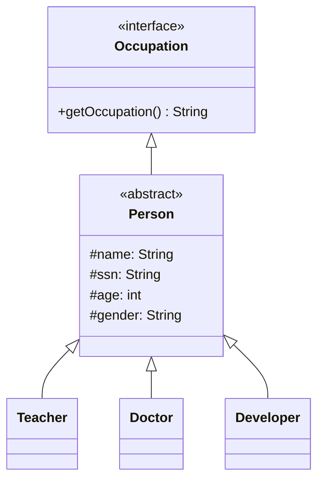

* Annotations on classes
  1. << interface >>
  2. << abstract >>
  3. << Service >>
  4. << enumeration >>

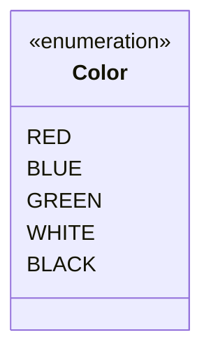

## interface
❓ What is interface?

✔️ the following definition

❌👎Bad definition: An interface is a completely "abstract class" that is used to group related methods with empty bodies.
> ✔️👍 An interface is a special java code block that define abstract methods, and possible constants.

❓ What is an abstract methond?

✔️ a method with an ***abstract*** modifier with all method signatures without implementation.

1. All methods defined in interface are ***abstract***.
2. All methods defined in interface are ***public***.
3. All vriables defined in interface are ***static***, ***final*** constants.
4. All classes implement the interface need implement all methods defined in the interface.
5. An interface can not be used to create object.
6. An interface can be used to delear variable or method return type.
   
## abstract class
❓ What is an abstract class?
✔️ Abstract classes are similar to interfaces. You cannot instantiate them, and they may contain a mix of methods declared with or without an implementation. Abstract class: is a restricted class 💡that cannot be used to create objects (to access it, it must be inherited from another class).

1. the abstract class can leave method as abstract. (can have abstract methods)
2. An abstract class can not used to create object.
3. if the abstract class implements an abstract method defined in the interface, its subclass won't be necessary to implement that method.

## concrete class
❓ What is an concrete class?
✔️
1. A concrete class can be used to create an object.
2. A concrete class cannot include abstract method.


3. use **abstract** modifier to make the class abstract which allow no implementation of the abstract method defined in interface.
 
* Inherit from Abstract class
  1. need implements all abstract methods or make itself to be abstract 
  
❓What is abstract method
Abstract method: can only be used in an abstract class, and it does not have a body. The body is provided by the subclass (inherited from).

❓Which should you use, abstract classes or interfaces?
>✔️👇Consider using abstract classes if any of these statements apply to your situation:
  * You want to share code among several closely related classes.
  * You expect that classes that extend your abstract class have many common methods or fields, or require access modifiers other than public (such as protected and private).
  * You want to declare non-static or non-final fields. This enables you to define methods that can access and modify the state of the object to which they belong.
>✔️👇Consider using interfaces if any of these statements apply to your situation:
  * You expect that unrelated classes would implement your interface. For example, the interfaces Comparable and Cloneable are implemented by many unrelated classes.
  * You want to specify the behavior of a particular data type, but not concerned about who implements its behavior.
  * You want to take advantage of multiple inheritance of type.

(🔥polymorphism) 👇see sample code below👇.

[Person.java](../huaxia/src/com/huaxia/java1/Person.java)

[Test.java](../huaxia/test/com/huaxia/java1/Test.java)  

## Method Overloading vs. Overriding
* Overloading:
> same method name within a class with different signature.
* Overriding: 
> same method name and signature defined in subclass

## An Abstract Class Example

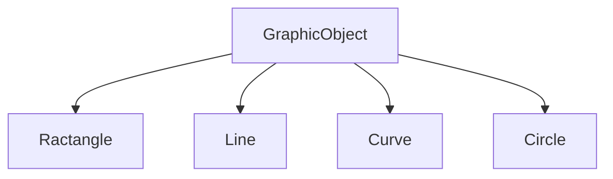
```java
//AbstractSum.java
//abstract class
abstract class Sum{
   /* These two are abstract methods, the child class
    * must implement these methods
    */
   public abstract int sumOfTwo(int n1, int n2);
   public abstract int sumOfThree(int n1, int n2, int n3);
	
   //Regular method 
   public void disp(){
	System.out.println("Method of class Sum");
   }
}

//ConcreteSum.java
//Regular class extends abstract class
class Demo extends Sum{

   /* If I don't provide the implementation of these two methods, the
    * program will throw compilation error.
    */
   public int sumOfTwo(int num1, int num2){
	  return num1+num2;
   }
   public int sumOfThree(int num1, int num2, int num3){
	  return num1+num2+num3;
   }
   public static void main(String args[]){
      Sum obj = new Demo();
      System.out.println(obj.sumOfTwo(3, 7));
      System.out.println(obj.sumOfThree(4, 3, 19));
      obj.disp();
    }
}
```

## Practices

### PrimeFactor
* [Math01](math01.md)
* [Square root](../basics/src/katherine/SquareRootSample.java)
* [Prime Factors](../basics/src/katherine/PrimeFactor.java)

### Prime number
* [is Prime](../basics/src/katherine/Prime.java)
  
### Perfact number
* [is Perfect Number](../basics/src/katherine/PerfactNumber.java)

### Translation

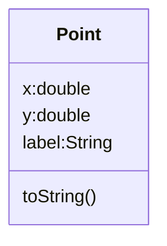

> $x' = x + \Delta x$
> $y' = y + \Delta y$

A(-5, 6), B(-2, 6), C(-2, 2)
$\Delta x = 7, \Delta y = 0$

after translation, we get
A'(2, 6), B'(5, 6), C'(5, 2)

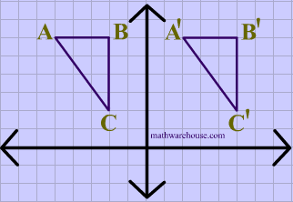

### Rotation


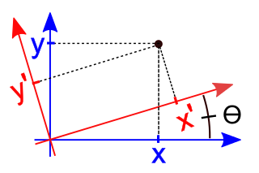

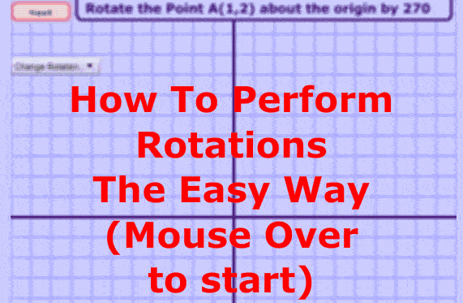

$x' = x cos \theta + y sin \theta$
$y' = - x sin \theta + y cos \theta$

$x = x' cos \theta - y' sin \theta$
$y = x' sin \theta + y' cos \theta$

* [Math02](math02.md)

## Dilation
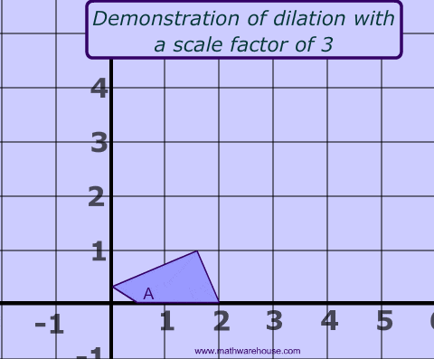
* [Math03](math03.md)

* [Math04](math04.md)
* [Math05](math05.md)
* [Coordinate transform](../basics/src/katherine/CoordinateTransform.java)

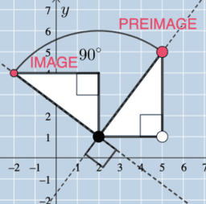

## References

* [坐标变换动画](https://www.mathwarehouse.com/animated-gifs/transformations.php)
* [数学动画](https://www.mathwarehouse.com/animated-gifs/)