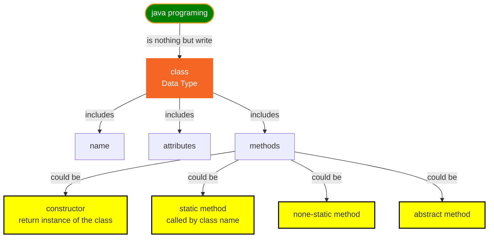
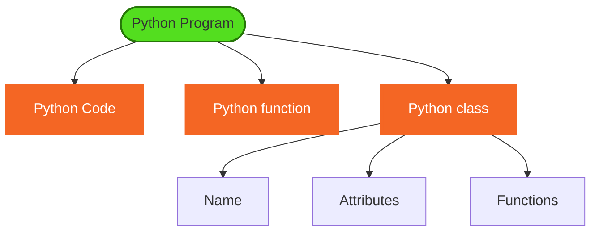
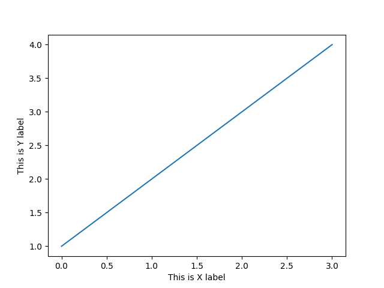

# Python vs. Java

* Both Java and Python are Object Oriented Programing language.
* Java start with class, need understand everyting about class to write Java program.
* Python start with code block, no need to understand class for beginer.

## Java



* Simple java code

```java
public class Hello{
    public static void main(String[] args){
        System.out.println("Hello, the world!");
    }
}
```

* Simple math: calculate circle area,

```java
package mymath;

public class MyMath{
    public double circleArea(double radius) {
        return Math.PI * radius * radius;
    }

    public static void main(String[] args) {
        MyMath math = new MyMath();
        double area = math.circleArea(2.3);
        System.out.println(area);
    }
}

```

## Python



* Simple Python code

```py
print('Hello, the world!')
```

* Simple math: calculate circle area,

```py
from math import pi

def circleArea(radius):
    return pi * radius * radius

a = circleArea(2.3)
print(a) 
```

* Simple plot

```py
import matplotlib.pyplot as plt

plt.plot([1,2,3,4])
plt.show()
```

