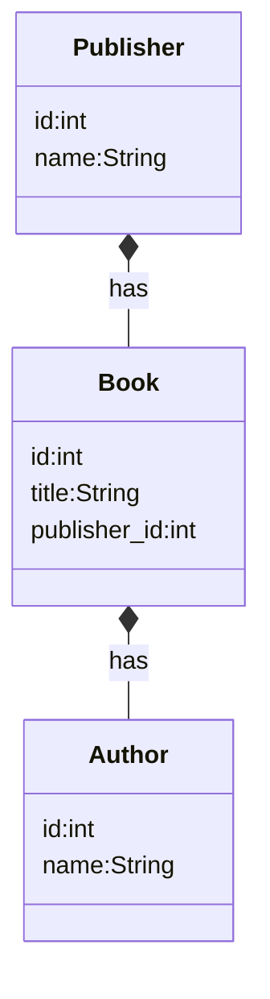
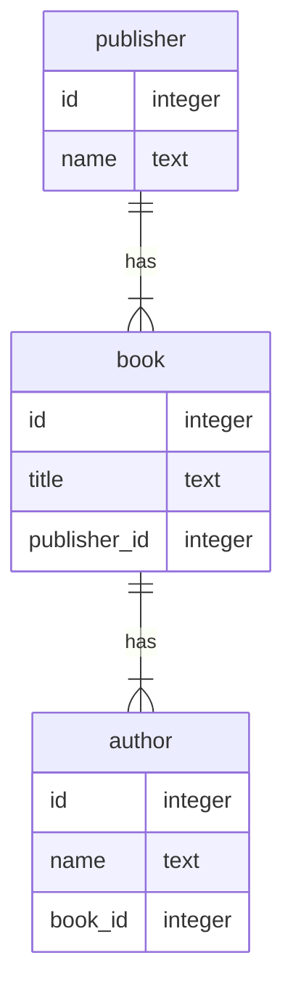
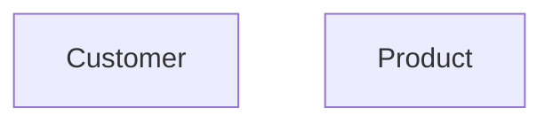
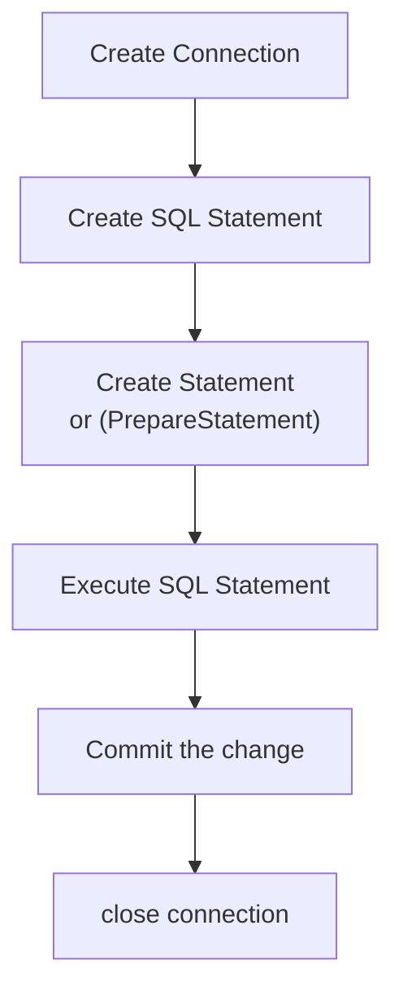
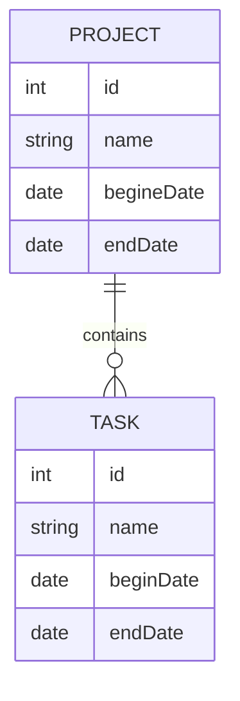
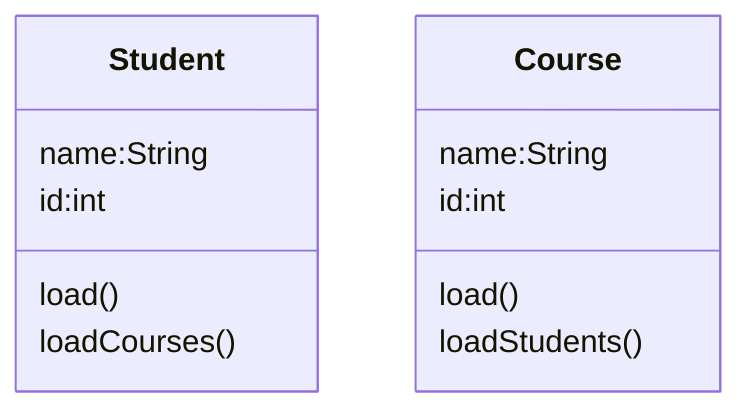
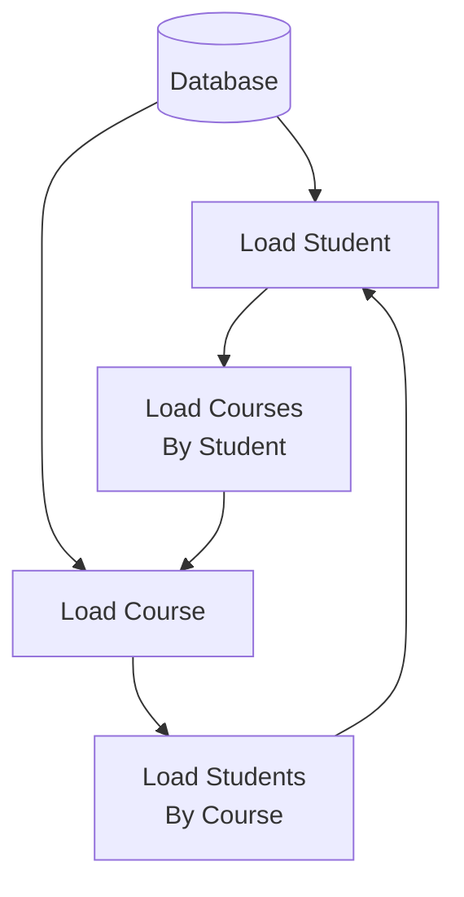

<h1>SQL Basics</h1>

❓What is SQL?
✔️SQL stands for Structured Query Language specially for relational database.
SQLite: Python built in SQL database.

* [Java MongoDB API](http://mongodb.github.io/mongo-java-driver/3.6/javadoc/org/bson/Document.html)

* [MongoDB Connection, Collection, CRUD](../mongodb/src/main/java/org/huaxia/mongodb/MongoDB_CRUD.java)
* [Book.java](../mongodb/src/main/java/org/huaxia/mongodb/Book.java)

>In NoSQL, you don't design your database based on the relationships between data entities. You design your database based on the queries you will run against it. Use the same criteria you would use to denormalize a relational database: if it's more important for data to have cohesion (think of values in a comma-separated list instead of a normalized table), then do it that way.

Incremental Map/Reduce




SQL==>Join vs. NoSQL==>Collation

```sql
SELECT 
  publisher.id, publisher.name, book.title
FROM publisher
JOIN book ON publisher.id=book.publisher_id
ORDER BY publisher.id, book.title
```

```json
{
  "_id":"oreilly",
  "collection":"publisher",
  "name":"O'Reilly Media",
  "books":[
    {"title":"CouchDB: The Definitive Guide"},
    {"title":"RESTful Web Services"},
    {"title":"DocBook: The definitive Guide"},
    {"title":"Building iPhone Apps with HTML, CSS, and JavaScript"}
  ]
}
```

[Entity Relationships in a Document Database](https://www.youtube.com/watch?v=lQLTiX93PL8)

### one-to-one relation
```mermaid
erDiagram

user{
  name text
  gender text
  age integer
  account_id integer
}

account{
  id integer
  name text
}

user ||--o| account:one-to-one
```
* when there is an exclusive need for getting the account data without the user data.

### one-to-many relation
```mermaid
erDiagram

user{
  name text
  gender text
  age integer
  account_id integer
}

account{
  id integer
  name text
}

user ||--o{ account:one-to-many
```
### many-to-many relation
```mermaid
erDiagram

user{
  name text
  gender text
  age integer
}

product{
  id integer
  name text
}

user }o--o{ product:many-to-many
```


## SQLite
❓ What is relational database (RDBMS)?
✔️A relational database is a type of database that stores and provides access to data points that are related to one another.


[SQLiteDB Connection, CRUD](../sqlite/src/main/java/sqlitedb/SQLiteDB_CRUD.java)
1. create()
2. retrieve()
3. update()
4. delete()

* Prepare for Relational database
1. create database (file)
2. create tables in the database

* to access the database

* [Book.java](../sqlite/src/main/java/sqlitedb/Book.java)
  - hide database complexity from Book user
* [Test.java](../sqlite/src/main/java/sqlitedb/Test.java)
* [Hide db access complexity](../sqlite/src/main/java/sqlitedb/DBHelper.java)
* [Test DB access function](../sqlite/src/main/java/sqlitedb/Test.java)

* Create Syntax
```sql
INSERT INTO <table name> VALUES (?,?,...)
INSERT INTO <table name> (column1, column2, ...) VALUES (?, ?, ...)
```

* Retrieve Syntax
```sql
SELECT * FROM <table name>
SELECT * FROM <table name> WHERE <condition>
```

* Update Syntax
```sql
UPDATE <table name> Set column1=?, column2=?, ... WHERE <condition>
```

* Delete Syntax
```sql
DELETE FROM <table name> WHERE <condition>
```

* Create [Book.writeBookToDB()]
* Retrieve All [Book.getAll()](../sqlite/src/main/java/sqlitedb/Book.java)
* Retrieve [Book.loadBookFromDB()](../sqlite/src/main/java/sqlitedb/Book.java)
* Update [Book.updateBookInDB()](../sqlite/src/main/java/sqlitedb/Book.java)
* Delete [Book.deleteBookInDB()]
* Book can CRUD itself to DB.
* Use DBHelper to reduce duplicated code
* Use DBSetting to set default database file connection

Practice:

### one-to-one relationship
* Passenger vs. ticket
```mermaid
erDiagram
passenger{
  id integer
  name text
  gender text
  age integer
  ticket_id integer
}

ticket{
  id integer
  flight text
  depature text
  arrival text
  airport text
  gate text
  airline text
  passenger_id integer
}

passenger ||--o| ticket:one-to-one
```
[Passenger Database Access](../sqlite/src/main/java/sqlitedb/Passenger.java)

[Ticket Database Access](../sqlite/src/main/java/sqlitedb/Ticket.java)

[Ticket-Passenger Test](../sqlite/src/main/java/sqlitedb/Test.java)

```mermaid
erDiagram
families{
  id integer
  reference text
  name text
  unite text
  article_id int
}

articles{
  id integer
  reference text
  name text
  quantity real
  unite text
  purchased integer
  reserved integer
  sold integer
  available integer
  minimum integer
  family_id integer
}

families ||--o| articles:one-to-one
```
### one-to-many relationship

* [one to many](../sqlite/src/main/java/sqlitedb/Project.java)
* [Project > Task](../sqlite/src/main/java/sqlitedb/Task.java)
* [Test.java](../sqlite/src/main/java/sqlitedb/Test.java)
* load project with all task
* get project from task
* 
### many-to-many relationship
```mermaid
 erDiagram
    Student ||--o{ Enrollment:one-to-many
    Course ||--o{ Enrollment:one-to-many
    Student {
        int sid
        string name
    }
    Course {
        int cid
        string name
    }
    Enrollment{
      int sid
      int cid
    }
```
where the intermediate table **Enrollment** is called linking or conjunction table.

SQL = SELECT Student.name FROM Student JOIN Enrollment On(Student.sid=Enrollment.sid) WHERE Course.name='CS4320'

[many to many, Course:Student](../sqlite/src/main/java/sqlitedb/Course.java)
[Student.java](../sqlite/src/main/java/sqlitedb/Student.java)
[Test.java](../sqlite/src/main/java/sqlitedb/Test.java)



⚡️❗️🐛👎Infinite Circle causes application died.


👍 Solution #1:
✔️💡 Load all courses while loading student by the same SQL statement.

💡lazy loading: only load from DB when demands

```sql
SELECT project.id, project.name, project.begin_date, project.end_date, task.id, task.name, task.priority, task.begin_date, task.end_date
FROM project JOIN task on project.id=task.project_id
```
[Student.loadCourses()](../sqlite/src/main/java/sqlitedb/Student.java)
[Course.loadStudents()](../sqlite/src/main/java/sqlitedb/Course.java)
[Test.manyToMany()](../sqlite/src/main/java/sqlitedb/Test.java)

