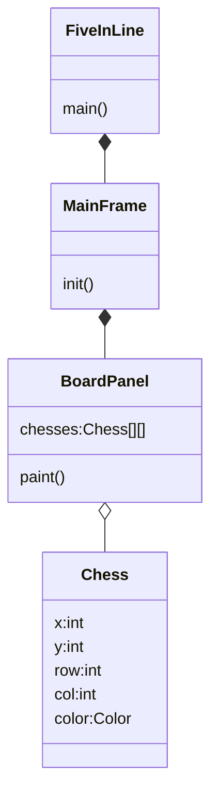
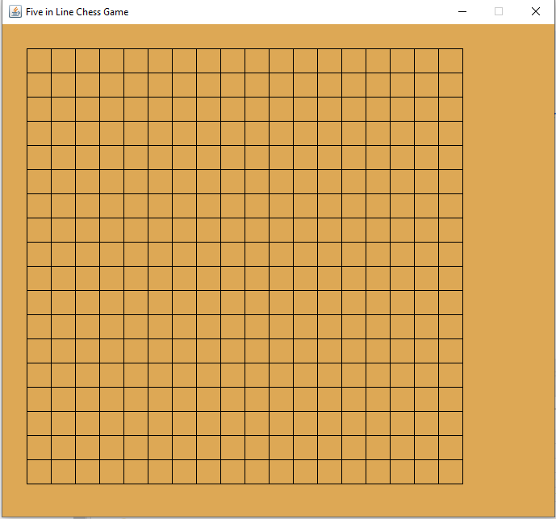
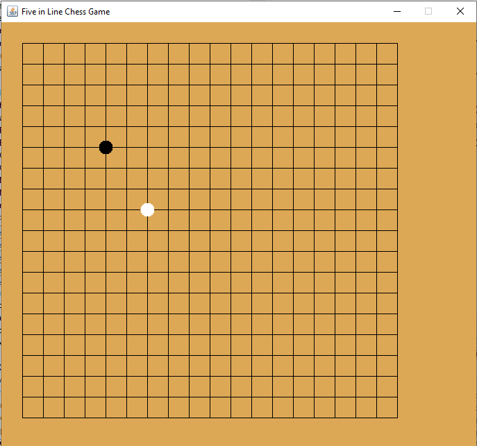
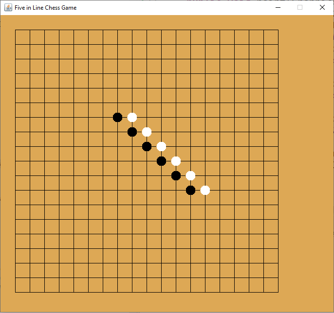

<h1>Five in Line Chess Game</h1>

## Source Code online
* 

## Getting Start
* [Start up class](../src/fiveinline/FiveInLine.java)
* [Main Frame](../savedSrc/MainFrame1.java)
  
## Draw Chess Board
👍😄 Idea: create Chess object array for every cross point on the chess board once.
* [Chess class](../savedSrc/Chess2.java)
* [Board class](../savedSrc/BoardPanel2.java)
* [MainFrame class](../savedSrc/MainFrame2.java)

## Draw Chess if any
* [Chess class add color attribute](../savedSrc/Chess3.java)
* [Board class add draw chess](../savedSrc/BoardPanel3.java)

## Mouse click response
* [get mouse click position](../savedSrc/BoardPanel4.java)
* [draw chess on mouse click](../savedSrc/BoardPanel5.java)

## Check for 5 chesses in line
* [add gameover() method](../savedSrc/BoardPanel6.java)
* [implements fiveInLine() method]()