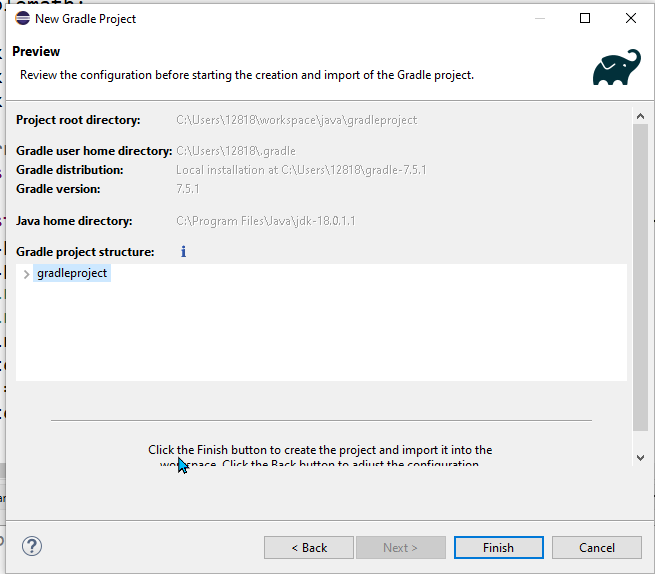

<h1>Gradle Tutorial</h1>

[😄 Gradle project in Eclipse](https://www.vogella.com/tutorials/EclipseGradle/article.html)
[](https://tomgregory.com/gradle-tutorial-for-complete-beginners/)
[Automation Step by Step](https://automationstepbystep.com/)
[YouTube turotial](https://www.youtube.com/playlist?list=PLhW3qG5bs-L8kzOvEjaOyUs2LqHZ3fz4X)
[using Eclipse build gradle project](https://www.youtube.com/watch?v=Tw0sI0WiXVg)
[👍😄YouTube channel - multiple modules](https://www.youtube.com/watch?v=5ZYOyo8ciBo)

[👍😄spring-core lib for gradle](https://mvnrepository.com/artifact/org.springframework/spring-core/5.3.22)

## Download and install Gradle

[](https://gradle.org/releases/)
File Name: gradle-7.5.1-bin.zip
unzip it in: C:\Users\12818\gradle-7.5.1

* check gradle installation

```dos
C:\Users\12818\workspace\java>gradle --version
```

* initial gradle project

```
mkdir gradle-tutorial
gradle init
```

* display build info

```dos
C:\Users\12818\workspace\java\gradleproject>gradlew build
C:\Users\12818\workspace\java\gradle-tutorial>gradle build run
```

* Using gradle wrapper

```do
C:\Users\12818\workspace\java\gradle-tutorial>gradlew tasks
C:\Users\12818\workspace\java\gradle-tutorial>gradlew test
C:\Users\12818\workspace\java\gradle-tutorial>gradlew jar
```
 * set Main-Class in build.gradle

```gradle
jar{
    manifest {
        attributes 'Main-Class':'gradle.tutorial.app.App'
    }
}
```

## Open Eclipse

```doc
Right-click package Explore ⟶ Project ⟶ Gradle:Gradle Project ⟶ 
[Next] ⟶ [Next] ⟶ Project name: <your project name here>
```



Google Search: spring core gradle dependency
[Spring Core](https://mvnrepository.com/artifact/org.springframework/spring-core)

```
// https://mvnrepository.com/artifact/org.springframework/spring-core
implementation group: 'org.springframework', name: 'spring-core', version: '6.0.0-M4'

```

## PureFun
a gradle project: Java Functional programing, monad, either, functor, applicative, 
