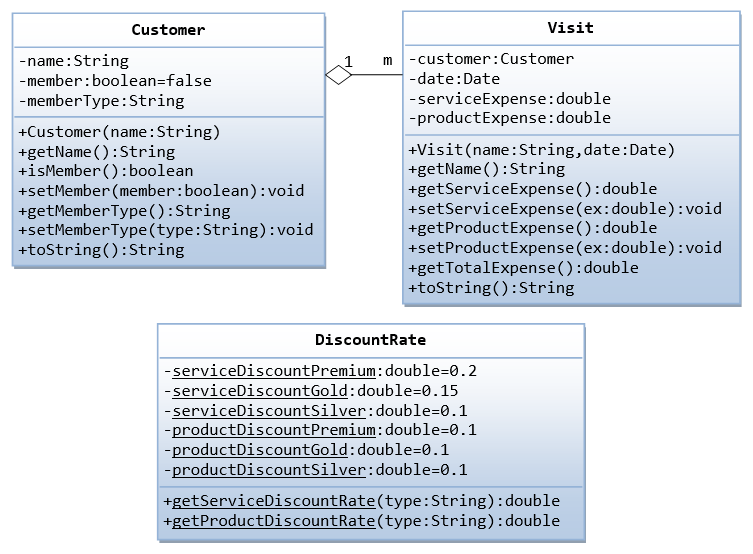
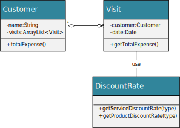

* Create a class Customer, Visit and DiscountRate, build one-to-many relationship shown below:

This homework may help student build up their ability to solve problem.

this homework is not very clear for someone. it could be a story. there is a national park, for every customer, there are two charges:

1. service charge
2. product charge

the customer could be a registered member customer, or walk-in customer. and member customer could have different discount type: (Premium, Golder, Silver), for different member type, the discount is different. The walk-in customer will have no discount at all. Any customer can visit the park as many as they want. this homework ask you to calculate total charge for a customer who maybe a member, or walk-in customer. 

👇the following diagram show the relationship of classes Customer, Visit, and DiscountRate.

where the diamond shape stands for aggregation, whenever you see this, you should add ArrayList<Visit> in Customer class. the symbol on Visit side means a customer may have 0 or many visits to the park, and every visit must correspond to a particular  customer. The visit will use DiscountRate to determine the charge based on the customer in the visit object.