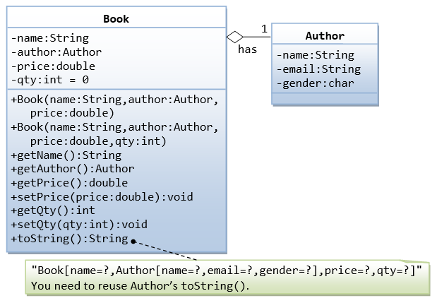
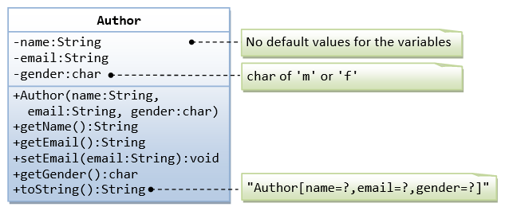

* Create a class Book and Author shown below:





A class called Book is designed (as shown in the class diagram) to model a book written by one author. In other word, an author is composition part of a book. Similarly, a wheel is compisition part of a car.

Composition vs. Inheritence.

```
Sample Execution result:
```