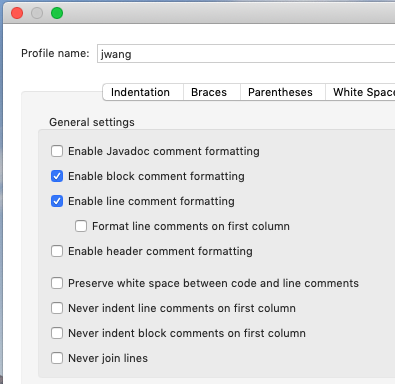

# Eclipse IDE Skills

* Switch to different workspace
	- menu: File > Switch Workspace...

* Generate Javadoc
	- menu:Project > Generate Javadoc...

* Edit Java code style
	- right-click [project name]: Properties > Java Code Style:Formatter > Configure workspace setting > Active Profile:[give name] > button:[Edit] >
	

* Git repository
	- commit: right-click [project name]: Team > Commit >
	
## Open second Eclipse IDE window:
* Right-click (Command+click) on the Eclipse Doc icon and choose Show in Finder.
* Right-click on Eclipse.app and choose Show Packages Contents.* 
* Navigate to Contents > MacOS directory.
* Double-click the eclipse executable there to launch Eclipse. Make sure to select a different workspace than is already open.