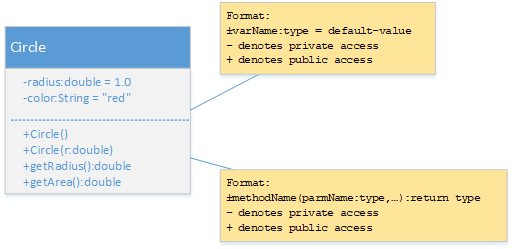

* Create a class Circle shown below:

Sample Execution result:

The circle area with radius=1.00 is 3.14.
The circle area with radius=2.00 is 12.57.

public double getCircumference()
public String toString()