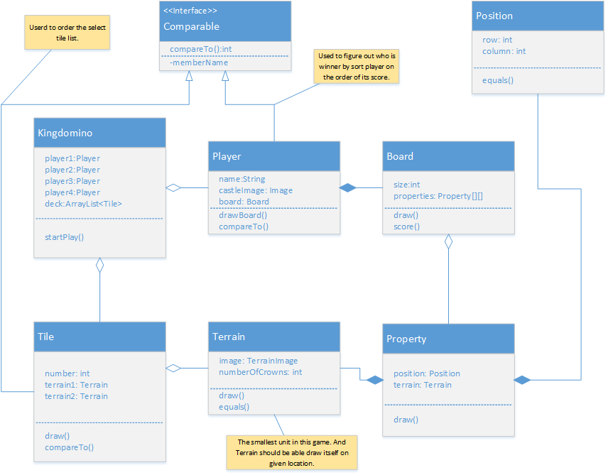

# Kingdomino Game

## Cosiderations
* 优化搁置tile的判断方法；
* 采用鼠标点击驱动程序继续运行的方法，而不是目前的while循环等待的方法（减少CPU的使用）；
* 使用图形terrain类型定义此游戏的最小单元；

## Optimizing
* Put everything belong to class inside the class （OOP）;
* Remove else if, and else, make method single responsibility;
* Use switch whenever needed instead of if-else
* Avoid duplicated code block;
* Use static final variable for gloable constants
* Board should know how to calculate the scores.
* Other than main() method try to get rid of static methods(OOP);
* Avoid the following code

```java
	private static boolean endGame(ArrayList<Tile> list) {
		if (list.size() == 0) {
			return true;
		} else {
			return false;
		}
	}
	
	private static boolean emptyTile(Tile tile) {
		if (tile.getNumber() == 0 && tile.getCrown1() == 0 && tile.getCrown2() == 0 && tile.getTile1() == '#'
				&& tile.getTile2() == '#') {
			return true;
		}
		return false;
	}
	
```


## Global constants.
 
```java
	static final int lengthCase = 70;
	static final int lengthBoard = 9;
	static final int numDominos = 48;
```

## Description
> 设定为4人玩的游戏，试图占领最大的连续地形图案和最大的得分。每个地形图案有数字表示分数，如果连续的图案都没有分数，得分为零。如果连续的图案至少一个有分数，总得分为所有分数加起来乘以连续图案的个数。每一组连续图案称为一个property。首先从Deck中随机获得四个tile，每个tile由两个图案组成，玩家将所选择的tile搁置在自己的board中，或者靠近Castle，或者至少有一个图案和邻近的图案相同，否则不能放置。如果待选图案中找不到在board中可以放置的位置，则这枚tile将被弃除。当所有48个tile使用完，游戏结束。最终计算总得分，得分高者为赢家。另外在放置tile时，包括Castle在内，不得超过5X5的范围（framework）。

## Design Idea
* 所有的图形文件保存于project的根目录中，可以直接使用文件名读入。
* 所有48个tile从文件"dominos.csv"中读取。
* 決定是否可以放置Tile时，先把Tile放入Board中，无论是否可以放，再将其位置清空，可放返回true，否则false。
* 游戏开始后，首先等待player点击Tile，然后点击两个放置terrain在Board中的位置，只有这三个动作完成，游戏才继续。也就是说，在没有点击terrain搁置位置时，player仍有机会改变主意，选择另外的Tile。
* 等待player选择tile并且选中搁置位置后，再继续运行程序。注意while循环判断！player作出错误选择后，有机会重新作出选择。

```java
private void wait4PlayerPickAndDropTile() {
	while (chooseTile == 0 || !case1Selected || !case2Selected) {
		try {
			TimeUnit.MILLISECONDS.sleep(20);
		} catch (InterruptedException e) {
			e.printStackTrace();
		}
	}
}

```

* Class Relationship Diagram



* Game Logic Diagram


```java
imageF = ImageIO.read(new File("Forest.jpg"));
```

## Classes
* Board.java

> 根据游戏范围的大小尺寸，确定所放图形的具体位置。如： size=9，指的是9行9列的图形格，城堡图形放于中央。

* Property.java

> crown: 牌面分数； x，y： 图形位置； tile：类型，初始为#，以后可能为六种图形之一。

* Tile.java

> number: 序号； crown1，crown2: 两个图形的牌面分数； 
tile1，tile2:初始为#, 表示无图像的空位置。使用“Q，M，L，P，W，F”六个字符代表不同的地形图案。

* Player.java

> name, board, score, castleImage ; 

* Configure.java

> used to configure Kingdomino game, such as player's name.
