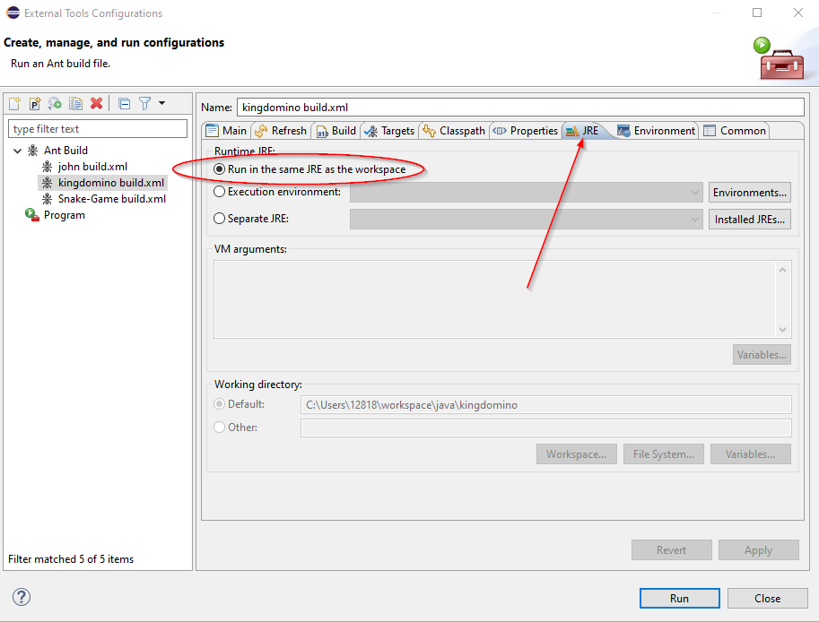
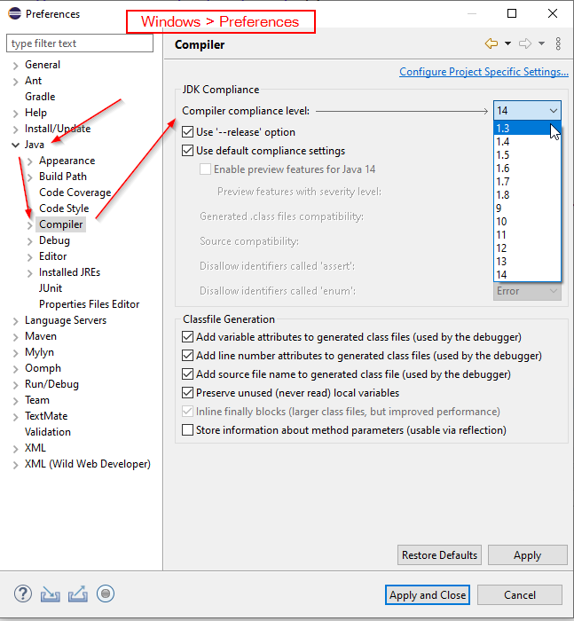
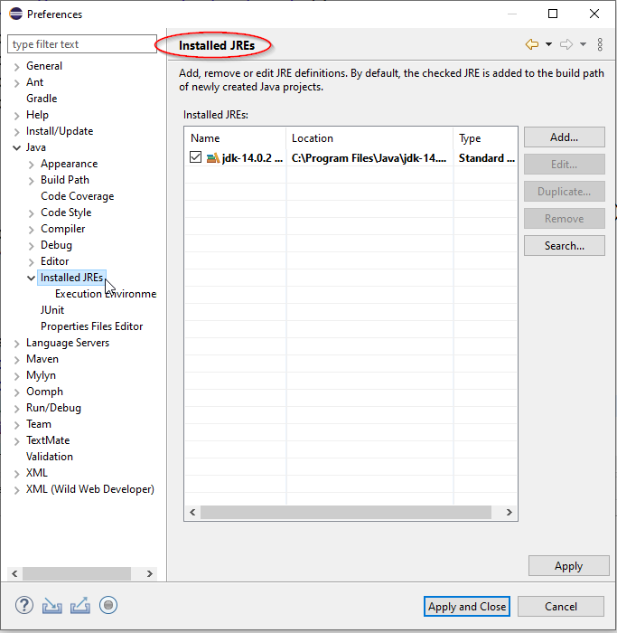

# Kingdomino Game Development Notes

## Development Status
* ~~Create Kingdomino main class;~~
* ~~Add menu bar to the Kingdomino frame;~~
* ~~Implement menu action listener to switch to different screen;~~
* ~~Create DominoPanel to display domino list;~~
* ~~Create PlayerBoardPanel to display player's board;~~
* ~~Add Mouse Action listener to player's main pane;~~
* ~~draw terrain after player drop the domino successfully;~~
* ~~switch to current player's screen automatically;~~
* reduce the screen blink;
* ~~build jar file~~
* ~~add play order in status~~
* ~~add game result to domino list panel~~
* build frame for each player
* add exit in menu
* 

## Idea
* Create only one JFrame for this game;
* when data (properties and dominoList) changes, ~~repaint panel~~, replace panel;
* Add menu so that player can choose to see other's screen;
* ~~Use TabbedPane for each player;~~ since the tabbed pane cannot fill the frame.


## Issues
* frame will repaint, need to call setVisible(false) > switch panel > setVisible(true), but this will make the screen blink.
* After player see other's screen, it is very hard to go back to current player's screen.
	- add "current" menu item into menu.
* TabbedPane cannot fill up the parent panel.
* put image file such as *.png, *.jpg into class folder, works in Eclipse, cannot be load in jar file.
* Ant cannot run compile due to "JAVA_HOME" point to jre1.8XXX;
> open build.xml > right-click > run as > External Tools Configuration > Jre > Run in the same jre as workspace. 



* image file name is case sensitive.

```java

```
* Config Eclipse Java Compiler



* Config Eclipse Installed JRE



## Questions
* how to trigger panel repaint without call frame.setVisible(false) > swicth panel > setVisible(true)?

* Strange, switch to current pane, we don't need seVisible(false), and it is fast.

## Tricks
* read *.csv file 

```java
		InputStream is = Configure.class.getResourceAsStream("dominos.csv");

		Scanner sc;
		sc = new Scanner(is);

```

* read image files

```java
// if all files put in project root
	static {
		try {
			imageF = ImageIO.read(new File("Forest.jpg"));

```

```java
// if all files put in class folder works fine, but cannot be loaded in jar
	static {
		try {
			String filepath = Terrain.class.getResource("Forest.jpg").toURI().getPath();
			imageF = ImageIO.read(new File(filepath));

```

```java
// this version works fine in jar
	InputStream is = Configure.class.getResourceAsStream("Kingdomino.png");
	image = new JLabel(new ImageIcon(ImageIO.read(is)));

```