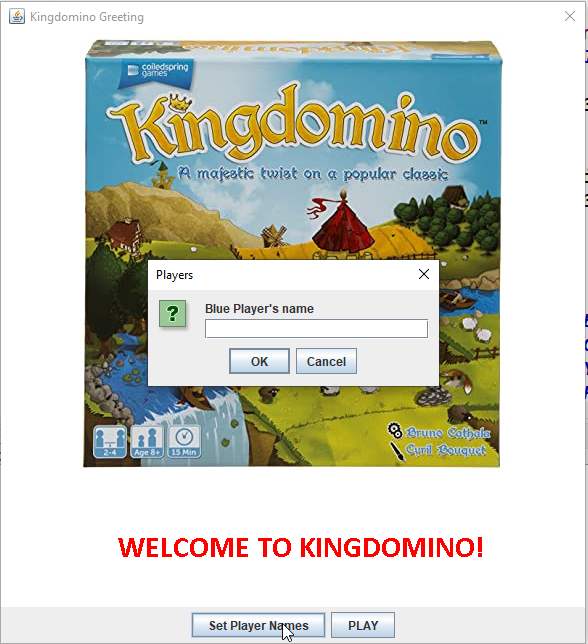
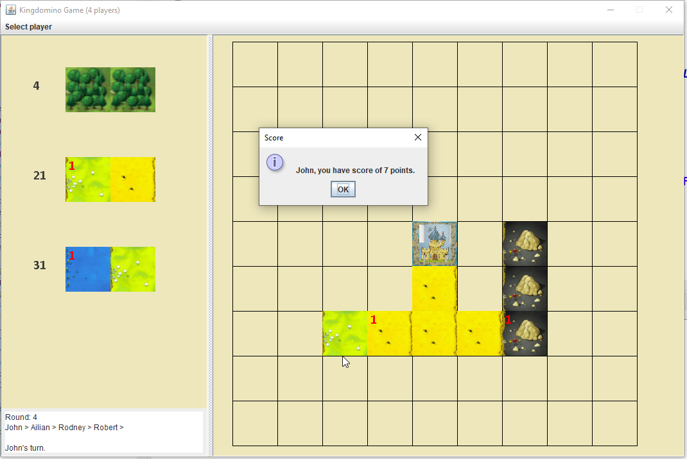
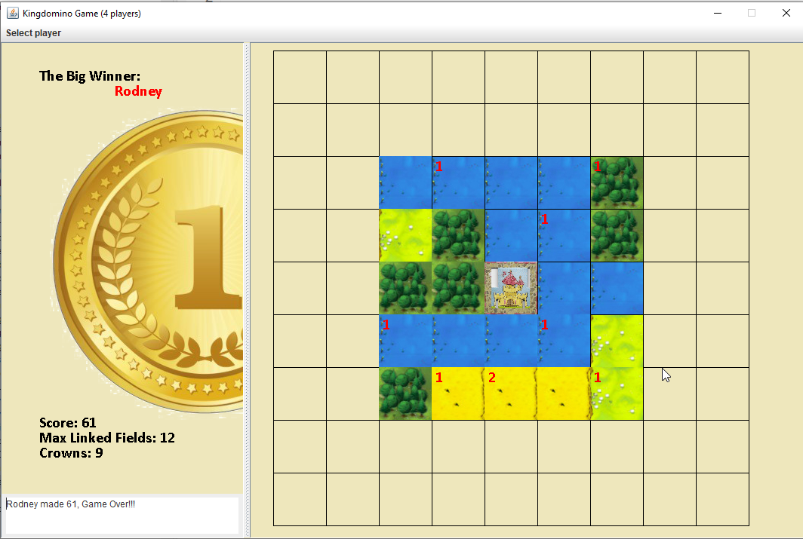
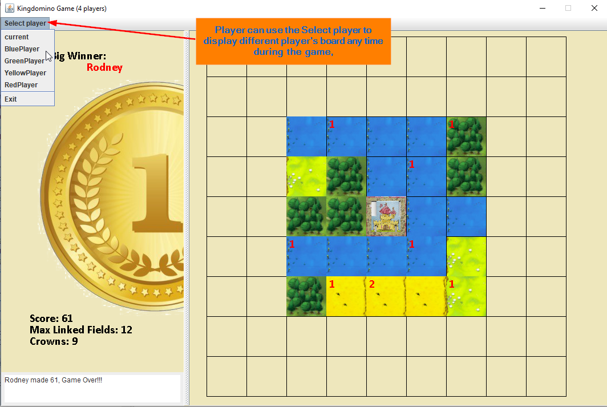

<h1>Kingdomino Game Player's Guide</h1>

This is a Java version of Kingdomino game, for game detail, you can refer to YouTube channel 
[Kingdomino how to play](https://www.youtube.com/watch?v=smbwBPmP4Ms&t=61s).

## Start a new game
* to start a new game, user simply click the **kindomino** icon on the desktop, a popup window will be open, you can now setup 4 player's name by click [Set Player Names] button shown below.

If you don't want to set player's name, by default there will be 4 players, yellow, red, blue and green.
* you then click [PLAY] button to start the game.

## Game board

as you can see, on the left-hand, it is the domino area, each player can pickup the domino he/she want, and drop it in the board. Since one Domino has 2 terrains, play need click 2 square area one at a time. here is dropdown rule:
1. player has to drop the Domino with the same type of terrain adjucent each other, or against to the castle.
2. player can only drop the domino horizontaly or verticaly, no diagnal.
3. player can only drop the domino within 5X5 square area.
4. there are total 12 round, once game over, computer will calculate the score for each player, and determine who is the big winner.
5. the score is equal to number of linked terrains multiply total number of crowns.

## Sample middle game

## Sample Game over

## Select Player menu

player can select to see different player's board which may help him/her to make pickup/drop decision. Some times, one player's decision may be same for him/her, but do make difference on next player.