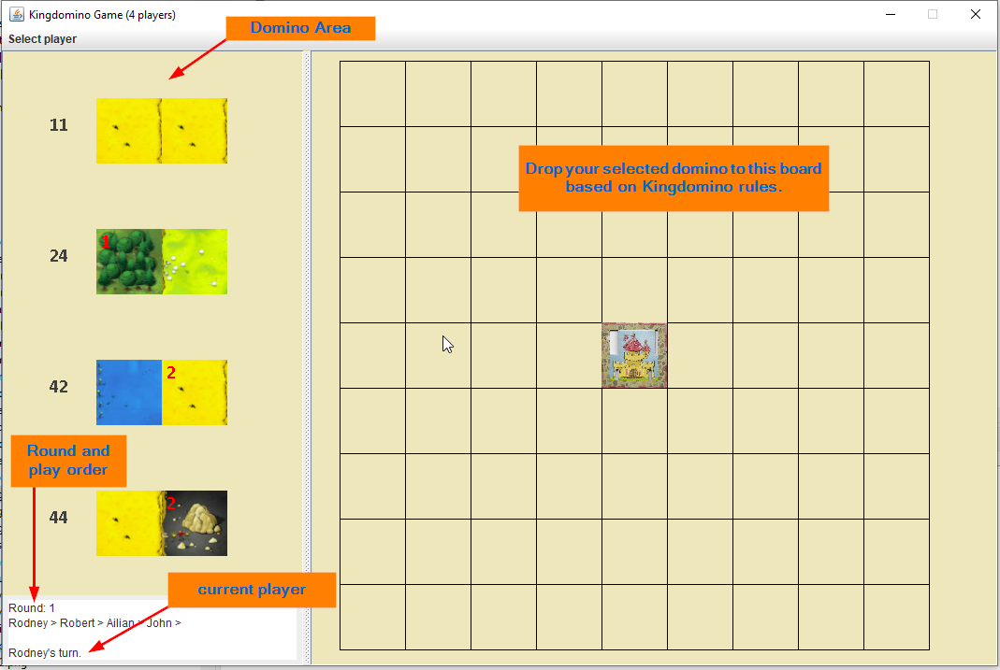

<h1>Kingdomino Game Specification and Design</h1>

## Start the application

Run Kingdomino.java file


## Play Ground


The user interface window split into 3 main part, on the left-hand is Domino pickup area, player can choose one domino from the area and then drop it into his/her board area. On the right-hand side, is the play ground, player can drop the domino into selected square-pair (horizontal or vertical).


## Game Configuration

* total of 48 domino cards data are stored in a csv file named **dominos.csv**, and loaded by **Deck** class.
```csv
Crowns1,Terrain1,Crowns2,Terrain2,NumberOfDomino
0,Swamp,0,Swamp,01
0,Swamp,0,Swamp,02
0,Forest,0,Forest,03
0,Forest,0,Forest,04
0,Forest,0,Forest,05
0,Forest,0,Forest,06
0,Water,0,Water,07
0,Water,0,Water,08
0,Water,0,Water,09
0,Field,0,Field,10
0,Field,0,Field,11
0,Mountain,0,Mountain,12
0,Swamp,0,Forest,13
0,Swamp,0,Water,14
0,Swamp,0,Field,15
0,Swamp,0,Mountain,16
0,Forest,0,Water,17
0,Forest,0,Field,18
1,Swamp,0,Forest,19
1,Swamp,0,Water,20
1,Swamp,0,Field,21
1,Swamp,0,Mountain,22
1,Swamp,0,Mine,23
1,Forest,0,Swamp,24
1,Forest,0,Swamp,25
1,Forest,0,Swamp,26
1,Forest,0,Swamp,27
1,Forest,0,Water,28
1,Forest,0,Field,29
1,Water,0,Swamp,30
1,Water,0,Swamp,31
1,Water,0,Forest,32
1,Water,0,Forest,33
1,Water,0,Forest,34
1,Water,0,Forest,35
0,Swamp,1,Field,36
0,Water,1,Field,37
0,Swamp,1,Mountain,38
0,Field,1,Mountain,39
1,Mine,0,Swamp,40
0,Swamp,2,Field,41
0,Water,2,Field,42
0,Swamp,2,Mountain,43
0,Field,2,Mountain,44
2,Mine,0,Swamp,45
0,Mountain,2,Mine,46
0,Mountain,2,Mine,47
0,Swamp,3,Mine,48
```
## Swing Components used
Other than basic Swing component JLabel,JButton, JTextField, we use the following Swing components:
1. JMenuBar, JMenu, JMenuItem
2. JPanel, JSplitPanel, JOptionPane
3. JFrame
4. JTextArea


## Class Diagram


where the minimum unit in this game is a terrain which has different image type and number of crowns. The property is a square in the board, which contains a terrain and 2D location. The Board object holds 9x9 properties. Each player has his/her own play board. One Domino object holds two terrains, and a domino number to sort the domino(based on Kingdomino rule).

## Calculate the score

Calculate score based on Kingdomino rule is little tricky. we need first find all connected terrain, and then find if there is any crown. Right after calculate one set of linked terrain, we need reset them to be empty, then continue for next linked terrains. we don't want to damage original board, so we clone a new board just for score calculation.


Another tricky process is how to find all linked terrains.


## Determine player click on board
Each player should have his/her own board, so player object determine where player clicked on the board. the player need 
1. pickup a domino from domino selection area;
2. then click first position in the board;
3. then click second position in the board;
4. application then determine the two selected position is valid or not;
5. if the position is right, application will display the domino on the board by selected position in the selection order;
6. if the position is invalid, the application shall popup related message to player, and allow player redo the drop.

Based on player's mouse click on the board, application will convert the mouse coordinates to property position on the board, which is 9x9 2D array. 

## Error Control
1. when player drop the domino in wrong position, application should popup message, and then allow player adjust different location.
2. when there is no place to drop domino, application should skip this player, let next player continue the game.

## Display game result
1. the application should calculate the score for each player after finishing drop the domino
2. the application should calculate the score for each player after 12 round finished, and then determine who is the big winner, display his/her score on the screen.