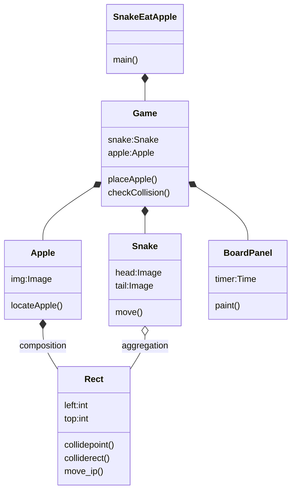

<h1>Snake Eat Apple</h1>

## Start Up

1. create package
2. [Game Main Frame](../src/snake/Game.java)
3. [Snake Eat Apple](../src/snake/SnakeEatApple.java)
4. [Apple](../src/snake/Apple.java)
5. [Snake](../src/snake/Snake.java)
6. [Position](../src/snake/Positin.java)
7. [Board Panel](../src/snake/BoardPanel.java)
8. [Rect](../../game2D/src/game2D/Rect.java)
9. [Size](../../game2D/src/game2D/Size.java)

## Objects
1. higher readibility
2. easyer to maintain
3. function or class can be used in other place

[Snake eat apple startup](../src/snake/SnakeEatApple.java)
[Cannot override JPanel.paint() method for drawing snake](../old/Game1.java)
[Snake](../old/Snake1.java)
[Apple](../old/Apple2.java)
[Rect](../old/Rect1.java)

