```mermaid
classDiagram

class BoardPanel

class Component{
    addKeyListener(KeyListener)
}

class JPanel{
    addKeyListener(KeyListener)    
}

class KeyListener{
    <<interface>>
    keyPressed​(KeyEvent e)
    keyReleased​(KeyEvent e)
    keyTyped​(KeyEvent e)
}

class KeyAdapter{
    <<abstract>>
}

class ArrowKey{
    keyPressed​(KeyEvent e)
}

JPanel <|-- BoardPanel
Component <|-- JPanel
KeyAdapter <|-- ArrowKey 
KeyListener <|-- KeyAdapter
```

<h1>Snake Eat Apple</h1>

## Start Up

1. create package
2. [Game Main Frame](../src/snake/Game.java)
3. [Snake Eat Apple](../src/snake/SnakeEatApple.java)
4. [Apple](../src/snake/Apple.java)
5. [Snake](../src/snake/Snake.java)
6. [Position](../src/snake/Positin.java)
7. [Board Panel](../src/snake/BoardPanel.java)
8. [Rect](../../game2D/src/game2D/Rect.java)
9. [Size](../../game2D/src/game2D/Size.java)


## Objects
> Object oriented programming means:
> 1. higher readibility
> 2. easyer to maintain
> 3. function or class may be used in other place

💡👉 **Knowlodge Base**
> Use Java to develop application doesn't mean you write OOP code.


## Move snake


[Snake eat apple startup](../src/snake/SnakeEatApple.java)
[Cannot override JPanel.paint() method for drawing snake](../old/Game1.java)
[Snake](../old/Snake1.java)
[Apple](../old/Apple2.java)
[Rect](../old/Rect1.java)


* [Understand how to move snake, create new head position](../old/Snake1.java)
* [move snake within window](../old/Snake3.java)

## Control snake by arrow keys

* define a dictionay as key-value pair with keyboard key as key, and speed as value:

```java
static Hashtable<Integer, Position> arrowDirections = new Hashtable<>();
static {
    arrowDirections.put(KeyEvent.VK_LEFT, new Position(-10, 0));
    arrowDirections.put(KeyEvent.VK_RIGHT, new Position(10, 0));
    arrowDirections.put(KeyEvent.VK_UP, new Position(0, -10));
    arrowDirections.put(KeyEvent.VK_DOWN, new Position(0, 10));		
}
```
* create inner class ArrowKey for key control
  
```java
class ArrowKey extends KeyAdapter{

    @Override
    public void keyPressed(KeyEvent e) {
        int key = e.getKeyCode();
        if(arrowDirections.containsKey(key)) {
            Position speed = arrowDirections.get(key);
            snake.setSpeed(speed);
        }
    }
}

```




💡👇 **Knowlodge Base**
> 1. interface is a group of method definitions without implementation. (such as KeyListener defined keyPressed() method)
> 2. cannot use abstract class to create instance. (such as KeyAdapter in the sample)
> 3. the abstract class implement default behavior for all methods defined in the interface it implements.
> 4. the abstract class allow us avoid implementing all methods defined in the interface.

* Understand Interface, abstract class, concrete class.

[Interface](../src/snake/MyMath.java)
[Abstract class](../src/snake/AbstractMath.java)
[Concrete class](../src/snake/ConcreteMath.java)


## DDD Demand Driven Development
> Call method on demand, then create the method.

## TDD Test Driven Development
> Write method test code before implementing the method.


* moveIp(Position) retrun nothing, but move the rect to the new relative position. 
* collidePoint() method return true if the point in the rect, otherwise return false.
* collideRect() method return true if the two rect overlap each other, otherwise return false.


💡👇 **Knowlodge Base**
> 1. try to test all cases(try different input value especially for extreme case)
> 2. modify souce code or test code if it is necessary.
> 3. keep your test code for future use.

* [replace Position to Rect for using colliderect()](../old/Snake5.java)
* [](../old/BoardPanel5.java)
* [](../old/Rect5.java)
* [](../old/RectTest5.java)

* [Build one-way relation between Snake and Apple](../old/Game6.java)
  
👎😢 **Issue**
> the apple is not located on the grid?
👍😄 **Conclusion**

the apple is on grid but sometimes is out of window
```java
	static Position randomPos(int width, int height, int gridWidth) {
		Random rand = new Random();
//		int x = Math.abs(rand.nextInt()) % (width-20);
//		int y = Math.abs(rand.nextInt()) % (height-50);
		int x = rand.nextInt(width/gridWidth) * gridWidth; // x will be on the grid
		int y = rand.nextInt(height/gridWidth) * gridWidth;
		return new Position(x, y);
	}
```

## create new project game2D

1. create new project game2D
2. move Position and Rect classes to the new project

## use the new project
1. one way is add related project to the project.
2. build a jar file for reference.

