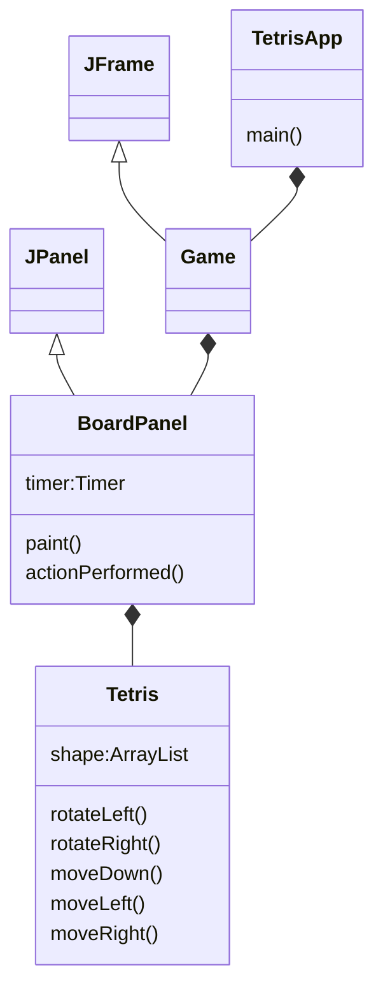
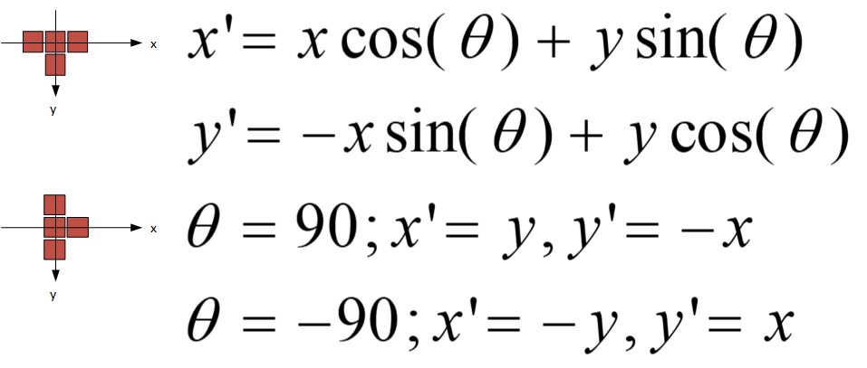

<h1>Tetris Game Development Notes</h1>

## Objects

```mermaid
classDiagram

class TetrisApp{
    main()
}
class BoardPanel{
    timer:Timer
    paint()
    actionPerformed()
}
class Game
class Tetris{
    shape:ArrayList<Rect>
    rotateLeft()
    rotateRight()
    moveDown()
    moveLeft()
    moveRight()
}

JFrame<|--Game
TetrisApp *-- Game
JPanel<|--BoardPanel
Game*--BoardPanel
BoardPanel*--Tetris
```

## Coordinates and Rotation
* [Rotation of Axes](RotationOfAxes.pdf)

* 
* Rotate to left
$$x'=y, y'=-x$$
* Rotate to right
$$x'=-y, y'=x$$

